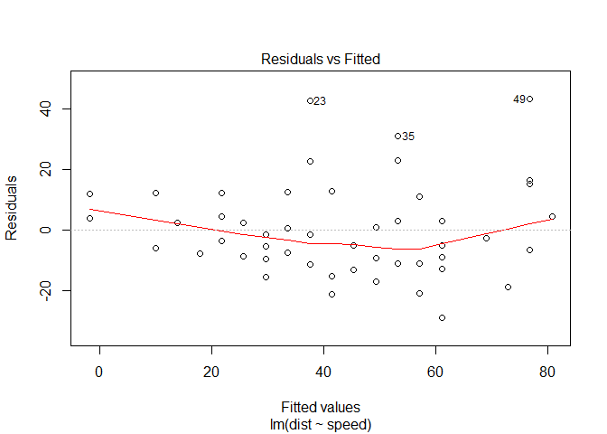
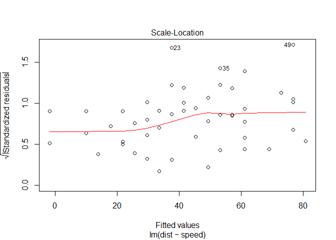
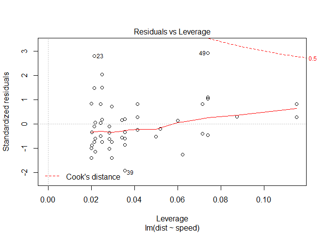

### Dataset CASdatasets

install.packages("CASdatasets", repos = "<http://cas.uqam.ca/pub/R/>",
type="source")

    library(xts)

    ## Loading required package: zoo

    ## 
    ## Attaching package: 'zoo'

    ## The following objects are masked from 'package:base':
    ## 
    ##     as.Date, as.Date.numeric

    library(sp)
    library(zoo)
    library(CASdatasets)
    data("asiacomrisk")

Las distribuciones de N y Xi son desconocidas pero se pueden estimar
utilizando ejemplos. Consideramos 200 ejemplos de importes de siniestro.

    set.seed(1)
    X <- rexp(200,rate=1/100)
    head(X)

    ## [1]  75.51818 118.16428  14.57067  13.97953  43.60686 289.49685

    summary(X)

    ##    Min. 1st Qu.  Median    Mean 3rd Qu.    Max. 
    ##   2.025  35.110  76.750 100.000 135.000 483.300

    rate <- 1/100
    mean <- 1/rate

Tenemos 200 importes que van desde 0.399 hasta 584

Vamos a olvidarnos de como hemos generado esos valores. Queremos estimar
la distribución de Xi. Una distribución standar para perdidas es Gamma
((  B ) ,(  ) )

    f <- function(x) log(x)-digamma(x)-log(mean(X))+mean(log(X))
    alpha <- uniroot(f,c(1e-8,1e8))$root
    beta <- alpha/mean(X)
    alpha

    ## [1] 1.308995

    beta

    ## [1] 0.01309016

### Comandos en R

    T <- 10
    r <- .05
    (1+r)^(-T)

    ## [1] 0.6139133

    (1+r)^(-T);(1+r/2)^(-T)

    ## [1] 0.6139133

    ## [1] 0.7811984

#### Vectors and Matrices

La esperanza de vida de una persona con edad x llegue a la edad x+k:

$\\sum\_{k=1}^{\\infty} k\_p\_x$

    life.exp <- function(x){sum(p[1:nrow(p),x])}

#### R packages

Are called libraries in C/C++ and classes in Java.

Packages por defecto:

    getOption("defaultPackages")
    (.packages(all.available = TRUE))
    install.packages("quantreg",dependencies = TRUE)

dependences true porque ese paquete puede tener funciones que vengan de
otros paquetes.

    library(quantreg)

    ## Loading required package: SparseM

    ## 
    ## Attaching package: 'SparseM'

    ## The following object is masked from 'package:base':
    ## 
    ##     backsolve

    library(stats4)
    library(VGAM)

    ## Loading required package: splines

Si está en funcionamiento VGAM y queremos usar la funcion coef() del
paquete stats4, o salimos de VGAM o seleccionamos dentro de stats4::coef

\``{} detach(package:VGAM,unload=TRUE) stats4::coef()`

Otra dificultad es encontrar que paquete es apropiado. Por ejemplo
tenemos este problema jerárquico:

Yi= Beta1*Xi+Lamda0+Lambda1*Zj(i)+uj(i)+Error(i)

Los lambda son los componentes aleatorios

Cada i es una observación (compañia, region, tipo de coche, etc..),
muchos paquetes pueden lidear con este problema, generalmente nlme o
lme4. Incluso plm. No lineal mixed-effect modelos.

    reg <- lme(fixed=Y~X,random=~X|Z,method='ML')
    reg <- lmer(Y~X+Z+(1|Z),method='ML')

lme devuelve p-values mientras lmer no. La sintaxis y el resultado son
diferentes.

#### Diferencia entre clases S3 y S4

S3 funciones fueron creadas con una version vieja de R(S), S4 fueron
creados con una versión más reciente. Por ejemplo lm, glm y gam son S3.
lmer y VGAM son S4.

Por ejemplo en un caso de health insurance, donde tenemos
características de unos individuos. Es posible definir un objeto
personal que contendrá toda la información importante.

S3

    person3 <-  function(name,age,weight,height){
    c <-list(name=name,age=age,weight=weight,height=height)
    class(c)<-"person3"
    return(c)}

Para crear una persona:

    JohnDoe<- person3(name="John",age=28,weight=76,height=182)
    JohnDoe$age

    ## [1] 28

\[1\]28

Es posible definir una funcion por ejemplo BMI(Body Mass Index) con
person3:

    BMI3<-function(object,...){return(object$weight*1e4/object$height^2)}
    BMI3(JohnDoe)

    ## [1] 22.94409

lm está en S3 class:

    reg3 <- lm(dist~speed,data=cars)
    reg3$coefficients

    ## (Intercept)       speed 
    ##  -17.579095    3.932409

    coef(reg3)

    ## (Intercept)       speed 
    ##  -17.579095    3.932409

    plot(reg3)

Versión S4:

    setClass("person4",representation(name="character",age="numeric",weight="numeric",height="numeric"))
    jon <- new("person4",name="Jon",age=28,weight=76,height=182)
    maria <- new("person4",name="Maria",age=28,weight=76,height=182)

Los atributos los vemos con @ no con $

    jon@name

    ## [1] "Jon"

    summary(jon)

    ##  Length   Class    Mode 
    ##       1 person4      S4

    summary(JohnDoe)

    ##        Length Class  Mode     
    ## name   1      -none- character
    ## age    1      -none- numeric  
    ## weight 1      -none- numeric  
    ## height 1      -none- numeric

Ahora se pueden definir funciones,primero definimos el método:

    setGeneric("BMI4",function(object,separator)return(standardGeneric("BMI4")))

    ## [1] "BMI4"

    setMethod("BMI4","person4",function(object){return(object@weight*1e4/object@height^2)})

    ## [1] "BMI4"

    BMI4(jon)

    ## [1] 22.94409

    BMI4(maria)

    ## [1] 22.94409

Los objetos VGAM están en la clase S4

    library(VGAM)
    reg4 <- vglm(dist~speed,data=cars,family=gaussianff)
    reg4@coefficients

    ## (Intercept)       speed 
    ##  -17.579095    3.932409

    coefficients(reg4)

    ## (Intercept)       speed 
    ##  -17.579095    3.932409

##### R Codes and Efficiency

Utilizaremos funciones de R para calcular el tiempo de ejecución
system.time

    n <- 1000
    A <- matrix(seq(1,n^2),n,n)
    B <- matrix(seq(1,n^2),n,n)
    system.time(A%*%B)
    system.time(solve(A%*%B))

    library(benchmark)
    benchmark(A*B,A%*%B,replications(1))[,c(1,3,4)]

    library(microbenchmark)
    microbenchmark(A*B,A%*%B,times=10)

lleva casi un segundo hacer esta operación

#### Importing and Creating Objects and Datasets in R

Creamos el objeto:

    x <- exp(1)
    x ##es el valor de e

    ## [1] 2.718282

    class(x)

    ## [1] "numeric"

    1/0

    ## [1] Inf

    .Machine$double.xmax ##El máximo numero antes de infinito

    ## [1] 1.797693e+308

    2e+307<Inf

    ## [1] TRUE

    2e+308<Inf

    ## [1] FALSE

    0/0

    ## [1] NaN

TRUE puede ser T, vamos a intentar usar TRUE para dejar T como posible
variable. La lista de todos los objetos en R

    ls()

    ##  [1] "alpha"       "asiacomrisk" "beta"        "BMI3"        "BMI4"       
    ##  [6] "f"           "JohnDoe"     "jon"         "life.exp"    "maria"      
    ## [11] "mean"        "person3"     "r"           "rate"        "reg3"       
    ## [16] "reg4"        "T"           "x"           "X"

    y <- x+1
    x <- pi
    y

    ## [1] 3.718282

Los nombres de los objetos no pueden empezar por número. x2,x\_2 pero no
2x Los objetos que creamos se pueden guardar en el directorio de trabajo
.RData

    find("x") ##el espacio de trabajo es solo un ambiente de R

    ## [1] ".GlobalEnv"

    find("pi")##pueden estar localizados en diferentes lugares

    ## [1] "package:base"

    search()

    ##  [1] ".GlobalEnv"          "package:VGAM"        "package:splines"    
    ##  [4] "package:stats4"      "package:quantreg"    "package:SparseM"    
    ##  [7] "package:CASdatasets" "package:sp"          "package:xts"        
    ## [10] "package:zoo"         "package:stats"       "package:graphics"   
    ## [13] "package:grDevices"   "package:utils"       "package:datasets"   
    ## [16] "package:methods"     "Autoloads"           "package:base"

#### More Complex Objects in R: From Vectors to Lists

##### Vectors in R

Es la forma más habitual de definir un valor en R, es el objeto más
simple.

    x <- c(-1,0,2)
    x

    ## [1] -1  0  2

    y <- c(0,2^x)
    y

    ## [1] 0.0 0.5 1.0 4.0

    u <- 1:50
    u

    ##  [1]  1  2  3  4  5  6  7  8  9 10 11 12 13 14 15 16 17 18 19 20 21 22 23
    ## [24] 24 25 26 27 28 29 30 31 32 33 34 35 36 37 38 39 40 41 42 43 44 45 46
    ## [47] 47 48 49 50

    c(NULL,x)##Hay un simbolo nulo en R

    ## [1] -1  0  2

Puede necesitar crear un objeto usado en un bucle

    x <- NULL
    for(i in 1:10){x <- c(x,max(sin(u[1:i])))}
    x

    ##  [1] 0.8414710 0.9092974 0.9092974 0.9092974 0.9092974 0.9092974 0.9092974
    ##  [8] 0.9893582 0.9893582 0.9893582

Creamos una secuencia:

    seq(from=0,to=1,by=.1)

    ##  [1] 0.0 0.1 0.2 0.3 0.4 0.5 0.6 0.7 0.8 0.9 1.0

    seq(5,2,-1)

    ## [1] 5 4 3 2

    seq(5,2,length=9)

    ## [1] 5.000 4.625 4.250 3.875 3.500 3.125 2.750 2.375 2.000

Replicamos elementos:

    rep(c(1,2,6),3)

    ## [1] 1 2 6 1 2 6 1 2 6

    rep(c(1,2,6),each=3)

    ## [1] 1 1 1 2 2 2 6 6 6

Sort function:

    x <- c(-1,0,2)
    sort(x,decreasing=TRUE)

    ## [1]  2  0 -1

    x ##no hemos cambiado el vector original

    ## [1] -1  0  2

    x <- sort(x,decreasing=TRUE)##hemos reasignado el vector
    names(x) <- c("A","B","C")
    x

    ##  A  B  C 
    ##  2  0 -1

    x[c(3,2)]

    ##  C  B 
    ## -1  0

    x[c("C","B")]

    ##  C  B 
    ## -1  0

    x[names(x)%in%c("C","B")]

    ##  B  C 
    ##  0 -1

Generar variables entre 0,1 aleatorias con runif:

    set.seed(1)
    U <- runif(20)
    U

    ##  [1] 0.26550866 0.37212390 0.57285336 0.90820779 0.20168193 0.89838968
    ##  [7] 0.94467527 0.66079779 0.62911404 0.06178627 0.20597457 0.17655675
    ## [13] 0.68702285 0.38410372 0.76984142 0.49769924 0.71761851 0.99190609
    ## [19] 0.38003518 0.77744522

    U[1:4]

    ## [1] 0.2655087 0.3721239 0.5728534 0.9082078

    options(digits = 5)##decimales que quiero
    U[1:4]

    ## [1] 0.26551 0.37212 0.57285 0.90821

Si tenemos vectores de diferentes tamaños y sumamos:

    x <- c(100,200,400,500,600,700)
    y <- c(1,2,3)
    x+y

    ## [1] 101 202 403 501 602 703

    y <- c(1,2,3,4)
    x+y

    ## Warning in x + y: longitud de objeto mayor no es múltiplo de la longitud de
    ## uno menor

    ## [1] 101 202 403 504 601 702

    age <- seq(0,90,by=10)
    length(age) <- 12
    age ##rellena con NA los últimos dos números de la secuencia

    ##  [1]  0 10 20 30 40 50 60 70 80 90 NA NA

    U[U>.8]

    ## [1] 0.90821 0.89839 0.94468 0.99191

    U[(U>.4)&(U<.5)]##devuelve los valores que cumplen

    ## [1] 0.4977

    (U>.4)&(U<.5)##devuelve verdadero falso

    ##  [1] FALSE FALSE FALSE FALSE FALSE FALSE FALSE FALSE FALSE FALSE FALSE
    ## [12] FALSE FALSE FALSE FALSE  TRUE FALSE FALSE FALSE FALSE

    U[(U>.4)&(U<.45)]##devuelve numeric(0) si no hay coincidencias

    ## numeric(0)

    length(U[(U>0.4)&(U<.45)])##número de casos que cumplen condiciones

    ## [1] 0

    which((U>.4)&(U<.6))##posicion de los números que cumplen las dos condiciones

    ## [1]  3 16

    which(!((U>.4)&(U<.6)))##No cumplen ninguna e las dos condiciones

    ##  [1]  1  2  4  5  6  7  8  9 10 11 12 13 14 15 17 18 19 20

    which((U<=.4)|(U>.6))##cumplen una u otra

    ##  [1]  1  2  4  5  6  7  8  9 10 11 12 13 14 15 17 18 19 20

    y

    ## [1] 1 2 3 4

    y==2##devuelve verdadero o falso

    ## [1] FALSE  TRUE FALSE FALSE

    all.equal((3/10-1/10),(7/10-5/10))##true

    ## [1] TRUE

    sqrt(2)^2==2##false

    ## [1] FALSE

Si creamos vectores con diferentes tipos de datos, R intenta volverlos
de un mismo tipo:

    x <- c(1:5,"yes")
    x

    ## [1] "1"   "2"   "3"   "4"   "5"   "yes"

    y <- c(TRUE,TRUE,TRUE,FALSE)
    y

    ## [1]  TRUE  TRUE  TRUE FALSE

    y+2

    ## [1] 3 3 3 2

#### Matrices and Array

    M <- matrix(U,nrow = 5,ncol=4)
    M

    ##         [,1]     [,2]    [,3]    [,4]
    ## [1,] 0.26551 0.898390 0.20597 0.49770
    ## [2,] 0.37212 0.944675 0.17656 0.71762
    ## [3,] 0.57285 0.660798 0.68702 0.99191
    ## [4,] 0.90821 0.629114 0.38410 0.38004
    ## [5,] 0.20168 0.061786 0.76984 0.77745

    dim(M)

    ## [1] 5 4

    ##cambiamos los atributos de la matriz a 5 columnas y 4 filas
    attributes(M)$dim=c(4,5)
    M

    ##         [,1]    [,2]     [,3]    [,4]    [,5]
    ## [1,] 0.26551 0.20168 0.629114 0.68702 0.71762
    ## [2,] 0.37212 0.89839 0.061786 0.38410 0.99191
    ## [3,] 0.57285 0.94468 0.205975 0.76984 0.38004
    ## [4,] 0.90821 0.66080 0.176557 0.49770 0.77745

Filas en ñas que los valores de la última columna son mayores 0.8:

    M[M[,5]>.8,]

    ## [1] 0.372124 0.898390 0.061786 0.384104 0.991906

columnas en las que en la última fila el valor sea mayor de 0.8

    M[,M[4,]>0.8]##devuelve los valores de la primera columna

    ## [1] 0.26551 0.37212 0.57285 0.90821

SWEEP aplica una función a cada una de las filas MARGIN=1 o a las
columnas MARGIN=2

    sweep(M,MARGIN=1,STATS=1:nrow(M),FUN="+")

    ##        [,1]   [,2]   [,3]   [,4]   [,5]
    ## [1,] 1.2655 1.2017 1.6291 1.6870 1.7176
    ## [2,] 2.3721 2.8984 2.0618 2.3841 2.9919
    ## [3,] 3.5729 3.9447 3.2060 3.7698 3.3800
    ## [4,] 4.9082 4.6608 4.1766 4.4977 4.7774

Las matrices son como los vectores con elementos del mismo tipo siempre.

    M <- matrix(seq(1,8),nrow=4,ncol=3,byrow=FALSE)

    ## Warning in matrix(seq(1, 8), nrow = 4, ncol = 3, byrow = FALSE): la
    ## longitud de los datos [8] no es un submúltiplo o múltiplo del número de
    ## columnas [3] en la matriz

    M##nos da una warning de que el tamaño 8 es no multiple del numero de filas

    ##      [,1] [,2] [,3]
    ## [1,]    1    5    1
    ## [2,]    2    6    2
    ## [3,]    3    7    3
    ## [4,]    4    8    4

    M+c(10,20,30,40,50)

    ## Warning in M + c(10, 20, 30, 40, 50): longitud de objeto mayor no es
    ## múltiplo de la longitud de uno menor

    ##      [,1] [,2] [,3]
    ## [1,]   11   55   41
    ## [2,]   22   16   52
    ## [3,]   33   27   13
    ## [4,]   44   38   24

RBIND and CBIND para concatenar filas o columnas

    A <- matrix(0,3,6)
    B <- matrix(1,2,6)
    C <- rbind(B,A,B)
    C

    ##      [,1] [,2] [,3] [,4] [,5] [,6]
    ## [1,]    1    1    1    1    1    1
    ## [2,]    1    1    1    1    1    1
    ## [3,]    0    0    0    0    0    0
    ## [4,]    0    0    0    0    0    0
    ## [5,]    0    0    0    0    0    0
    ## [6,]    1    1    1    1    1    1
    ## [7,]    1    1    1    1    1    1

para rbind tienen el mismo número de columnas, para cbind el mismo de
filas.

La matriz puede ser vista en dos dimensiones con un array

    A <- array(1:36,c(3,6,2))
    A

    ## , , 1
    ## 
    ##      [,1] [,2] [,3] [,4] [,5] [,6]
    ## [1,]    1    4    7   10   13   16
    ## [2,]    2    5    8   11   14   17
    ## [3,]    3    6    9   12   15   18
    ## 
    ## , , 2
    ## 
    ##      [,1] [,2] [,3] [,4] [,5] [,6]
    ## [1,]   19   22   25   28   31   34
    ## [2,]   20   23   26   29   32   35
    ## [3,]   21   24   27   30   33   36

#### Lists

Podemos tener una variedad de objetos dentro de una lista:

    stored <- list(submatrix=M,sequenceu=U,x)
    stored

    ## $submatrix
    ##      [,1] [,2] [,3]
    ## [1,]    1    5    1
    ## [2,]    2    6    2
    ## [3,]    3    7    3
    ## [4,]    4    8    4
    ## 
    ## $sequenceu
    ##  [1] 0.265509 0.372124 0.572853 0.908208 0.201682 0.898390 0.944675
    ##  [8] 0.660798 0.629114 0.061786 0.205975 0.176557 0.687023 0.384104
    ## [15] 0.769841 0.497699 0.717619 0.991906 0.380035 0.777445
    ## 
    ## [[3]]
    ## [1] "1"   "2"   "3"   "4"   "5"   "yes"

    names(stored)

    ## [1] "submatrix" "sequenceu" ""

    stored$submatrix

    ##      [,1] [,2] [,3]
    ## [1,]    1    5    1
    ## [2,]    2    6    2
    ## [3,]    3    7    3
    ## [4,]    4    8    4

    stored[[3]]

    ## [1] "1"   "2"   "3"   "4"   "5"   "yes"

Muchas funciones de R nos dan los resultados en listas:

    f <- function(x){return(x*(1-x))}
    optim.f <- optimize(f,interval=c(0,1),maximum=TRUE)
    names(optim.f)

    ## [1] "maximum"   "objective"

    optim.f$maximum

    ## [1] 0.5
