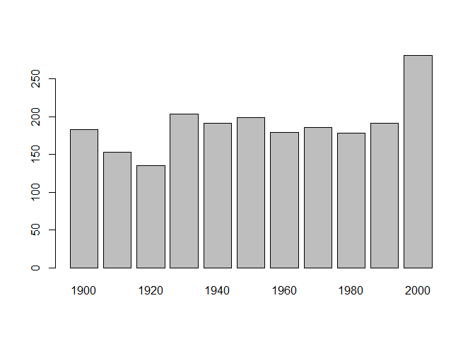
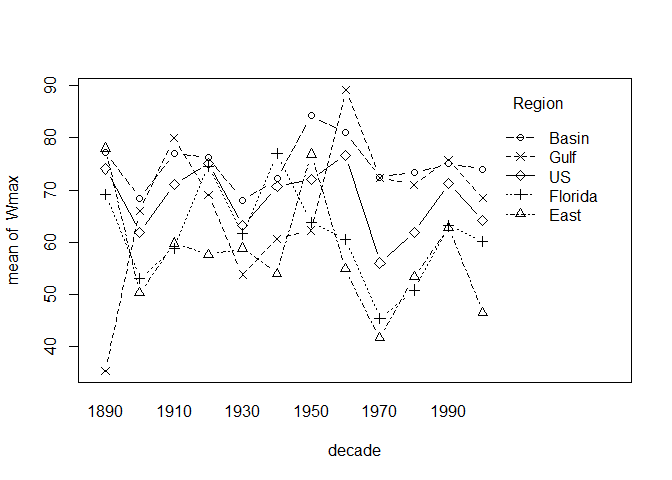

#### Reading csv or txt files

    getwd()

    ## [1] "D:/ActuarialScienceR"

    setwd("D:\\ActuarialScienceR\\")
    ##db <- read.table("file.txt")

    stormmax <- read.table("extremedatasince1899.csv",header=TRUE,sep = ",")
    head(stormmax)

    ##     Yr  Region      Wmax      sst sun   soi split naofl naogulf   nao
    ## 1 1899   Basin 105.56342 0.046596 8.4 -0.21     0 -1.03   -0.25 -0.64
    ## 2 1899   Basin  40.00000 0.046596 8.4 -0.21     0 -1.03   -0.25 -0.64
    ## 3 1899   Basin  35.41822 0.046596 8.4 -0.21     0 -1.03   -0.25 -0.64
    ## 4 1899   Basin  51.06743 0.046596 8.4 -0.21     0 -1.03   -0.25 -0.64
    ## 5 1899 Florida  87.34328 0.046596 8.4 -0.21     0 -1.03   -0.25 -0.64
    ## 6 1899   Basin  96.64138 0.046596 8.4 -0.21     0 -1.03   -0.25 -0.64
    ##   naoONDJ
    ## 1  0.3825
    ## 2  0.3825
    ## 3  0.3825
    ## 4  0.3825
    ## 5  0.3825
    ## 6  0.3825

    nbvariables <- count.fields("extremedatasince1899.csv",sep = ",")
    ##count.fields se puede usar para descubrir si hay errores y donde estan
    which(nbvariables!=quantile(nbvariables,0.9))##me da 0

    ## integer(0)

    stormmax[is.na(stormmax),]

    ##  [1] Yr      Region  Wmax    sst     sun     soi     split   naofl  
    ##  [9] naogulf nao     naoONDJ
    ## <0 rows> (or 0-length row.names)

    tail(stormmax)

    ##        Yr Region      Wmax       sst sun        soi split naofl naogulf
    ## 2095 2009  Basin 105.26713 0.3189293 4.3 -0.6333333     1  1.52   -3.05
    ## 2096 2009  Basin  55.35117 0.3189293 4.3 -0.6333333     1  1.52   -3.05
    ## 2097 2009  Basin  45.77632 0.3189293 4.3 -0.6333333     1  1.52   -3.05
    ## 2098 2009  Basin  90.00000 0.3189293 4.3 -0.6333333     1  1.52   -3.05
    ## 2099 2009     US  50.44100 0.3189293 4.3 -0.6333333     1  1.52   -3.05
    ## 2100 2009     US  65.28814 0.3189293 4.3 -0.6333333     1  1.52   -3.05
    ##         nao naoONDJ
    ## 2095 -0.765  -0.315
    ## 2096 -0.765  -0.315
    ## 2097 -0.765  -0.315
    ## 2098 -0.765  -0.315
    ## 2099 -0.765  -0.315
    ## 2100 -0.765  -0.315

    str(stormmax)

    ## 'data.frame':    2100 obs. of  11 variables:
    ##  $ Yr     : int  1899 1899 1899 1899 1899 1899 1899 1899 1899 1899 ...
    ##  $ Region : Factor w/ 5 levels "Basin","East",..: 1 1 1 1 3 1 4 5 5 5 ...
    ##  $ Wmax   : num  105.6 40 35.4 51.1 87.3 ...
    ##  $ sst    : num  0.0466 0.0466 0.0466 0.0466 0.0466 ...
    ##  $ sun    : num  8.4 8.4 8.4 8.4 8.4 8.4 8.4 8.4 8.4 8.4 ...
    ##  $ soi    : num  -0.21 -0.21 -0.21 -0.21 -0.21 -0.21 -0.21 -0.21 -0.21 -0.21 ...
    ##  $ split  : int  0 0 0 0 0 0 0 0 0 0 ...
    ##  $ naofl  : num  -1.03 -1.03 -1.03 -1.03 -1.03 -1.03 -1.03 -1.03 -1.03 -1.03 ...
    ##  $ naogulf: num  -0.25 -0.25 -0.25 -0.25 -0.25 -0.25 -0.25 -0.25 -0.25 -0.25 ...
    ##  $ nao    : num  -0.64 -0.64 -0.64 -0.64 -0.64 -0.64 -0.64 -0.64 -0.64 -0.64 ...
    ##  $ naoONDJ: num  0.383 0.383 0.383 0.383 0.383 ...

    set.seed(123)
    df <- data.frame(x1=rnorm(5),x2=sample(1:2,size=5,replace=TRUE),x3=rnorm(5))
    df[order(df$x2,-df$x1),]

    ##            x1 x2         x3
    ## 5  0.12928774  1  2.5283366
    ## 2 -0.23017749  1 -1.7272706
    ## 3  1.55870831  2  1.6901844
    ## 4  0.07050839  2  0.5038124
    ## 1 -0.56047565  2  1.2805549

Volviendo al caso anterior vemos que read.table convierte
automáticamente character variables en factores esto se puede evitar con
stringsAsFactors.

Para datasets largos se puede seleccionar algunas columnas para importar
o manualmente o con funcion en paquete: install.packages("ColByCol")
library(colbycol)

    mycols <- rep("NULL",11)
    mycols[c(1,2,3)] <- NA
    mycols

    ##  [1] NA     NA     NA     "NULL" "NULL" "NULL" "NULL" "NULL" "NULL" "NULL"
    ## [11] "NULL"

    stormmax <- read.table("extremedatasince1899.csv",header=TRUE,sep=",",colClasses = mycols)
    tail(stormmax)

    ##        Yr Region      Wmax
    ## 2095 2009  Basin 105.26713
    ## 2096 2009  Basin  55.35117
    ## 2097 2009  Basin  45.77632
    ## 2098 2009  Basin  90.00000
    ## 2099 2009     US  50.44100
    ## 2100 2009     US  65.28814

Es más rapido especificar la clase de los elementos a importar:

    mycols <- rep("NULL",11)
    mycols[c(1,2,3)] <- c("integer","factor","numeric")
    stormmax <- read.table("extremedatasince1899.csv",header=TRUE,sep=",",colClasses = mycols)
    str(stormmax)

    ## 'data.frame':    2100 obs. of  3 variables:
    ##  $ Yr    : int  1899 1899 1899 1899 1899 1899 1899 1899 1899 1899 ...
    ##  $ Region: Factor w/ 5 levels "Basin","East",..: 1 1 1 1 3 1 4 5 5 5 ...
    ##  $ Wmax  : num  105.6 40 35.4 51.1 87.3 ...

Para datasets pesados es mejor importar el zip

    read.table(unz("file.zip",filename = "file.txt"))
    import.url.zip = function(file,name="file.txt"){temp=tempfile(),download.file(file,temp);read.table(unz(temp,name),sep=",",header=TRUE,encoding="latin1")}

primero bajamos el fichero y luego hacemos el unz esta funcion solo
funciona con el fichero en nuestro ordenador.

    system.time(read.table("file.txt",sep=",",header=TRUE)) mucho mas largo
    system.time(read.table(unz("file.txt.zip",filename="file.txt"),sep=",",header=TRUE))más corto

R usa Ram existen paquetes para trabajar con datos grandes:

    install.packages("ff")
    install.packages("bigmemory")

Desde Python podemos usar R con el paquete rpy2, ya que python es más
eficiente leyendo.

#### Missing Values

Para saber si hay missing values:

    Xfull <- stormmax[is.na(stormmax)==FALSE]
    Xfull <- stormmax[!is.na(stormmax)]
    length(Xfull)

    ## [1] 6300

    dim(stormmax)

    ## [1] 2100    3

    ##no hay missing

Si na.rm es TRUE los NA son borrados y se computa la media en el
sub-vector. En la lm() es posible indicar na.action. En grandes dataset
es posible usar la libreria data.table que es más rápida.

    library(data.table)
    DF <- data.frame(matrix(rnorm(100000),10000,10));DF$index <- 1:nrow(DF)
    DT <- data.table(DF)
    library(benchmark)

    ## Loading required package: proto

    ## Loading required package: ggplot2

    ## Loading required package: relations

    ## Loading required package: psychotools

    ## 
    ## Attaching package: 'benchmark'

    ## The following object is masked from 'package:psychotools':
    ## 
    ##     paircomp

    ##benchmark(DF[DF$X1>2,],DT[DT$X1>2,])[,c(1,3,4)]
    head(DF)

    ##            X1         X2          X3         X4           X5         X6
    ## 1  0.54909674  0.1869921 -0.04920198 -1.7287594  0.625786213  1.3742161
    ## 2  0.23821292  0.9924360  0.00285171 -0.5463696  0.009945248  0.4112193
    ## 3 -1.04889314  0.9222959  1.21422310  0.8935073  0.083750173 -0.3863942
    ## 4  1.29476325  0.5284415  1.20055269 -1.4546095 -2.022941434  0.6355866
    ## 5  0.82553984 -1.4306107  1.32774042 -0.2682767  0.697167223  0.6473134
    ## 6 -0.05568601  0.6821985  0.59202802  0.5920604  0.863554500  0.1982106
    ##            X7          X8         X9        X10 index
    ## 1 -0.15234401 -1.30500232 -0.7997699 -0.6422631     1
    ## 2  0.23812816  1.88595146  0.2600385  0.1634567     2
    ## 3  0.03066876 -0.13588421 -0.7419409  1.0150062     3
    ## 4  1.32971967  0.07066055  0.4940410 -0.4409448     4
    ## 5 -0.19097509  0.10304939  2.0277157  0.4444695     5
    ## 6  1.87819551 -0.72347150  0.2221851 -0.1033075     6

write.table() exporta la matrix o dataframe a fichero de texto.

    cat(object,file="namefile.txt",append=FALSE) ## si apend TRUE añadimos el objeto al fichero existente, si es FALSE overwrite el fichero.

    cat("File DF contains",nrow(DF),"rows \n")

    ## File DF contains 10000 rows

La función sink() creamos un fichero de texto y guardamos cualquier
objeto dentro:

    sink('DT.txt')
    print(DT);

    ##                X1          X2          X3         X4           X5
    ##     1:  0.5490967  0.18699215 -0.04920198 -1.7287594  0.625786213
    ##     2:  0.2382129  0.99243603  0.00285171 -0.5463696  0.009945248
    ##     3: -1.0488931  0.92229593  1.21422310  0.8935073  0.083750173
    ##     4:  1.2947633  0.52844151  1.20055269 -1.4546095 -2.022941434
    ##     5:  0.8255398 -1.43061073  1.32774042 -0.2682767  0.697167223
    ##    ---                                                           
    ##  9996:  0.8248959  0.04218737  1.54004717 -0.8994505  0.681091067
    ##  9997:  0.8214279 -1.10984560 -0.75304702 -0.2569539 -1.045106930
    ##  9998: -0.2503399  0.41340248  1.05260314 -0.1891174  0.025253199
    ##  9999: -2.0638567 -1.94505016  0.38111499  0.2256089  1.459528858
    ## 10000: -0.8488723 -1.17343665  1.24506408  0.1313747  1.378025384
    ##                X6          X7          X8         X9        X10 index
    ##     1:  1.3742161 -0.15234401 -1.30500232 -0.7997699 -0.6422631     1
    ##     2:  0.4112193  0.23812816  1.88595146  0.2600385  0.1634567     2
    ##     3: -0.3863942  0.03066876 -0.13588421 -0.7419409  1.0150062     3
    ##     4:  0.6355866  1.32971967  0.07066055  0.4940410 -0.4409448     4
    ##     5:  0.6473134 -0.19097509  0.10304939  2.0277157  0.4444695     5
    ##    ---                                                               
    ##  9996:  0.3633584 -0.54347278 -0.31410639 -0.6361419 -1.1684353  9996
    ##  9997: -0.6865484  0.79738557 -0.23849374 -0.1453281 -0.8766137  9997
    ##  9998:  0.7599112  0.60693164  2.09125334  0.4492329  1.1472810  9998
    ##  9999: -1.3687239  1.25524738  0.88368788  0.2774798  1.1522529  9999
    ## 10000:  0.2007512  0.32925775 -0.87007754 -0.9746535 -1.3124155 10000

    sink()

Scan() to import data, to read html pages:

    scan("https://cran.r-project.org/",what="character",encoding = "latin1")

    ##  [1] "<!DOCTYPE"                              
    ##  [2] "HTML"                                   
    ##  [3] "PUBLIC"                                 
    ##  [4] "-//W3C//DTD HTML 4.01 Frameset//EN"     
    ##  [5] "http://www.w3.org/TR/html4/frameset.dtd"
    ##  [6] ">"                                      
    ##  [7] "<html>"                                 
    ##  [8] "<head>"                                 
    ##  [9] "<title>The"                             
    ## [10] "Comprehensive"                          
    ## [11] "R"                                      
    ## [12] "Archive"                                
    ## [13] "Network</title>"                        
    ## [14] "<META"                                  
    ## [15] "HTTP-EQUIV=\"content-type\""            
    ## [16] "CONTENT=\"text/html;"                   
    ## [17] "charset=utf-8\">"                       
    ## [18] "<link"                                  
    ## [19] "rel=\"icon\""                           
    ## [20] "href=\"favicon.ico\""                   
    ## [21] "type=\"image/x-icon\">"                 
    ## [22] "<link"                                  
    ## [23] "rel=\"shortcut"                         
    ## [24] "icon\""                                 
    ## [25] "href=\"favicon.ico\""                   
    ## [26] "type=\"image/x-icon\">"                 
    ## [27] "<link"                                  
    ## [28] "rel=\"stylesheet\""                     
    ## [29] "type=\"text/css\""                      
    ## [30] "href=\"R.css\">"                        
    ## [31] "</head>"                                
    ## [32] "<FRAMESET"                              
    ## [33] "cols=\"1*,"                             
    ## [34] "4*\""                                   
    ## [35] "style=\"border:"                        
    ## [36] "none;\">"                               
    ## [37] "<FRAMESET"                              
    ## [38] "rows=\"120,"                            
    ## [39] "1*\">"                                  
    ## [40] "<FRAME"                                 
    ## [41] "src=\"logo.html\""                      
    ## [42] "name=\"logo\""                          
    ## [43] "frameborder=0>"                         
    ## [44] "<FRAME"                                 
    ## [45] "src=\"navbar.html\""                    
    ## [46] "name=\"contents\""                      
    ## [47] "frameborder=0>"                         
    ## [48] "</FRAMESET>"                            
    ## [49] "<FRAME"                                 
    ## [50] "src=\"banner.shtml\""                   
    ## [51] "name=\"banner\""                        
    ## [52] "frameborder=0>"                         
    ## [53] "<noframes>"                             
    ## [54] "<h1>The"                                
    ## [55] "Comprehensive"                          
    ## [56] "R"                                      
    ## [57] "Archive"                                
    ## [58] "Network</h1>"                           
    ## [59] "Your"                                   
    ## [60] "browser"                                
    ## [61] "seems"                                  
    ## [62] "not"                                    
    ## [63] "to"                                     
    ## [64] "support"                                
    ## [65] "frames,"                                
    ## [66] "here"                                   
    ## [67] "is"                                     
    ## [68] "the"                                    
    ## [69] "<A"                                     
    ## [70] "href=\"navbar.html\">contents"          
    ## [71] "page</A>"                               
    ## [72] "of"                                     
    ## [73] "CRAN."                                  
    ## [74] "</noframes>"                            
    ## [75] "</FRAMESET>"

Cuando trabajamos con data frames es posible usar SQL

    library(sqldf)

    ## Loading required package: gsubfn

    ## Loading required package: RSQLite

    ##df3 <- sqldf("SELECT Id, X1, X2 FROM df1 JOIN df2 USING(Id)")
    library(plyr)
    ##df3 <- join(df1,df2,type="inner")

### IMPORT EXCEL FILES AND SAS TABLES

    library(foreign)
    library(RODBC)
    library(gdata)

    ## gdata: read.xls support for 'XLS' (Excel 97-2004) files ENABLED.

    ## 

    ## gdata: read.xls support for 'XLSX' (Excel 2007+) files ENABLED.

    ## 
    ## Attaching package: 'gdata'

    ## The following object is masked from 'package:data.table':
    ## 
    ##     last

    ## The following object is masked from 'package:stats':
    ## 
    ##     nobs

    ## The following object is masked from 'package:utils':
    ## 
    ##     object.size

    ## The following object is masked from 'package:base':
    ## 
    ##     startsWith

    ##http://www.activestate.com/activeperl/downloads se ha descargado perl aquí porque daba error al intentar cargar el fichero de excel
    tablasgkfm95 <- read.xls("Tablas_95.xls",sheet=1,perl="C:\\Perl64\\bin\\perl.exe")
    str(tablasgkfm95)

    ## 'data.frame':    112 obs. of  10 variables:
    ##  $ edad     : int  15 16 17 18 19 20 21 22 23 24 ...
    ##  $ GKF_95_qx: Factor w/ 112 levels "0.296","0.326",..: 1 4 7 6 3 2 5 8 9 10 ...
    ##  $ GKM_95_qx: Factor w/ 104 levels "1,000.000","1.297",..: 20 21 22 21 20 18 17 15 13 11 ...
    ##  $ GKF_95_px: num  1000 1000 1000 1000 1000 ...
    ##  $ GKM_95_px: num  998 998 998 998 998 ...
    ##  $ X        : logi  NA NA NA NA NA NA ...
    ##  $ X.1      : logi  NA NA NA NA NA NA ...
    ##  $ X.2      : logi  NA NA NA NA NA NA ...
    ##  $ X.3      : logi  NA NA NA NA NA NA ...
    ##  $ X.4      : logi  NA NA NA NA NA NA ...

    tablasgkfm95[6:10] <- list(NULL)
    str(tablasgkfm95)

    ## 'data.frame':    112 obs. of  5 variables:
    ##  $ edad     : int  15 16 17 18 19 20 21 22 23 24 ...
    ##  $ GKF_95_qx: Factor w/ 112 levels "0.296","0.326",..: 1 4 7 6 3 2 5 8 9 10 ...
    ##  $ GKM_95_qx: Factor w/ 104 levels "1,000.000","1.297",..: 20 21 22 21 20 18 17 15 13 11 ...
    ##  $ GKF_95_px: num  1000 1000 1000 1000 1000 ...
    ##  $ GKM_95_px: num  998 998 998 998 998 ...

#### Characters, Factors and Dates with R

##### Character and Factors

Muchas funciones pueden usarse con strings:

    city <- "Boston, MA"
    nchar(city)

    ## [1] 10

    substr(city,9,10)

    ## [1] "MA"

    city <- paste(city,"SSACHUSETTS",sep="")
    (strsplit(city,","))##nos da una lista

    ## [[1]]
    ## [1] "Boston"         " MASSACHUSETTS"

    cities <- c("New York, NY","Los Angeles, CA","Boston, MA")
    substr(cities,nchar(cities)-1,nchar(cities))

    ## [1] "NY" "CA" "MA"

    unlist(strsplit(cities,","))[seq(2,6,by=2)]

    ## [1] " NY" " CA" " MA"

Strings de caracteres pueden ser inputs en modelos actuariales
(localizacion, nombres...) pero también output.

    ##cat("Number of available packages =",length(available.packages()[,1]))
    ##si queremos ver cuantos paquetes empiezan por "e" o "E" si usamos tolower()
    ##packageletter <- "e"
    #cat("Number of packages \n starting with a \"",packageletter,"\" is ",sum(tolower(substr(available.packages()[,1],1,1))==packageletter),sep="")

En modelos estadísticos characters son usados como factores.

    x <- c("A","A","B","B","C")
    x <- c(rep(LETTERS[1:2],each=2),LETTERS[3])
    x <- factor(x)
    unclass(x)

    ## [1] 1 1 2 2 3
    ## attr(,"levels")
    ## [1] "A" "B" "C"

Como podemos ver un dator esta guardado en codigo cogiendo valores
1,2,3..n donde n es el numero de categorías, los niveles sono ordenados
alfabeticamente.

    factor(rev(x))

    ## [1] C B B A A
    ## Levels: A B C

    x <- factor(x,labels=c("Young","Adult","Senior")) ##el orden tendrá que ser el mismo que indican los niveles A;B;C

Si la variable x se usa en una regresión el nivel Young será la
referencia, si queremos especificar otra:

    relevel(x,"Senior")

    ## [1] Young  Young  Adult  Adult  Senior
    ## Levels: Senior Young Adult

    x <- factor(x,labels=c("Young","Adult","Senior"),ordered = TRUE) ##ordenar los niveles puede ser interesante en regresion multinomial ordenada
    x

    ## [1] Young  Young  Adult  Adult  Senior
    ## Levels: Young < Adult < Senior

A partir de un vector con diferentes categorias podemos crear una
variable dummy:

    model.matrix(~0+x)

    ##   xYoung xAdult xSenior
    ## 1      1      0       0
    ## 2      1      0       0
    ## 3      0      1       0
    ## 4      0      1       0
    ## 5      0      0       1
    ## attr(,"assign")
    ## [1] 1 1 1
    ## attr(,"contrasts")
    ## attr(,"contrasts")$x
    ## [1] "contr.poly"

Los datos numéricos los podemos partir en categorias:

    U <- runif(20)
    cut(U,breaks = 2)

    ##  [1] (0.000585,0.44] (0.44,0.88]     (0.000585,0.44] (0.000585,0.44]
    ##  [5] (0.44,0.88]     (0.44,0.88]     (0.44,0.88]     (0.44,0.88]    
    ##  [9] (0.000585,0.44] (0.44,0.88]     (0.44,0.88]     (0.44,0.88]    
    ## [13] (0.44,0.88]     (0.44,0.88]     (0.000585,0.44] (0.44,0.88]    
    ## [17] (0.44,0.88]     (0.44,0.88]     (0.44,0.88]     (0.000585,0.44]
    ## Levels: (0.000585,0.44] (0.44,0.88]

    cut(U,breaks = 2,labels=c("small","large"))

    ##  [1] small large small small large large large large small large large
    ## [12] large large large small large large large large small
    ## Levels: small large

    cut(U,breaks = c(0,.3,.8,1),labels=c("small","medium","large"))

    ##  [1] small  large  medium small  medium medium medium medium small  medium
    ## [11] medium medium medium medium small  medium medium large  medium small 
    ## Levels: small medium large

Hemos creado dos niveles.

Para conocer la frecuencia de cada factor: TABLE()

    table(cut(U,breaks = c(0,.3,.8,1),labels=c("small","medium","large")))

    ## 
    ##  small medium  large 
    ##      5     13      2

Para generar vectores de factores gl()

    gl(2,4,labels=c("In","Out"))

    ## [1] In  In  In  In  Out Out Out Out
    ## Levels: In Out

##### Dates in R

strptime and as.Date

    Sys.setlocale(category="LC_TIME","C")

    ## [1] "C"

    some.dates <- strptime(c("16/Oct/2012:07:51:12","19/Nov/2012:23:17:12"),format="%d/%B/%Y:%H:%M:%S")
    some.dates

    ## [1] "2012-10-16 07:51:12 CEST" "2012-11-19 23:17:12 CET"

    some.dates <- as.Date(c("16/10/12","19/11/12"),format="%d/%m/%y")
    some.dates

    ## [1] "2012-10-16" "2012-11-19"

    diff(some.dates)

    ## Time difference of 34 days

    difftime(some.dates[2],some.dates[1],units="hours")

    ## Time difference of 816 hours

    sequence.date <- seq(from=some.dates[1],to=some.dates[2],by=7)##fecha sumando siete dias
    sequence.date

    ## [1] "2012-10-16" "2012-10-23" "2012-10-30" "2012-11-06" "2012-11-13"

Funcion que genera fecha a partir del mes, dia y año

    mdy=function(m,d,y){
      d.char=as.character(d);d.char[d<10]=paste("0",d.char[d<10],sep="")
      m.char= as.character(m);m.char[m<10]=paste("0",m.char[m<10],sep="")
      y.char=as.character(y)
      return(as.Date(paste(m.char,d.char,y.char,sep="/"),"%m/%d/%Y"))
    }
    mdy(c(12,6),5,c(1975,1976))

    ## [1] "1975-12-05" "1976-06-05"

Podemos convertir las fechas usando format() o weekdays

    format(sequence.date,"%b")

    ## [1] "Oct" "Oct" "Oct" "Nov" "Nov"

    weekdays(sequence.date)

    ## [1] "Tuesday" "Tuesday" "Tuesday" "Tuesday" "Tuesday"

En el caso anterior no hemos creado ningún objeto:

    Months <- months(sequence.date)
    Months

    ## [1] "October"  "October"  "October"  "November" "November"

    ##en sequence.date las 4 primeras cifras son el año, podemos extraerlas
    Year <- substr(as.POSIXct(sequence.date),1,4)
    substr(sequence.date,1,4)

    ## [1] "2012" "2012" "2012" "2012" "2012"

    strftime(sequence.date,"%Y")##más rápido

    ## [1] "2012" "2012" "2012" "2012" "2012"

Fechas en Español, buscar en la ?Sys.setlocale para ver que nomenclatura
tiene segun el sistema operativo.

    Sys.setlocale("LC_TIME","Spanish")

    ## [1] "Spanish_Spain.1252"

    weekdays(some.dates)

    ## [1] "martes" "lunes"

#### Symbolic expressions in R

Y= B0+B1*X1+B2*X2+B3\*X3+error

es una regresión lineal la expresion es:

    fit <- lm(y~x1+x2+x3.data=df)
    fit <- lm(y~x1+I(x2+x3),data=df)##regression con x1 y x2+x3

Para variables categóricas posibles interacciones entre X1 y x2 se
obtienene usando x1:x2.

Ejemplo:

    set.seed(123)
    df <- data.frame(Y=rnorm(50),X1=as.factor(sample(LETTERS[1:4],size=50,replace=TRUE)),X2=as.factor(sample(1:3,size=50,replace=TRUE)))
    tail(df)

    ##              Y X1 X2
    ## 45  1.20796200  D  3
    ## 46 -1.12310858  A  2
    ## 47 -0.40288484  A  2
    ## 48 -0.46665535  A  2
    ## 49  0.77996512  A  1
    ## 50 -0.08336907  C  2

el modelo por defecto:

    reg <- lm(Y~X1+X2,data=df)
    reg

    ## 
    ## Call:
    ## lm(formula = Y ~ X1 + X2, data = df)
    ## 
    ## Coefficients:
    ## (Intercept)          X1B          X1C          X1D          X22  
    ##    -0.26417     -0.10447      0.20252      0.09937      0.51541  
    ##         X23  
    ##    -0.04403

    model.matrix(reg)[45:50,]##pasamos a dummies las dos variables son categóricas

    ##    (Intercept) X1B X1C X1D X22 X23
    ## 45           1   0   0   1   0   1
    ## 46           1   0   0   0   1   0
    ## 47           1   0   0   0   1   0
    ## 48           1   0   0   0   1   0
    ## 49           1   0   0   0   0   0
    ## 50           1   0   1   0   1   0

Este modelo tiene 6 variables explicatorias, ahora añadimos x1:x2 al
modelo:

    reg <- lm(Y~X1+X2+X1:X2,data=df)
    model.matrix(reg)[45:50,]

    ##    (Intercept) X1B X1C X1D X22 X23 X1B:X22 X1C:X22 X1D:X22 X1B:X23 X1C:X23
    ## 45           1   0   0   1   0   1       0       0       0       0       0
    ## 46           1   0   0   0   1   0       0       0       0       0       0
    ## 47           1   0   0   0   1   0       0       0       0       0       0
    ## 48           1   0   0   0   1   0       0       0       0       0       0
    ## 49           1   0   0   0   0   0       0       0       0       0       0
    ## 50           1   0   1   0   1   0       0       1       0       0       0
    ##    X1D:X23
    ## 45       1
    ## 46       0
    ## 47       0
    ## 48       0
    ## 49       0
    ## 50       0

Es igual que:

    reg <- lm(Y~X1*X2,data=df)
    model.matrix(reg)[45:50,]

    ##    (Intercept) X1B X1C X1D X22 X23 X1B:X22 X1C:X22 X1D:X22 X1B:X23 X1C:X23
    ## 45           1   0   0   1   0   1       0       0       0       0       0
    ## 46           1   0   0   0   1   0       0       0       0       0       0
    ## 47           1   0   0   0   1   0       0       0       0       0       0
    ## 48           1   0   0   0   1   0       0       0       0       0       0
    ## 49           1   0   0   0   0   0       0       0       0       0       0
    ## 50           1   0   1   0   1   0       0       1       0       0       0
    ##    X1D:X23
    ## 45       1
    ## 46       0
    ## 47       0
    ## 48       0
    ## 49       0
    ## 50       0

    reg <- lm(Y~X1:X2,data=df)
    model.matrix(reg)[45:50,]

    ##    (Intercept) X1A:X21 X1B:X21 X1C:X21 X1D:X21 X1A:X22 X1B:X22 X1C:X22
    ## 45           1       0       0       0       0       0       0       0
    ## 46           1       0       0       0       0       1       0       0
    ## 47           1       0       0       0       0       1       0       0
    ## 48           1       0       0       0       0       1       0       0
    ## 49           1       1       0       0       0       0       0       0
    ## 50           1       0       0       0       0       0       0       1
    ##    X1D:X22 X1A:X23 X1B:X23 X1C:X23 X1D:X23
    ## 45       0       0       0       0       1
    ## 46       0       0       0       0       0
    ## 47       0       0       0       0       0
    ## 48       0       0       0       0       0
    ## 49       0       0       0       0       0
    ## 50       0       0       0       0       0

    ncol(model.matrix(reg))

    ## [1] 13

Es posible usar %in%

    reg <- lm(Y~X1+X2%in%X1,data=df)
    model.matrix(reg)[45:50,]

    ##    (Intercept) X1B X1C X1D X1A:X22 X1B:X22 X1C:X22 X1D:X22 X1A:X23 X1B:X23
    ## 45           1   0   0   1       0       0       0       0       0       0
    ## 46           1   0   0   0       1       0       0       0       0       0
    ## 47           1   0   0   0       1       0       0       0       0       0
    ## 48           1   0   0   0       1       0       0       0       0       0
    ## 49           1   0   0   0       0       0       0       0       0       0
    ## 50           1   0   1   0       0       0       1       0       0       0
    ##    X1C:X23 X1D:X23
    ## 45       0       1
    ## 46       0       0
    ## 47       0       0
    ## 48       0       0
    ## 49       0       0
    ## 50       0       0

las interacciones son {A,B,C,D}x{2,3} 12 variables explicatorias.

Una fórmula es un string es possible usar:

    stringformula <- paste("Y~",paste(names(df)[2:3],collapse = "+"))
    stringformula

    ## [1] "Y~ X1+X2"

    fit <- lm(formula=stringformula,data=df)
    fit

    ## 
    ## Call:
    ## lm(formula = stringformula, data = df)
    ## 
    ## Coefficients:
    ## (Intercept)          X1B          X1C          X1D          X22  
    ##    -0.26417     -0.10447      0.20252      0.09937      0.51541  
    ##         X23  
    ##    -0.04403

#### BASICS R LANGUAGE

    factorial

    ## function (x) 
    ## gamma(x + 1)
    ## <bytecode: 0x0000000011f50db0>
    ## <environment: namespace:base>

    gamma

    ## function (x)  .Primitive("gamma")

    var

    ## function (x, y = NULL, na.rm = FALSE, use) 
    ## {
    ##     if (missing(use)) 
    ##         use <- if (na.rm) 
    ##             "na.or.complete"
    ##         else "everything"
    ##     na.method <- pmatch(use, c("all.obs", "complete.obs", "pairwise.complete.obs", 
    ##         "everything", "na.or.complete"))
    ##     if (is.na(na.method)) 
    ##         stop("invalid 'use' argument")
    ##     if (is.data.frame(x)) 
    ##         x <- as.matrix(x)
    ##     else stopifnot(is.atomic(x))
    ##     if (is.data.frame(y)) 
    ##         y <- as.matrix(y)
    ##     else stopifnot(is.atomic(y))
    ##     .Call(C_cov, x, y, na.method, FALSE)
    ## }
    ## <bytecode: 0x0000000017195e30>
    ## <environment: namespace:stats>

    x <- 0:1
    x

    ## [1] 0 1

    sum((x-mean(x))^2)

    ## [1] 0.5

    var(x)

    ## [1] 0.5

    x <- c(1,4,6,6,10,5)
    mean(x)

    ## [1] 5.333333

    m <- matrix(x,3,2)
    m

    ##      [,1] [,2]
    ## [1,]    1    6
    ## [2,]    4   10
    ## [3,]    6    5

    mean(m)

    ## [1] 5.333333

Para calcular medias por columna o por filas, en una matriz:

    apply(m,1,mean)#cada fila

    ## [1] 3.5 7.0 5.5

    apply(m,2,mean)#cada columna

    ## [1] 3.666667 7.000000

    apply(m,2,cumsum)##suma acumulada por columna

    ##      [,1] [,2]
    ## [1,]    1    6
    ## [2,]    5   16
    ## [3,]   11   21

Podemos quereer las medias de un factor:

    sex <- c("H","F","F","H","H","H")
    base <- data.frame(x,sex)
    base

    ##    x sex
    ## 1  1   H
    ## 2  4   F
    ## 3  6   F
    ## 4  6   H
    ## 5 10   H
    ## 6  5   H

Queremos saber la media de x por sexo:

    tapply(x,sex,mean)

    ##   F   H 
    ## 5.0 5.5

    tapply(x,sex,sum)

    ##  F  H 
    ## 10 22

    rowsum(x,sex)

    ##   [,1]
    ## F   10
    ## H   22

Segunda categórica:

    base$hair <- c("Black","Brown","Black","Black","Brown","Blonde")
    table(base$sex,base$hair)

    ##    
    ##     Black Blonde Brown
    ##   F     1      0     1
    ##   H     2      1     1

    addmargins(table(base$sex,base$hair))##incluye las sumas por fila y por columna

    ##      
    ##       Black Blonde Brown Sum
    ##   F       1      0     1   2
    ##   H       2      1     1   4
    ##   Sum     3      1     2   6

#### GRÁFICOS

    f <- function(x,p,d){
      s <- sum(p*x/(1+d)^(1:length(x)))
      return(s)
    }
    f(x=c(100,200,100),p=c(.4,.5,.3),d=.05)

    ## [1] 154.7133

    f(c(100,200,100),c(.4,.5,.3),.05)##no es necesario escribir el nombre, los considera en el orden de la fórmula

    ## [1] 154.7133

Vector con la gente viva en la edad x.

    library(CASdatasets)

    ## Loading required package: xts

    ## Loading required package: zoo

    ## 
    ## Attaching package: 'zoo'

    ## The following objects are masked from 'package:base':
    ## 
    ##     as.Date, as.Date.numeric

    ## 
    ## Attaching package: 'xts'

    ## The following objects are masked from 'package:gdata':
    ## 
    ##     first, last

    ## The following object is masked from 'package:data.table':
    ## 
    ##     last

    ## Loading required package: sp

    #alive <- TV8890$Lx

trunc nos da por décadas

    d <- table(trunc(stormmax$Yr/10)*10)[-1]
    barplot(d)

Interaction.plot clasificamos los años por década, cada entrada queda
clasidicada en una década. que lo agrupe por Region y por década y me de
la media de Wmax.

    attach(stormmax)
    decade <- trunc(Yr/10)*10
    stormmax$decade <- decade
    head(stormmax)

    ##     Yr  Region      Wmax decade
    ## 1 1899   Basin 105.56342   1890
    ## 2 1899   Basin  40.00000   1890
    ## 3 1899   Basin  35.41822   1890
    ## 4 1899   Basin  51.06743   1890
    ## 5 1899 Florida  87.34328   1890
    ## 6 1899   Basin  96.64138   1890

    pruebaagg <- aggregate(stormmax$Wmax,by=list(Region,decade),mean)
    head(pruebaagg[order(-pruebaagg$x),])

    ##    Group.1 Group.2        x
    ## 39    Gulf    1960 89.19454
    ## 31   Basin    1950 84.23932
    ## 36   Basin    1960 80.98782
    ## 14    Gulf    1910 79.98295
    ## 2     East    1890 78.02347
    ## 1    Basin    1890 77.12685

    interaction.plot(decade,Region,Wmax,type="b",pch=1:5)  

### Control Flow

Queremos listar todos los csv:

    listdf <- list()
    listcsv <- dir(pattern = "*.csv")
    listcsv

    ## [1] "extremedatasince1899.csv"

    for(filename in listcsv){ listdf[filename] <- read.csv(filename)}

    ## Warning in listdf[filename] <- read.csv(filename): número de items para
    ## para sustituir no es un múltiplo de la longitud del reemplazo

Abrimos todos los ficheros csv en una lista:

    listdf <- lapply(dir(pattern = "*.csv"), read.csv)
    listdf[[1]]

    ##        Yr  Region      Wmax           sst   sun         soi split naofl
    ## 1    1899   Basin 105.56342  0.0465960000   8.4 -0.21000000     0 -1.03
    ## 2    1899   Basin  40.00000  0.0465960000   8.4 -0.21000000     0 -1.03
    ## 3    1899   Basin  35.41822  0.0465960000   8.4 -0.21000000     0 -1.03
    ## 4    1899   Basin  51.06743  0.0465960000   8.4 -0.21000000     0 -1.03
    ## 5    1899 Florida  87.34328  0.0465960000   8.4 -0.21000000     0 -1.03
    ## 6    1899   Basin  96.64138  0.0465960000   8.4 -0.21000000     0 -1.03
    ## 7    1899    Gulf  35.41822  0.0465960000   8.4 -0.21000000     0 -1.03
    ## 8    1899      US  35.41822  0.0465960000   8.4 -0.21000000     0 -1.03
    ## 9    1899      US  87.34328  0.0465960000   8.4 -0.21000000     0 -1.03
    ## 10   1899      US 106.35318  0.0465960000   8.4 -0.21000000     0 -1.03
    ## 11   1899      US  51.06743  0.0465960000   8.4 -0.21000000     0 -1.03
    ## 12   1899      US  90.19791  0.0465960000   8.4 -0.21000000     0 -1.03
    ## 13   1899   Basin  56.48593  0.0465960000   8.4 -0.21000000     0 -1.03
    ## 14   1899   Basin 131.26902  0.0465960000   8.4 -0.21000000     0 -1.03
    ## 15   1899 Florida  51.06743  0.0465960000   8.4 -0.21000000     0 -1.03
    ## 16   1899    East 106.35318  0.0465960000   8.4 -0.21000000     0 -1.03
    ## 17   1899   Basin  87.34328  0.0465960000   8.4 -0.21000000     0 -1.03
    ## 18   1899    East  90.19791  0.0465960000   8.4 -0.21000000     0 -1.03
    ## 19   1899   Basin  90.35300  0.0465960000   8.4 -0.21000000     0 -1.03
    ## 20   1899    East  37.51933  0.0465960000   8.4 -0.21000000     0 -1.03
    ## 21   1900 Florida  62.84838 -0.0584040000   8.3 -0.99666667     1 -0.57
    ## 22   1900   Basin 128.12384 -0.0584040000   8.3 -0.99666667     1 -0.57
    ## 23   1900    East  65.38216 -0.0584040000   8.3 -0.99666667     1 -0.57
    ## 24   1900    East  40.08103 -0.0584040000   8.3 -0.99666667     1 -0.57
    ## 25   1900    East  35.57069 -0.0584040000   8.3 -0.99666667     1 -0.57
    ## 26   1900      US 128.12384 -0.0584040000   8.3 -0.99666667     1 -0.57
    ## 27   1900      US  45.00000 -0.0584040000   8.3 -0.99666667     1 -0.57
    ## 28   1900      US  40.08103 -0.0584040000   8.3 -0.99666667     1 -0.57
    ## 29   1900      US  40.39887 -0.0584040000   8.3 -0.99666667     1 -0.57
    ## 30   1900 Florida  30.06302 -0.0584040000   8.3 -0.99666667     1 -0.57
    ## 31   1900 Florida  40.39887 -0.0584040000   8.3 -0.99666667     1 -0.57
    ## 32   1900   Basin  45.56111 -0.0584040000   8.3 -0.99666667     1 -0.57
    ## 33   1900   Basin  60.56754 -0.0584040000   8.3 -0.99666667     1 -0.57
    ## 34   1900    Gulf 128.12384 -0.0584040000   8.3 -0.99666667     1 -0.57
    ## 35   1900    Gulf  45.00000 -0.0584040000   8.3 -0.99666667     1 -0.57
    ## 36   1900   Basin  85.42808 -0.0584040000   8.3 -0.99666667     1 -0.57
    ## 37   1900   Basin 105.37382 -0.0584040000   8.3 -0.99666667     1 -0.57
    ## 38   1900   Basin  40.55842 -0.0584040000   8.3 -0.99666667     1 -0.57
    ## 39   1900   Basin  45.53454 -0.0584040000   8.3 -0.99666667     1 -0.57
    ## 40   1901    Gulf  80.88609 -0.0844040000   0.6 -1.15666667     1 -0.71
    ## 41   1901   Basin  50.59432 -0.0844040000   0.6 -1.15666667     1 -0.71
    ## 42   1901   Basin  70.85380 -0.0844040000   0.6 -1.15666667     1 -0.71
    ## 43   1901   Basin  90.57373 -0.0844040000   0.6 -1.15666667     1 -0.71
    ## 44   1901    Gulf  47.88564 -0.0844040000   0.6 -1.15666667     1 -0.71
    ## 45   1901 Florida  35.57090 -0.0844040000   0.6 -1.15666667     1 -0.71
    ## 46   1901 Florida  59.99103 -0.0844040000   0.6 -1.15666667     1 -0.71
    ## 47   1901   Basin  70.43647 -0.0844040000   0.6 -1.15666667     1 -0.71
    ## 48   1901   Basin  70.48710 -0.0844040000   0.6 -1.15666667     1 -0.71
    ## 49   1901   Basin  35.57090 -0.0844040000   0.6 -1.15666667     1 -0.71
    ## 50   1901   Basin  60.56321 -0.0844040000   0.6 -1.15666667     1 -0.71
    ## 51   1901   Basin  45.68628 -0.0844040000   0.6 -1.15666667     1 -0.71
    ## 52   1901   Basin  80.88609 -0.0844040000   0.6 -1.15666667     1 -0.71
    ## 53   1901   Basin  45.94751 -0.0844040000   0.6 -1.15666667     1 -0.71
    ## 54   1901    East  70.85380 -0.0844040000   0.6 -1.15666667     1 -0.71
    ## 55   1901      US  80.88609 -0.0844040000   0.6 -1.15666667     1 -0.71
    ## 56   1901   Basin  60.44089 -0.0844040000   0.6 -1.15666667     1 -0.71
    ## 57   1901      US  47.88564 -0.0844040000   0.6 -1.15666667     1 -0.71
    ## 58   1901      US  70.85380 -0.0844040000   0.6 -1.15666667     1 -0.71
    ## 59   1901      US  35.57090 -0.0844040000   0.6 -1.15666667     1 -0.71
    ## 60   1901 Florida  50.66722 -0.0844040000   0.6 -1.15666667     1 -0.71
    ## 61   1901 Florida  39.34312 -0.0844040000   0.6 -1.15666667     1 -0.71
    ## 62   1901   Basin  50.43679 -0.0844040000   0.6 -1.15666667     1 -0.71
    ## 63   1901    East  37.11339 -0.0844040000   0.6 -1.15666667     1 -0.71
    ## 64   1901      US  50.66722 -0.0844040000   0.6 -1.15666667     1 -0.71
    ## 65   1901      US  39.34312 -0.0844040000   0.6 -1.15666667     1 -0.71
    ## 66   1902    Gulf  67.09340 -0.1597373333   7.6 -1.20666667     1  0.54
    ## 67   1902 Florida  45.10353 -0.1597373333   7.6 -1.20666667     1  0.54
    ## 68   1902      US  54.33618 -0.1597373333   7.6 -1.20666667     1  0.54
    ## 69   1902    Gulf  54.33618 -0.1597373333   7.6 -1.20666667     1  0.54
    ## 70   1902 Florida  50.42244 -0.1597373333   7.6 -1.20666667     1  0.54
    ## 71   1902      US  50.42244 -0.1597373333   7.6 -1.20666667     1  0.54
    ## 72   1902   Basin  50.42244 -0.1597373333   7.6 -1.20666667     1  0.54
    ## 73   1902    East  41.03806 -0.1597373333   7.6 -1.20666667     1  0.54
    ## 74   1902   Basin  70.00000 -0.1597373333   7.6 -1.20666667     1  0.54
    ## 75   1902    East  35.01214 -0.1597373333   7.6 -1.20666667     1  0.54
    ## 76   1902      US  67.09340 -0.1597373333   7.6 -1.20666667     1  0.54
    ## 77   1902   Basin  60.43949 -0.1597373333   7.6 -1.20666667     1  0.54
    ## 78   1902   Basin  85.43864 -0.1597373333   7.6 -1.20666667     1  0.54
    ## 79   1902   Basin  90.45825 -0.1597373333   7.6 -1.20666667     1  0.54
    ## 80   1903   Basin  50.41780 -0.5284040000  11.1  0.32000000     1  0.14
    ## 81   1903 Florida  81.62150 -0.5284040000  11.1  0.32000000     1  0.14
    ## 82   1903   Basin  50.56637 -0.5284040000  11.1  0.32000000     1  0.14
    ## 83   1903   Basin  70.50998 -0.5284040000  11.1  0.32000000     1  0.14
    ## 84   1903   Basin  85.56793 -0.5284040000  11.1  0.32000000     1  0.14
    ## 85   1903   Basin  60.41919 -0.5284040000  11.1  0.32000000     1  0.14
    ## 86   1903   Basin  70.44007 -0.5284040000  11.1  0.32000000     1  0.14
    ## 87   1903   Basin  95.36406 -0.5284040000  11.1  0.32000000     1  0.14
    ## 88   1903    East  74.61279 -0.5284040000  11.1  0.32000000     1  0.14
    ## 89   1903      US  74.61279 -0.5284040000  11.1  0.32000000     1  0.14
    ## 90   1903   Basin  85.00000 -0.5284040000  11.1  0.32000000     1  0.14
    ## 91   1903      US  81.62150 -0.5284040000  11.1  0.32000000     1  0.14
    ## 92   1903   Basin  81.62150 -0.5284040000  11.1  0.32000000     1  0.14
    ## 93   1903   Basin 106.75052 -0.5284040000  11.1  0.32000000     1  0.14
    ## 94   1904   Basin  75.12913 -0.5034040000  30.1 -0.07666667     1  1.75
    ## 95   1904   Basin  70.33709 -0.5034040000  30.1 -0.07666667     1  1.75
    ## 96   1904    Gulf  35.02836 -0.5034040000  30.1 -0.07666667     1  1.75
    ## 97   1904   Basin  45.50010 -0.5034040000  30.1 -0.07666667     1  1.75
    ## 98   1904    East  75.12913 -0.5034040000  30.1 -0.07666667     1  1.75
    ## 99   1904    East  35.54281 -0.5034040000  30.1 -0.07666667     1  1.75
    ## 100  1904   Basin  70.21354 -0.5034040000  30.1 -0.07666667     1  1.75
    ## 101  1904   Basin  45.58972 -0.5034040000  30.1 -0.07666667     1  1.75
    ## 102  1904 Florida  70.21354 -0.5034040000  30.1 -0.07666667     1  1.75
    ## 103  1904      US  75.12913 -0.5034040000  30.1 -0.07666667     1  1.75
    ## 104  1904      US  70.21354 -0.5034040000  30.1 -0.07666667     1  1.75
    ## 105  1904      US  35.54281 -0.5034040000  30.1 -0.07666667     1  1.75
    ## 106  1904 Florida  35.38503 -0.5034040000  30.1 -0.07666667     1  1.75
    ## 107  1905   Basin  46.07456 -0.3524040000  55.0 -0.83000000     1 -0.72
    ## 108  1905   Basin 105.86835 -0.3524040000  55.0 -0.83000000     1 -0.72
    ## 109  1905   Basin  50.44717 -0.3524040000  55.0 -0.83000000     1 -0.72
    ## 110  1905    Gulf  45.00000 -0.3524040000  55.0 -0.83000000     1 -0.72
    ## 111  1905      US  45.00000 -0.3524040000  55.0 -0.83000000     1 -0.72
    ## 112  1905   Basin  50.96095 -0.3524040000  55.0 -0.83000000     1 -0.72
    ## 113  1905    East  25.00560 -0.3524040000  55.0 -0.83000000     1 -0.72
    ## 114  1905   Basin  45.53214 -0.3524040000  55.0 -0.83000000     1 -0.72
    ## 115  1905      US  45.38930 -0.3524040000  55.0 -0.83000000     1 -0.72
    ## 116  1905    Gulf  45.38930 -0.3524040000  55.0 -0.83000000     1 -0.72
    ## 117  1906      US  77.94029 -0.2090706667  56.1  1.33000000     1 -1.75
    ## 118  1906   Basin  45.56337 -0.2090706667  56.1  1.33000000     1 -1.75
    ## 119  1906      US 105.94556 -0.2090706667  56.1  1.33000000     1 -1.75
    ## 120  1906      US  27.54834 -0.2090706667  56.1  1.33000000     1 -1.75
    ## 121  1906 Florida  45.37959 -0.2090706667  56.1  1.33000000     1 -1.75
    ## 122  1906      US  98.09723 -0.2090706667  56.1  1.33000000     1 -1.75
    ## 123  1906   Basin  45.38985 -0.2090706667  56.1  1.33000000     1 -1.75
    ## 124  1906    Gulf  98.09723 -0.2090706667  56.1  1.33000000     1 -1.75
    ## 125  1906      US  45.37959 -0.2090706667  56.1  1.33000000     1 -1.75
    ## 126  1906      US  75.54128 -0.2090706667  56.1  1.33000000     1 -1.75
    ## 127  1906    East  77.94029 -0.2090706667  56.1  1.33000000     1 -1.75
    ## 128  1906    East  70.43146 -0.2090706667  56.1  1.33000000     1 -1.75
    ## 129  1906   Basin 105.94556 -0.2090706667  56.1  1.33000000     1 -1.75
    ## 130  1906   Basin  90.49974 -0.2090706667  56.1  1.33000000     1 -1.75
    ## 131  1906   Basin  46.07972 -0.2090706667  56.1  1.33000000     1 -1.75
    ## 132  1906   Basin  70.05979 -0.2090706667  56.1  1.33000000     1 -1.75
    ## 133  1906 Florida  27.54834 -0.2090706667  56.1  1.33000000     1 -1.75
    ## 134  1906   Basin 115.53204 -0.2090706667  56.1  1.33000000     1 -1.75
    ## 135  1906 Florida  75.54128 -0.2090706667  56.1  1.33000000     1 -1.75
    ## 136  1906 Florida 105.94556 -0.2090706667  56.1  1.33000000     1 -1.75
    ## 137  1906   Basin  60.57076 -0.2090706667  56.1  1.33000000     1 -1.75
    ## 138  1906   Basin  60.79319 -0.2090706667  56.1  1.33000000     1 -1.75
    ## 139  1906   Basin  81.63492 -0.2090706667  56.1  1.33000000     1 -1.75
    ## 140  1906   Basin 105.50922 -0.2090706667  56.1  1.33000000     1 -1.75
    ## 141  1907      US  44.24474 -0.3360706667  85.0 -0.51666667     1 -1.42
    ## 142  1907      US  55.35019 -0.3360706667  85.0 -0.51666667     1 -1.42
    ## 143  1907    Gulf  41.17286 -0.3360706667  85.0 -0.51666667     1 -1.42
    ## 144  1907    East  35.27673 -0.3360706667  85.0 -0.51666667     1 -1.42
    ## 145  1907      US  40.53205 -0.3360706667  85.0 -0.51666667     1 -1.42
    ## 146  1907    Gulf  40.53205 -0.3360706667  85.0 -0.51666667     1 -1.42
    ## 147  1907   Basin  40.53205 -0.3360706667  85.0 -0.51666667     1 -1.42
    ## 148  1907   Basin  45.00000 -0.3360706667  85.0 -0.51666667     1 -1.42
    ## 149  1907   Basin  45.52228 -0.3360706667  85.0 -0.51666667     1 -1.42
    ## 150  1907   Basin  55.35019 -0.3360706667  85.0 -0.51666667     1 -1.42
    ## 151  1907 Florida  55.00000 -0.3360706667  85.0 -0.51666667     1 -1.42
    ## 152  1907 Florida  35.63636 -0.3360706667  85.0 -0.51666667     1 -1.42
    ## 153  1907 Florida  44.24474 -0.3360706667  85.0 -0.51666667     1 -1.42
    ## 154  1907    Gulf  50.37885 -0.3360706667  85.0 -0.51666667     1 -1.42
    ## 155  1907    East  55.35019 -0.3360706667  85.0 -0.51666667     1 -1.42
    ## 156  1907    East  33.82960 -0.3360706667  85.0 -0.51666667     1 -1.42
    ## 157  1907   Basin  40.53253 -0.3360706667  85.0 -0.51666667     1 -1.42
    ## 158  1908    Gulf  50.92473 -0.1634040000  86.9  0.86333333     1  1.92
    ## 159  1908   Basin  92.62564 -0.1634040000  86.9  0.86333333     1  1.92
    ## 160  1908    East  45.58037 -0.1634040000  86.9  0.86333333     1  1.92
    ## 161  1908    East  35.38984 -0.1634040000  86.9  0.86333333     1  1.92
    ## 162  1908      US  71.06642 -0.1634040000  86.9  0.86333333     1  1.92
    ## 163  1908   Basin  35.38984 -0.1634040000  86.9  0.86333333     1  1.92
    ## 164  1908   Basin  86.64281 -0.1634040000  86.9  0.86333333     1  1.92
    ## 165  1908   Basin  65.41991 -0.1634040000  86.9  0.86333333     1  1.92
    ## 166  1908   Basin  71.06642 -0.1634040000  86.9  0.86333333     1  1.92
    ## 167  1908   Basin  50.92473 -0.1634040000  86.9  0.86333333     1  1.92
    ## 168  1908   Basin  45.58037 -0.1634040000  86.9  0.86333333     1  1.92
    ## 169  1908   Basin 105.57459 -0.1634040000  86.9  0.86333333     1  1.92
    ## 170  1908   Basin  60.25604 -0.1634040000  86.9  0.86333333     1  1.92
    ## 171  1908   Basin  95.42068 -0.1634040000  86.9  0.86333333     1  1.92
    ## 172  1908    East  65.31348 -0.1634040000  86.9  0.86333333     1  1.92
    ## 173  1908    East  71.06642 -0.1634040000  86.9  0.86333333     1  1.92
    ## 174  1908      US  65.31348 -0.1634040000  86.9  0.86333333     1  1.92
    ## 175  1908      US  45.58037 -0.1634040000  86.9  0.86333333     1  1.92
    ## 176  1908      US  35.38984 -0.1634040000  86.9  0.86333333     1  1.92
    ## 177  1908      US  50.92473 -0.1634040000  86.9  0.86333333     1  1.92
    ## 178  1909   Basin  40.50052 -0.2100706667  38.8  0.38333333     1 -0.92
    ## 179  1909   Basin  45.73811 -0.2100706667  38.8  0.38333333     1 -0.92
    ## 180  1909   Basin 100.00000 -0.2100706667  38.8  0.38333333     1 -0.92
    ## 181  1909   Basin  50.35461 -0.2100706667  38.8  0.38333333     1 -0.92
    ## 182  1909   Basin 105.41220 -0.2100706667  38.8  0.38333333     1 -0.92
    ## 183  1909   Basin  90.34379 -0.2100706667  38.8  0.38333333     1 -0.92
    ## 184  1909 Florida  45.94140 -0.2100706667  38.8  0.38333333     1 -0.92
    ## 185  1909    Gulf  85.00000 -0.2100706667  38.8  0.38333333     1 -0.92
    ## 186  1909    Gulf 100.00000 -0.2100706667  38.8  0.38333333     1 -0.92
    ## 187  1909   Basin  40.56997 -0.2100706667  38.8  0.38333333     1 -0.92
    ## 188  1909   Basin  85.00000 -0.2100706667  38.8  0.38333333     1 -0.92
    ## 189  1909    East  30.53233 -0.2100706667  38.8  0.38333333     1 -0.92
    ## 190  1909      US  85.00000 -0.2100706667  38.8  0.38333333     1 -0.92
    ## 191  1909   Basin 106.39504 -0.2100706667  38.8  0.38333333     1 -0.92
    ## 192  1909   Basin  45.94140 -0.2100706667  38.8  0.38333333     1 -0.92
    ## 193  1909   Basin 107.72257 -0.2100706667  38.8  0.38333333     1 -0.92
    ## 194  1909 Florida  45.73811 -0.2100706667  38.8  0.38333333     1 -0.92
    ## 195  1909      US  45.73811 -0.2100706667  38.8  0.38333333     1 -0.92
    ## 196  1909      US 100.00000 -0.2100706667  38.8  0.38333333     1 -0.92
    ## 197  1909      US  45.94140 -0.2100706667  38.8  0.38333333     1 -0.92
    ## 198  1909 Florida 104.03780 -0.2100706667  38.8  0.38333333     1 -0.92
    ## 199  1909      US  35.24835 -0.2100706667  38.8  0.38333333     1 -0.92
    ## 200  1909 Florida  35.24835 -0.2100706667  38.8  0.38333333     1 -0.92
    ## 201  1909    Gulf 107.72257 -0.2100706667  38.8  0.38333333     1 -0.92
    ## 202  1909      US 107.72257 -0.2100706667  38.8  0.38333333     1 -0.92
    ## 203  1909      US 104.03780 -0.2100706667  38.8  0.38333333     1 -0.92
    ## 204  1910    East  40.59600 -0.2767373333  26.2  1.13000000     1 -1.50
    ## 205  1910    East  61.00589 -0.2767373333  26.2  1.13000000     1 -1.50
    ## 206  1910   Basin 131.17483 -0.2767373333  26.2  1.13000000     1 -1.50
    ## 207  1910    Gulf  97.69238 -0.2767373333  26.2  1.13000000     1 -1.50
    ## 208  1910   Basin  40.59600 -0.2767373333  26.2  1.13000000     1 -1.50
    ## 209  1910   Basin  85.86043 -0.2767373333  26.2  1.13000000     1 -1.50
    ## 210  1910      US  40.59600 -0.2767373333  26.2  1.13000000     1 -1.50
    ## 211  1910 Florida 116.22691 -0.2767373333  26.2  1.13000000     1 -1.50
    ## 212  1910      US  97.69238 -0.2767373333  26.2  1.13000000     1 -1.50
    ## 213  1910      US 116.22691 -0.2767373333  26.2  1.13000000     1 -1.50
    ## 214  1910   Basin  97.69238 -0.2767373333  26.2  1.13000000     1 -1.50
    ## 215  1910      US  40.00000 -0.2767373333  26.2  1.13000000     1 -1.50
    ## 216  1910   Basin  40.49458 -0.2767373333  26.2  1.13000000     1 -1.50
    ## 217  1910    Gulf  40.00000 -0.2767373333  26.2  1.13000000     1 -1.50
    ## 218  1910 Florida  29.82748 -0.2767373333  26.2  1.13000000     1 -1.50
    ## 219  1911   Basin  87.29646 -0.1884040000   4.0 -1.19666667     1  0.79
    ## 220  1911      US  29.72177 -0.1884040000   4.0 -1.19666667     1  0.79
    ## 221  1911   Basin  86.74495 -0.1884040000   4.0 -1.19666667     1  0.79
    ## 222  1911    East  86.74495 -0.1884040000   4.0 -1.19666667     1  0.79
    ## 223  1911 Florida  29.72177 -0.1884040000   4.0 -1.19666667     1  0.79
    ## 224  1911      US  86.74495 -0.1884040000   4.0 -1.19666667     1  0.79
    ## 225  1911   Basin  70.69382 -0.1884040000   4.0 -1.19666667     1  0.79
    ## 226  1911 Florida  70.00000 -0.1884040000   4.0 -1.19666667     1  0.79
    ## 227  1911      US  25.53061 -0.1884040000   4.0 -1.19666667     1  0.79
    ## 228  1911   Basin  55.59892 -0.1884040000   4.0 -1.19666667     1  0.79
    ## 229  1911   Basin  45.92183 -0.1884040000   4.0 -1.19666667     1  0.79
    ## 230  1911 Florida  25.53061 -0.1884040000   4.0 -1.19666667     1  0.79
    ## 231  1911    Gulf  58.67249 -0.1884040000   4.0 -1.19666667     1  0.79
    ## 232  1911      US  70.00000 -0.1884040000   4.0 -1.19666667     1  0.79
    ## 233  1911   Basin  50.35206 -0.1884040000   4.0 -1.19666667     1  0.79
    ## 234  1912      US  33.04686 -0.3830706667   9.5 -0.77000000     1  1.70
    ## 235  1912      US  88.51009 -0.3830706667   9.5 -0.77000000     1  1.70
    ## 236  1912      US  45.00000 -0.3830706667   9.5 -0.77000000     1  1.70
    ## 237  1912      US  37.54515 -0.3830706667   9.5 -0.77000000     1  1.70
    ## 238  1912      US  71.33781 -0.3830706667   9.5 -0.77000000     1  1.70
    ## 239  1912      US  60.00000 -0.3830706667   9.5 -0.77000000     1  1.70
    ## 240  1912   Basin  45.00000 -0.3830706667   9.5 -0.77000000     1  1.70
    ## 241  1912   Basin  45.55600 -0.3830706667   9.5 -0.77000000     1  1.70
    ## 242  1912   Basin  80.34700 -0.3830706667   9.5 -0.77000000     1  1.70
    ## 243  1912   Basin  60.42065 -0.3830706667   9.5 -0.77000000     1  1.70
    ## 244  1912   Basin  88.51009 -0.3830706667   9.5 -0.77000000     1  1.70
    ## 245  1912    East  40.42679 -0.3830706667   9.5 -0.77000000     1  1.70
    ## 246  1912    East  37.54515 -0.3830706667   9.5 -0.77000000     1  1.70
    ## 247  1912   Basin  80.52255 -0.3830706667   9.5 -0.77000000     1  1.70
    ## 248  1912    Gulf  60.00000 -0.3830706667   9.5 -0.77000000     1  1.70
    ## 249  1912    Gulf  21.64987 -0.3830706667   9.5 -0.77000000     1  1.70
    ## 250  1912    Gulf  30.00000 -0.3830706667   9.5 -0.77000000     1  1.70
    ## 251  1912    Gulf  88.51009 -0.3830706667   9.5 -0.77000000     1  1.70
    ## 252  1912 Florida  50.00000 -0.3830706667   9.5 -0.77000000     1  1.70
    ## 253  1912 Florida  33.04686 -0.3830706667   9.5 -0.77000000     1  1.70
    ## 254  1912   Basin 101.48465 -0.3830706667   9.5 -0.77000000     1  1.70
    ## 255  1912    Gulf  71.33781 -0.3830706667   9.5 -0.77000000     1  1.70
    ## 256  1912 Florida  45.00000 -0.3830706667   9.5 -0.77000000     1  1.70
    ## 257  1912 Florida  30.51278 -0.3830706667   9.5 -0.77000000     1  1.70
    ## 258  1913      US  66.89534 -0.4990706667   1.2 -0.96333333     1  0.38
    ## 259  1913      US  76.77186 -0.4990706667   1.2 -0.96333333     1  0.38
    ## 260  1913      US  65.00000 -0.4990706667   1.2 -0.96333333     1  0.38
    ## 261  1913    East  65.00000 -0.4990706667   1.2 -0.96333333     1  0.38
    ## 262  1913   Basin  76.77186 -0.4990706667   1.2 -0.96333333     1  0.38
    ## 263  1913   Basin  66.89534 -0.4990706667   1.2 -0.96333333     1  0.38
    ## 264  1913    East  76.77186 -0.4990706667   1.2 -0.96333333     1  0.38
    ## 265  1913   Basin  40.59029 -0.4990706667   1.2 -0.96333333     1  0.38
    ## 266  1913    Gulf  66.89534 -0.4990706667   1.2 -0.96333333     1  0.38
    ## 267  1913   Basin  67.28266 -0.4990706667   1.2 -0.96333333     1  0.38
    ## 268  1913   Basin  66.39387 -0.4990706667   1.2 -0.96333333     1  0.38
    ## 269  1913   Basin  60.53470 -0.4990706667   1.2 -0.96333333     1  0.38
    ## 270  1914 Florida  62.27159 -0.3060706667  12.7 -1.34666667     1  2.19
    ## 271  1914    Gulf  35.56125 -0.3060706667  12.7 -1.34666667     1  2.19
    ## 272  1914      US  62.27159 -0.3060706667  12.7 -1.34666667     1  2.19
    ## 273  1914   Basin  62.27159 -0.3060706667  12.7 -1.34666667     1  2.19
    ## 274  1915      US  66.79559  0.0665960000  49.5  1.19666667     1 -2.47
    ## 275  1915    East  50.00000  0.0665960000  49.5  1.19666667     1 -2.47
    ## 276  1915   Basin 105.57350  0.0665960000  49.5  1.19666667     1 -2.47
    ## 277  1915   Basin  86.26565  0.0665960000  49.5  1.19666667     1 -2.47
    ## 278  1915   Basin  50.84342  0.0665960000  49.5  1.19666667     1 -2.47
    ## 279  1915   Basin  66.79559  0.0665960000  49.5  1.19666667     1 -2.47
    ## 280  1915      US 118.62816  0.0665960000  49.5  1.19666667     1 -2.47
    ## 281  1915    Gulf 115.76693  0.0665960000  49.5  1.19666667     1 -2.47
    ## 282  1915 Florida  78.11576  0.0665960000  49.5  1.19666667     1 -2.47
    ## 283  1915      US 115.76693  0.0665960000  49.5  1.19666667     1 -2.47
    ## 284  1915   Basin 125.58131  0.0665960000  49.5  1.19666667     1 -2.47
    ## 285  1915   Basin 118.62816  0.0665960000  49.5  1.19666667     1 -2.47
    ## 286  1915      US  78.11576  0.0665960000  49.5  1.19666667     1 -2.47
    ## 287  1915 Florida  66.79559  0.0665960000  49.5  1.19666667     1 -2.47
    ## 288  1915    Gulf 118.62816  0.0665960000  49.5  1.19666667     1 -2.47
    ## 289  1916      US  51.14720 -0.1084040000  45.1  0.76333333     1 -0.72
    ## 290  1916   Basin  51.14720 -0.1084040000  45.1  0.76333333     1 -0.72
    ## 291  1916   Basin  51.56140 -0.1084040000  45.1  0.76333333     1 -0.72
    ## 292  1916    East 100.00000 -0.1084040000  45.1  0.76333333     1 -0.72
    ## 293  1916      US 102.76421 -0.1084040000  45.1  0.76333333     1 -0.72
    ## 294  1916    East  51.14720 -0.1084040000  45.1  0.76333333     1 -0.72
    ## 295  1916    East  60.00000 -0.1084040000  45.1  0.76333333     1 -0.72
    ## 296  1916    Gulf 116.41966 -0.1084040000  45.1  0.76333333     1 -0.72
    ## 297  1916    Gulf  96.17913 -0.1084040000  45.1  0.76333333     1 -0.72
    ## 298  1916 Florida  50.00000 -0.1084040000  45.1  0.76333333     1 -0.72
    ## 299  1916   Basin 105.93445 -0.1084040000  45.1  0.76333333     1 -0.72
    ## 300  1916   Basin  90.57310 -0.1084040000  45.1  0.76333333     1 -0.72
    ## 301  1916   Basin 100.76270 -0.1084040000  45.1  0.76333333     1 -0.72
    ## 302  1916   Basin  51.82288 -0.1084040000  45.1  0.76333333     1 -0.72
    ## 303  1916   Basin 116.96348 -0.1084040000  45.1  0.76333333     1 -0.72
    ## 304  1916   Basin  95.30662 -0.1084040000  45.1  0.76333333     1 -0.72
    ## 305  1916   Basin  70.57008 -0.1084040000  45.1  0.76333333     1 -0.72
    ## 306  1916      US  60.00000 -0.1084040000  45.1  0.76333333     1 -0.72
    ## 307  1916    East  45.97934 -0.1084040000  45.1  0.76333333     1 -0.72
    ## 308  1916   Basin 105.45365 -0.1084040000  45.1  0.76333333     1 -0.72
    ## 309  1916      US 100.00000 -0.1084040000  45.1  0.76333333     1 -0.72
    ## 310  1916      US 116.41966 -0.1084040000  45.1  0.76333333     1 -0.72
    ## 311  1916   Basin 105.80527 -0.1084040000  45.1  0.76333333     1 -0.72
    ## 312  1916 Florida  86.87899 -0.1084040000  45.1  0.76333333     1 -0.72
    ## 313  1916 Florida  54.57870 -0.1084040000  45.1  0.76333333     1 -0.72
    ## 314  1916   Basin  60.55719 -0.1084040000  45.1  0.76333333     1 -0.72
    ## 315  1916      US  50.00000 -0.1084040000  45.1  0.76333333     1 -0.72
    ## 316  1916      US  96.17913 -0.1084040000  45.1  0.76333333     1 -0.72
    ## 317  1916      US  54.57870 -0.1084040000  45.1  0.76333333     1 -0.72
    ## 318  1916    Gulf 102.76421 -0.1084040000  45.1  0.76333333     1 -0.72
    ## 319  1916 Florida  40.46316 -0.1084040000  45.1  0.76333333     1 -0.72
    ## 320  1916   Basin  45.97934 -0.1084040000  45.1  0.76333333     1 -0.72
    ## 321  1916   Basin  75.54227 -0.1084040000  45.1  0.76333333     1 -0.72
    ## 322  1916   Basin  98.00886 -0.1084040000  45.1  0.76333333     1 -0.72
    ## 323  1916      US  40.42009 -0.1084040000  45.1  0.76333333     1 -0.72
    ## 324  1916 Florida  40.42009 -0.1084040000  45.1  0.76333333     1 -0.72
    ## 325  1916      US  45.97934 -0.1084040000  45.1  0.76333333     1 -0.72
    ## 326  1917    Gulf 105.79630 -0.3457373333 129.4  2.61000000     1 -1.59
    ## 327  1917   Basin 131.76883 -0.3457373333 129.4  2.61000000     1 -1.59
    ## 328  1917      US 105.79630 -0.3457373333 129.4  2.61000000     1 -1.59
    ## 329  1917   Basin  46.08231 -0.3457373333 129.4  2.61000000     1 -1.59
    ## 330  1917   Basin  61.42692 -0.3457373333 129.4  2.61000000     1 -1.59
    ## 331  1917   Basin 105.59003 -0.3457373333 129.4  2.61000000     1 -1.59
    ## 332  1917      US  56.77252 -0.3457373333 129.4  2.61000000     1 -1.59
    ## 333  1917    East  56.77252 -0.3457373333 129.4  2.61000000     1 -1.59
    ## 334  1917 Florida 101.42764 -0.3457373333 129.4  2.61000000     1 -1.59
    ## 335  1918   Basin  90.15762 -0.4087373333  79.9 -0.70333333     1  0.23
    ## 336  1918   Basin  65.00000 -0.4087373333  79.9 -0.70333333     1  0.23
    ## 337  1918   Basin  60.59414 -0.4087373333  79.9 -0.70333333     1  0.23
    ## 338  1918    East  65.00000 -0.4087373333  79.9 -0.70333333     1  0.23
    ## 339  1918   Basin 109.64080 -0.4087373333  79.9 -0.70333333     1  0.23
    ## 340  1918    Gulf 109.64080 -0.4087373333  79.9 -0.70333333     1  0.23
    ## 341  1918   Basin  95.37512 -0.4087373333  79.9 -0.70333333     1  0.23
    ## 342  1918   Basin  40.53454 -0.4087373333  79.9 -0.70333333     1  0.23
    ## 343  1918      US 109.64080 -0.4087373333  79.9 -0.70333333     1  0.23
    ## 344  1918      US  65.00000 -0.4087373333  79.9 -0.70333333     1  0.23
    ## 345  1919 Florida  54.00057 -0.2434040000  54.7 -0.91333333     1  1.35
    ## 346  1919   Basin  55.73415 -0.2434040000  54.7 -0.91333333     1  1.35
    ## 347  1919 Florida  40.44538 -0.2434040000  54.7 -0.91333333     1  1.35
    ## 348  1919   Basin 130.41966 -0.2434040000  54.7 -0.91333333     1  1.35
    ## 349  1919    Gulf 104.17873 -0.2434040000  54.7 -0.91333333     1  1.35
    ## 350  1919 Florida 130.41966 -0.2434040000  54.7 -0.91333333     1  1.35
    ## 351  1919      US  40.44538 -0.2434040000  54.7 -0.91333333     1  1.35
    ## 352  1919   Basin  60.59418 -0.2434040000  54.7 -0.91333333     1  1.35
    ## 353  1919      US 130.41966 -0.2434040000  54.7 -0.91333333     1  1.35
    ## 354  1919      US  54.00057 -0.2434040000  54.7 -0.91333333     1  1.35
    ## 355  1919   Basin  40.54290 -0.2434040000  54.7 -0.91333333     1  1.35
    ## 356  1919   Basin  86.95134 -0.2434040000  54.7 -0.91333333     1  1.35
    ## 357  1920   Basin  40.56998 -0.3470706667  36.3  0.07333333     1  0.76
    ## 358  1920   Basin  75.26405 -0.3470706667  36.3  0.07333333     1  0.76
    ## 359  1920   Basin  85.39324 -0.3470706667  36.3  0.07333333     1  0.76
    ## 360  1920   Basin  75.31414 -0.3470706667  36.3  0.07333333     1  0.76
    ## 361  1920    East  62.16336 -0.3470706667  36.3  0.07333333     1  0.76
    ## 362  1920      US  85.39324 -0.3470706667  36.3  0.07333333     1  0.76
    ## 363  1920   Basin  95.50240 -0.3470706667  36.3  0.07333333     1  0.76
    ## 364  1920    Gulf  85.39324 -0.3470706667  36.3  0.07333333     1  0.76
    ## 365  1920 Florida  53.14069 -0.3470706667  36.3  0.07333333     1  0.76
    ## 366  1920      US  62.16336 -0.3470706667  36.3  0.07333333     1  0.76
    ## 367  1920      US  53.14069 -0.3470706667  36.3  0.07333333     1  0.76
    ## 368  1921   Basin 112.97831 -0.2377373333  17.8  0.18333333     1 -0.64
    ## 369  1921    Gulf  82.91738 -0.2377373333  17.8  0.18333333     1 -0.64
    ## 370  1921      US 110.00000 -0.2377373333  17.8  0.18333333     1 -0.64
    ## 371  1921   Basin  82.91738 -0.2377373333  17.8  0.18333333     1 -0.64
    ## 372  1921   Basin  70.00000 -0.2377373333  17.8  0.18333333     1 -0.64
    ## 373  1921 Florida 110.00000 -0.2377373333  17.8  0.18333333     1 -0.64
    ## 374  1921   Basin  50.89869 -0.2377373333  17.8  0.18333333     1 -0.64
    ## 375  1921   Basin  80.41780 -0.2377373333  17.8  0.18333333     1 -0.64
    ## 376  1921 Florida  36.57601 -0.2377373333  17.8  0.18333333     1 -0.64
    ## 377  1921   Basin 120.83910 -0.2377373333  17.8  0.18333333     1 -0.64
    ## 378  1921      US  36.57601 -0.2377373333  17.8  0.18333333     1 -0.64
    ## 379  1921   Basin  70.76407 -0.2377373333  17.8  0.18333333     1 -0.64
    ## 380  1921      US  82.91738 -0.2377373333  17.8  0.18333333     1 -0.64
    ## 381  1922   Basin  45.42573 -0.3804040000   4.7  0.24333333     1  2.36
    ## 382  1922 Florida  25.18054 -0.3804040000   4.7  0.24333333     1  2.36
    ## 383  1922   Basin  96.42730 -0.3804040000   4.7  0.24333333     1  2.36
    ## 384  1922   Basin  46.29272 -0.3804040000   4.7  0.24333333     1  2.36
    ## 385  1922   Basin 105.53195 -0.3804040000   4.7  0.24333333     1  2.36
    ## 386  1922   Basin  70.42013 -0.3804040000   4.7  0.24333333     1  2.36
    ## 387  1922      US  25.18054 -0.3804040000   4.7  0.24333333     1  2.36
    ## 388  1923   Basin  50.74299 -0.4097373333  13.2 -1.44000000     1  0.35
    ## 389  1923    Gulf  51.30749 -0.4097373333  13.2 -1.44000000     1  0.35
    ## 390  1923   Basin  91.03345 -0.4097373333  13.2 -1.44000000     1  0.35
    ## 391  1923   Basin  45.60117 -0.4097373333  13.2 -1.44000000     1  0.35
    ## 392  1923    Gulf  72.25416 -0.4097373333  13.2 -1.44000000     1  0.35
    ## 393  1923   Basin  70.66369 -0.4097373333  13.2 -1.44000000     1  0.35
    ## 394  1923   Basin 105.43854 -0.4097373333  13.2 -1.44000000     1  0.35
    ## 395  1923   Basin  72.25416 -0.4097373333  13.2 -1.44000000     1  0.35
    ## 396  1923 Florida  35.00000 -0.4097373333  13.2 -1.44000000     1  0.35
    ## 397  1923    Gulf  40.72059 -0.4097373333  13.2 -1.44000000     1  0.35
    ## 398  1923      US  40.80324 -0.4097373333  13.2 -1.44000000     1  0.35
    ## 399  1923      US  48.48334 -0.4097373333  13.2 -1.44000000     1  0.35
    ## 400  1923      US  51.30749 -0.4097373333  13.2 -1.44000000     1  0.35
    ## 401  1923   Basin  40.43779 -0.4097373333  13.2 -1.44000000     1  0.35
    ## 402  1923   Basin  55.44783 -0.4097373333  13.2 -1.44000000     1  0.35
    ## 403  1923    East  40.80324 -0.4097373333  13.2 -1.44000000     1  0.35
    ## 404  1923   Basin  51.30749 -0.4097373333  13.2 -1.44000000     1  0.35
    ## 405  1923    East  48.48334 -0.4097373333  13.2 -1.44000000     1  0.35
    ## 406  1923      US  72.25416 -0.4097373333  13.2 -1.44000000     1  0.35
    ## 407  1924      US  90.14283 -0.2467373333  25.1  0.75000000     1 -0.55
    ## 408  1924 Florida  55.48169 -0.2467373333  25.1  0.75000000     1 -0.55
    ## 409  1924   Basin  51.55934 -0.2467373333  25.1  0.75000000     1 -0.55
    ## 410  1924 Florida  75.93539 -0.2467373333  25.1  0.75000000     1 -0.55
    ## 411  1924   Basin  55.80201 -0.2467373333  25.1  0.75000000     1 -0.55
    ## 412  1924 Florida 100.00000 -0.2467373333  25.1  0.75000000     1 -0.55
    ## 413  1924    Gulf  53.99180 -0.2467373333  25.1  0.75000000     1 -0.55
    ## 414  1924   Basin  75.93539 -0.2467373333  25.1  0.75000000     1 -0.55
    ## 415  1924      US  75.93539 -0.2467373333  25.1  0.75000000     1 -0.55
    ## 416  1924      US  65.05071 -0.2467373333  25.1  0.75000000     1 -0.55
    ## 417  1924      US 100.00000 -0.2467373333  25.1  0.75000000     1 -0.55
    ## 418  1924   Basin  95.84010 -0.2467373333  25.1  0.75000000     1 -0.55
    ## 419  1924   Basin 147.48927 -0.2467373333  25.1  0.75000000     1 -0.55
    ## 420  1924   Basin  70.56269 -0.2467373333  25.1  0.75000000     1 -0.55
    ## 421  1924   Basin 105.55723 -0.2467373333  25.1  0.75000000     1 -0.55
    ## 422  1924   Basin  65.05071 -0.2467373333  25.1  0.75000000     1 -0.55
    ## 423  1924   Basin  40.74986 -0.2467373333  25.1  0.75000000     1 -0.55
    ## 424  1924    East  90.14283 -0.2467373333  25.1  0.75000000     1 -0.55
    ## 425  1924   Basin  50.53303 -0.2467373333  25.1  0.75000000     1 -0.55
    ## 426  1924    East  45.27664 -0.2467373333  25.1  0.75000000     1 -0.55
    ## 427  1924    East  65.05071 -0.2467373333  25.1  0.75000000     1 -0.55
    ## 428  1924   Basin  40.52700 -0.2467373333  25.1  0.75000000     1 -0.55
    ## 429  1925   Basin  70.87675 -0.1644040000  60.2 -1.13333333     1  1.12
    ## 430  1925 Florida  68.40757 -0.1644040000  60.2 -1.13333333     1  1.12
    ## 431  1925    East  70.74096 -0.1644040000  60.2 -1.13333333     1  1.12
    ## 432  1925   Basin  45.79225 -0.1644040000  60.2 -1.13333333     1  1.12
    ## 433  1925   Basin  80.00000 -0.1644040000  60.2 -1.13333333     1  1.12
    ## 434  1925   Basin  35.55942 -0.1644040000  60.2 -1.13333333     1  1.12
    ## 435  1925      US  70.74096 -0.1644040000  60.2 -1.13333333     1  1.12
    ## 436  1926 Florida  92.78624  0.0409293333  60.8 -0.18666667     1 -1.19
    ## 437  1926 Florida 120.12636  0.0409293333  60.8 -0.18666667     1 -1.19
    ## 438  1926 Florida  35.56996  0.0409293333  60.8 -0.18666667     1 -1.19
    ## 439  1926 Florida  96.34272  0.0409293333  60.8 -0.18666667     1 -1.19
    ## 440  1926    Gulf  90.51391  0.0409293333  60.8 -0.18666667     1 -1.19
    ## 441  1926    Gulf  76.45418  0.0409293333  60.8 -0.18666667     1 -1.19
    ## 442  1926   Basin  40.53439  0.0409293333  60.8 -0.18666667     1 -1.19
    ## 443  1926   Basin 105.35300  0.0409293333  60.8 -0.18666667     1 -1.19
    ## 444  1926   Basin  35.38984  0.0409293333  60.8 -0.18666667     1 -1.19
    ## 445  1926   Basin  35.38984  0.0409293333  60.8 -0.18666667     1 -1.19
    ## 446  1926      US  90.51391  0.0409293333  60.8 -0.18666667     1 -1.19
    ## 447  1926      US 120.12636  0.0409293333  60.8 -0.18666667     1 -1.19
    ## 448  1926      US  35.56996  0.0409293333  60.8 -0.18666667     1 -1.19
    ## 449  1926      US  96.34272  0.0409293333  60.8 -0.18666667     1 -1.19
    ## 450  1926   Basin 120.56138  0.0409293333  60.8 -0.18666667     1 -1.19
    ## 451  1926   Basin 120.81885  0.0409293333  60.8 -0.18666667     1 -1.19
    ## 452  1926   Basin 105.55585  0.0409293333  60.8 -0.18666667     1 -1.19
    ## 453  1926   Basin  90.54800  0.0409293333  60.8 -0.18666667     1 -1.19
    ## 454  1926   Basin 116.76986  0.0409293333  60.8 -0.18666667     1 -1.19
    ## 455  1926   Basin  91.11941  0.0409293333  60.8 -0.18666667     1 -1.19
    ## 456  1926   Basin 130.48969  0.0409293333  60.8 -0.18666667     1 -1.19
    ## 457  1926      US  92.78624  0.0409293333  60.8 -0.18666667     1 -1.19
    ## 458  1927   Basin  90.47794  0.0979293333  68.4 -0.45666667     1 -2.03
    ## 459  1927   Basin  40.53247  0.0979293333  68.4 -0.45666667     1 -2.03
    ## 460  1927   Basin 105.56666  0.0979293333  68.4 -0.45666667     1 -2.03
    ## 461  1927      US  89.58440  0.0979293333  68.4 -0.45666667     1 -2.03
    ## 462  1927   Basin  50.87477  0.0979293333  68.4 -0.45666667     1 -2.03
    ## 463  1927 Florida  50.87477  0.0979293333  68.4 -0.45666667     1 -2.03
    ## 464  1927      US  50.87477  0.0979293333  68.4 -0.45666667     1 -2.03
    ## 465  1927   Basin  40.43779  0.0979293333  68.4 -0.45666667     1 -2.03
    ## 466  1927    East  89.58440  0.0979293333  68.4 -0.45666667     1 -2.03
    ## 467  1927    East  47.25312  0.0979293333  68.4 -0.45666667     1 -2.03
    ## 468  1927   Basin  70.38653  0.0979293333  68.4 -0.45666667     1 -2.03
    ## 469  1927   Basin 105.35480  0.0979293333  68.4 -0.45666667     1 -2.03
    ## 470  1928   Basin  85.53415  0.0329293333  89.7  0.77000000     1 -2.90
    ## 471  1928 Florida  55.00000  0.0329293333  89.7  0.77000000     1 -2.90
    ## 472  1928    East  61.67636  0.0329293333  89.7  0.77000000     1 -2.90
    ## 473  1928    East  30.01023  0.0329293333  89.7  0.77000000     1 -2.90
    ## 474  1928   Basin  50.93467  0.0329293333  89.7  0.77000000     1 -2.90
    ## 475  1928      US  85.53415  0.0329293333  89.7  0.77000000     1 -2.90
    ## 476  1928 Florida 131.22714  0.0329293333  89.7  0.77000000     1 -2.90
    ## 477  1928   Basin  71.13280  0.0329293333  89.7  0.77000000     1 -2.90
    ## 478  1928 Florida  85.53415  0.0329293333  89.7  0.77000000     1 -2.90
    ## 479  1928   Basin  70.30280  0.0329293333  89.7  0.77000000     1 -2.90
    ## 480  1928      US 131.22714  0.0329293333  89.7  0.77000000     1 -2.90
    ## 481  1928   Basin  50.52248  0.0329293333  89.7  0.77000000     1 -2.90
    ## 482  1928   Basin 140.62935  0.0329293333  89.7  0.77000000     1 -2.90
    ## 483  1928      US  55.00000  0.0329293333  89.7  0.77000000     1 -2.90
    ## 484  1929   Basin  75.00000 -0.1320706667  34.4  0.18666667     1  0.67
    ## 485  1929    East  40.58979 -0.1320706667  34.4  0.18666667     1  0.67
    ## 486  1929      US  67.98523 -0.1320706667  34.4  0.18666667     1  0.67
    ## 487  1929    Gulf  67.98523 -0.1320706667  34.4  0.18666667     1  0.67
    ## 488  1929   Basin 120.34640 -0.1320706667  34.4  0.18666667     1  0.67
    ## 489  1929      US 116.00668 -0.1320706667  34.4  0.18666667     1  0.67
    ## 490  1929 Florida 116.00668 -0.1320706667  34.4  0.18666667     1  0.67
    ## 491  1929   Basin  80.53032 -0.1320706667  34.4  0.18666667     1  0.67
    ## 492  1930    East  70.31436  0.1475960000  32.1 -0.21666667     1  1.84
    ## 493  1930      US  70.31436  0.1475960000  32.1 -0.21666667     1  1.84
    ## 494  1930 Florida  40.20400  0.1475960000  32.1 -0.21666667     1  1.84
    ## 495  1930   Basin  95.88648  0.1475960000  32.1 -0.21666667     1  1.84
    ## 496  1930   Basin 134.70854  0.1475960000  32.1 -0.21666667     1  1.84
    ## 497  1931   Basin  35.38984  0.2089293333  19.0 -0.38333333     1 -0.62
    ## 498  1931    Gulf  50.00000  0.2089293333  19.0 -0.38333333     1 -0.62
    ## 499  1931   Basin 111.10783  0.2089293333  19.0 -0.38333333     1 -0.62
    ## 500  1931   Basin  86.05596  0.2089293333  19.0 -0.38333333     1 -0.62
    ## 501  1931    Gulf  35.39035  0.2089293333  19.0 -0.38333333     1 -0.62
    ## 502  1931   Basin  35.38984  0.2089293333  19.0 -0.38333333     1 -0.62
    ## 503  1931      US  35.39035  0.2089293333  19.0 -0.38333333     1 -0.62
    ## 504  1931   Basin  40.52708  0.2089293333  19.0 -0.38333333     1 -0.62
    ## 505  1931   Basin  40.53431  0.2089293333  19.0 -0.38333333     1 -0.62
    ## 506  1931   Basin  40.52780  0.2089293333  19.0 -0.38333333     1 -0.62
    ## 507  1931   Basin  50.52225  0.2089293333  19.0 -0.38333333     1 -0.62
    ## 508  1931      US  50.00000  0.2089293333  19.0 -0.38333333     1 -0.62
    ## 509  1931   Basin  50.44857  0.2089293333  19.0 -0.38333333     1 -0.62
    ## 510  1932    Gulf  35.55980  0.2879293333   4.0 -0.81666667     1 -0.68
    ## 511  1932   Basin  45.43995  0.2879293333   4.0 -0.81666667     1 -0.68
    ## 512  1932   Basin 125.69553  0.2879293333   4.0 -0.81666667     1 -0.68
    ## 513  1932   Basin  45.59811  0.2879293333   4.0 -0.81666667     1 -0.68
    ## 514  1932   Basin 115.52631  0.2879293333   4.0 -0.81666667     1 -0.68
    ## 515  1932    Gulf  40.40500  0.2879293333   4.0 -0.81666667     1 -0.68
    ## 516  1932    Gulf  70.58584  0.2879293333   4.0 -0.81666667     1 -0.68
    ## 517  1932      US  35.55980  0.2879293333   4.0 -0.81666667     1 -0.68
    ## 518  1932      US  40.40500  0.2879293333   4.0 -0.81666667     1 -0.68
    ## 519  1932   Basin  35.55980  0.2879293333   4.0 -0.81666667     1 -0.68
    ## 520  1932      US  45.41586  0.2879293333   4.0 -0.81666667     1 -0.68
    ## 521  1932   Basin 140.45067  0.2879293333   4.0 -0.81666667     1 -0.68
    ## 522  1932   Basin  45.55423  0.2879293333   4.0 -0.81666667     1 -0.68
    ## 523  1932      US  70.80577  0.2879293333   4.0 -0.81666667     1 -0.68
    ## 524  1932   Basin  70.80577  0.2879293333   4.0 -0.81666667     1 -0.68
    ## 525  1932    Gulf 125.69553  0.2879293333   4.0 -0.81666667     1 -0.68
    ## 526  1932      US 125.69553  0.2879293333   4.0 -0.81666667     1 -0.68
    ## 527  1932    East  37.00020  0.2879293333   4.0 -0.81666667     1 -0.68
    ## 528  1932   Basin  85.34413  0.2879293333   4.0 -0.81666667     1 -0.68
    ## 529  1932   Basin 105.00000  0.2879293333   4.0 -0.81666667     1 -0.68
    ## 530  1932   Basin  45.56060  0.2879293333   4.0 -0.81666667     1 -0.68
    ## 531  1932 Florida  70.80577  0.2879293333   4.0 -0.81666667     1 -0.68
    ## 532  1932 Florida  45.41586  0.2879293333   4.0 -0.81666667     1 -0.68
    ## 533  1933   Basin  80.52476  0.2549293333   5.1  0.03666667     1 -0.55
    ## 534  1933    Gulf  70.20155  0.2549293333   5.1  0.03666667     1 -0.55
    ## 535  1933    Gulf  91.09067  0.2549293333   5.1  0.03666667     1 -0.55
    ## 536  1933   Basin  40.52855  0.2549293333   5.1  0.03666667     1 -0.55
    ## 537  1933    Gulf  40.52855  0.2549293333   5.1  0.03666667     1 -0.55
    ## 538  1933   Basin  50.51543  0.2549293333   5.1  0.03666667     1 -0.55
    ## 539  1933   Basin  35.52176  0.2549293333   5.1  0.03666667     1 -0.55
    ## 540  1933   Basin 105.04233  0.2549293333   5.1  0.03666667     1 -0.55
    ## 541  1933      US  75.65863  0.2549293333   5.1  0.03666667     1 -0.55
    ## 542  1933   Basin  40.52559  0.2549293333   5.1  0.03666667     1 -0.55
    ## 543  1933   Basin  91.00045  0.2549293333   5.1  0.03666667     1 -0.55
    ## 544  1933   Basin  45.52499  0.2549293333   5.1  0.03666667     1 -0.55
    ## 545  1933      US  40.52855  0.2549293333   5.1  0.03666667     1 -0.55
    ## 546  1933 Florida 116.71017  0.2549293333   5.1  0.03666667     1 -0.55
    ## 547  1933      US  40.38980  0.2549293333   5.1  0.03666667     1 -0.55
    ## 548  1933      US  68.08463  0.2549293333   5.1  0.03666667     1 -0.55
    ## 549  1933      US  91.09067  0.2549293333   5.1  0.03666667     1 -0.55
    ## 550  1933      US 117.42402  0.2549293333   5.1  0.03666667     1 -0.55
    ## 551  1933   Basin  45.56383  0.2549293333   5.1  0.03666667     1 -0.55
    ## 552  1933   Basin  35.38984  0.2549293333   5.1  0.03666667     1 -0.55
    ## 553  1933    East  68.08463  0.2549293333   5.1  0.03666667     1 -0.55
    ## 554  1933    East  95.49876  0.2549293333   5.1  0.03666667     1 -0.55
    ## 555  1933   Basin 120.79552  0.2549293333   5.1  0.03666667     1 -0.55
    ## 556  1933 Florida  75.65863  0.2549293333   5.1  0.03666667     1 -0.55
    ## 557  1933 Florida  40.38980  0.2549293333   5.1  0.03666667     1 -0.55
    ## 558  1933 Florida 117.42402  0.2549293333   5.1  0.03666667     1 -0.55
    ## 559  1933   Basin  97.89367  0.2549293333   5.1  0.03666667     1 -0.55
    ## 560  1933   Basin 130.01616  0.2549293333   5.1  0.03666667     1 -0.55
    ## 561  1933   Basin  87.13396  0.2549293333   5.1  0.03666667     1 -0.55
    ## 562  1933   Basin  60.40295  0.2549293333   5.1  0.03666667     1 -0.55
    ## 563  1933   Basin  35.38984  0.2549293333   5.1  0.03666667     1 -0.55
    ## 564  1933      US  95.49876  0.2549293333   5.1  0.03666667     1 -0.55
    ## 565  1933      US 116.71017  0.2549293333   5.1  0.03666667     1 -0.55
    ## 566  1933   Basin 106.37854  0.2549293333   5.1  0.03666667     1 -0.55
    ## 567  1933   Basin 110.58836  0.2549293333   5.1  0.03666667     1 -0.55
    ## 568  1933   Basin  40.57222  0.2549293333   5.1  0.03666667     1 -0.55
    ## 569  1933   Basin  35.38984  0.2549293333   5.1  0.03666667     1 -0.55
    ## 570  1933   Basin  76.28975  0.2549293333   5.1  0.03666667     1 -0.55
    ## 571  1934      US  71.06858  0.1039293333   4.0 -0.90000000     1  1.41
    ## 572  1934    Gulf  68.84287  0.1039293333   4.0 -0.90000000     1  1.41
    ## 573  1934      US  75.00000  0.1039293333   4.0 -0.90000000     1  1.41
    ## 574  1934      US  51.28393  0.1039293333   4.0 -0.90000000     1  1.41
    ## 575  1934    Gulf  65.11055  0.1039293333   4.0 -0.90000000     1  1.41
    ## 576  1934    Gulf  71.06858  0.1039293333   4.0 -0.90000000     1  1.41
    ## 577  1934   Basin  51.28393  0.1039293333   4.0 -0.90000000     1  1.41
    ## 578  1934   Basin  70.87319  0.1039293333   4.0 -0.90000000     1  1.41
    ## 579  1934    Gulf  40.59586  0.1039293333   4.0 -0.90000000     1  1.41
    ## 580  1934      US  68.84287  0.1039293333   4.0 -0.90000000     1  1.41
    ## 581  1934      US  65.11055  0.1039293333   4.0 -0.90000000     1  1.41
    ## 582  1934    East  51.28393  0.1039293333   4.0 -0.90000000     1  1.41
    ## 583  1934      US  40.59586  0.1039293333   4.0 -0.90000000     1  1.41
    ## 584  1934   Basin  75.63858  0.1039293333   4.0 -0.90000000     1  1.41
    ## 585  1934    East  75.00000  0.1039293333   4.0 -0.90000000     1  1.41
    ## 586  1934   Basin  40.53436  0.1039293333   4.0 -0.90000000     1  1.41
    ## 587  1934   Basin  85.58046  0.1039293333   4.0 -0.90000000     1  1.41
    ## 588  1934 Florida  51.13895  0.1039293333   4.0 -0.90000000     1  1.41
    ## 589  1934 Florida  40.04573  0.1039293333   4.0 -0.90000000     1  1.41
    ## 590  1934 Florida  35.50306  0.1039293333   4.0 -0.90000000     1  1.41
    ## 591  1934   Basin  65.23035  0.1039293333   4.0 -0.90000000     1  1.41
    ## 592  1934   Basin  35.52228  0.1039293333   4.0 -0.90000000     1  1.41
    ## 593  1934   Basin  71.12292  0.1039293333   4.0 -0.90000000     1  1.41
    ## 594  1934    East  40.03836  0.1039293333   4.0 -0.90000000     1  1.41
    ## 595  1934    East  40.38985  0.1039293333   4.0 -0.90000000     1  1.41
    ## 596  1934   Basin  50.59259  0.1039293333   4.0 -0.90000000     1  1.41
    ## 597  1934   Basin  40.53546  0.1039293333   4.0 -0.90000000     1  1.41
    ## 598  1934   Basin  86.18396  0.1039293333   4.0 -0.90000000     1  1.41
    ## 599  1935   Basin  40.00000 -0.0410706667  42.1  0.39666667     1 -3.21
    ## 600  1935 Florida 140.00000 -0.0410706667  42.1  0.39666667     1 -3.21
    ## 601  1935      US  65.04090 -0.0410706667  42.1  0.39666667     1 -3.21
    ## 602  1935   Basin 105.55570 -0.0410706667  42.1  0.39666667     1 -3.21
    ## 603  1935   Basin  70.53262 -0.0410706667  42.1  0.39666667     1 -3.21
    ## 604  1935    East  65.00000 -0.0410706667  42.1  0.39666667     1 -3.21
    ## 605  1935   Basin 106.04338 -0.0410706667  42.1  0.39666667     1 -3.21
    ## 606  1935   Basin  76.60415 -0.0410706667  42.1  0.39666667     1 -3.21
    ## 607  1935      US 100.13366 -0.0410706667  42.1  0.39666667     1 -3.21
    ## 608  1935 Florida 100.13366 -0.0410706667  42.1  0.39666667     1 -3.21
    ## 609  1935 Florida  65.04090 -0.0410706667  42.1  0.39666667     1 -3.21
    ## 610  1935      US 140.00000 -0.0410706667  42.1  0.39666667     1 -3.21
    ## 611  1935   Basin 140.00000 -0.0410706667  42.1  0.39666667     1 -3.21
    ## 612  1936      US  45.00000  0.1419293333  76.0 -0.29333333     1 -2.34
    ## 613  1936   Basin  41.24760  0.1419293333  76.0 -0.29333333     1 -2.34
    ## 614  1936   Basin  81.15760  0.1419293333  76.0 -0.29333333     1 -2.34
    ## 615  1936      US  40.53176  0.1419293333  76.0 -0.29333333     1 -2.34
    ## 616  1936      US  70.32146  0.1419293333  76.0 -0.29333333     1 -2.34
    ## 617  1936      US  40.74504  0.1419293333  76.0 -0.29333333     1 -2.34
    ## 618  1936      US  90.19476  0.1419293333  76.0 -0.29333333     1 -2.34
    ## 619  1936      US  35.94108  0.1419293333  76.0 -0.29333333     1 -2.34
    ## 620  1936   Basin  35.77967  0.1419293333  76.0 -0.29333333     1 -2.34
    ## 621  1936   Basin  70.32146  0.1419293333  76.0 -0.29333333     1 -2.34
    ## 622  1936   Basin  40.53946  0.1419293333  76.0 -0.29333333     1 -2.34
    ## 623  1936   Basin  35.38984  0.1419293333  76.0 -0.29333333     1 -2.34
    ## 624  1936   Basin  70.64388  0.1419293333  76.0 -0.29333333     1 -2.34
    ## 625  1936   Basin  45.76149  0.1419293333  76.0 -0.29333333     1 -2.34
    ## 626  1936   Basin  70.33558  0.1419293333  76.0 -0.29333333     1 -2.34
    ## 627  1936    East  90.19476  0.1419293333  76.0 -0.29333333     1 -2.34
    ## 628  1936   Basin  95.57362  0.1419293333  76.0 -0.29333333     1 -2.34
    ## 629  1936   Basin  35.39021  0.1419293333  76.0 -0.29333333     1 -2.34
    ## 630  1936   Basin 105.54692  0.1419293333  76.0 -0.29333333     1 -2.34
    ## 631  1936      US  80.72238  0.1419293333  76.0 -0.29333333     1 -2.34
    ## 632  1936   Basin  40.53180  0.1419293333  76.0 -0.29333333     1 -2.34
    ## 633  1936   Basin  95.52590  0.1419293333  76.0 -0.29333333     1 -2.34
    ## 634  1936   Basin  35.41984  0.1419293333  76.0 -0.29333333     1 -2.34
    ## 635  1936 Florida  45.00000  0.1419293333  76.0 -0.29333333     1 -2.34
    ## 636  1936    Gulf  70.32146  0.1419293333  76.0 -0.29333333     1 -2.34
    ## 637  1936    Gulf  40.74504  0.1419293333  76.0 -0.29333333     1 -2.34
    ## 638  1936    Gulf  25.00000  0.1419293333  76.0 -0.29333333     1 -2.34
    ## 639  1936    Gulf  35.94108  0.1419293333  76.0 -0.29333333     1 -2.34
    ## 640  1936   Basin  40.53212  0.1419293333  76.0 -0.29333333     1 -2.34
    ## 641  1936 Florida  40.53176  0.1419293333  76.0 -0.29333333     1 -2.34
    ## 642  1936 Florida  80.72238  0.1419293333  76.0 -0.29333333     1 -2.34
    ## 643  1937      US  35.41783  0.4459293333 100.7 -0.05000000     1  2.31
    ## 644  1937   Basin  40.52559  0.4459293333 100.7 -0.05000000     1  2.31
    ## 645  1937    East  55.22156  0.4459293333 100.7 -0.05000000     1  2.31
    ## 646  1937    East  47.37076  0.4459293333 100.7 -0.05000000     1  2.31
    ## 647  1937   Basin  85.56283  0.4459293333 100.7 -0.05000000     1  2.31
    ## 648  1937      US  55.22156  0.4459293333 100.7 -0.05000000     1  2.31
    ## 649  1937      US  47.37076  0.4459293333 100.7 -0.05000000     1  2.31
    ## 650  1937      US  50.18452  0.4459293333 100.7 -0.05000000     1  2.31
    ## 651  1937      US  40.45748  0.4459293333 100.7 -0.05000000     1  2.31
    ## 652  1937      US  34.99799  0.4459293333 100.7 -0.05000000     1  2.31
    ## 653  1937   Basin  85.46194  0.4459293333 100.7 -0.05000000     1  2.31
    ## 654  1937   Basin  95.57241  0.4459293333 100.7 -0.05000000     1  2.31
    ## 655  1937   Basin  40.53179  0.4459293333 100.7 -0.05000000     1  2.31
    ## 656  1937 Florida  40.45748  0.4459293333 100.7 -0.05000000     1  2.31
    ## 657  1937 Florida  34.99799  0.4459293333 100.7 -0.05000000     1  2.31
    ## 658  1937   Basin  35.41783  0.4459293333 100.7 -0.05000000     1  2.31
    ## 659  1937 Florida  50.18452  0.4459293333 100.7 -0.05000000     1  2.31
    ## 660  1937    Gulf  35.41783  0.4459293333 100.7 -0.05000000     1  2.31
    ## 661  1937   Basin  61.93055  0.4459293333 100.7 -0.05000000     1  2.31
    ## 662  1937 Florida  40.50718  0.4459293333 100.7 -0.05000000     1  2.31
    ## 663  1937    Gulf  40.01059  0.4459293333 100.7 -0.05000000     1  2.31
    ## 664  1937   Basin  50.51867  0.4459293333 100.7 -0.05000000     1  2.31
    ## 665  1937   Basin  50.56602  0.4459293333 100.7 -0.05000000     1  2.31
    ## 666  1938    East  82.78094  0.3035960000  89.6  1.10000000     1 -0.35
    ## 667  1938    East  40.00000  0.3035960000  89.6  1.10000000     1 -0.35
    ## 668  1938      US  40.46327  0.3035960000  89.6  1.10000000     1 -0.35
    ## 669  1938   Basin  85.56413  0.3035960000  89.6  1.10000000     1 -0.35
    ## 670  1938   Basin  85.52372  0.3035960000  89.6  1.10000000     1 -0.35
    ## 671  1938   Basin 140.49212  0.3035960000  89.6  1.10000000     1 -0.35
    ## 672  1938   Basin  60.59211  0.3035960000  89.6  1.10000000     1 -0.35
    ## 673  1938      US  82.78094  0.3035960000  89.6  1.10000000     1 -0.35
    ## 674  1938      US  35.36376  0.3035960000  89.6  1.10000000     1 -0.35
    ## 675  1938 Florida  40.46327  0.3035960000  89.6  1.10000000     1 -0.35
    ## 676  1938   Basin  50.56608  0.3035960000  89.6  1.10000000     1 -0.35
    ## 677  1938      US  65.00000  0.3035960000  89.6  1.10000000     1 -0.35
    ## 678  1938    Gulf  65.00000  0.3035960000  89.6  1.10000000     1 -0.35
    ## 679  1938    Gulf  35.36376  0.3035960000  89.6  1.10000000     1 -0.35
    ## 680  1938   Basin  60.72103  0.3035960000  89.6  1.10000000     1 -0.35
    ## 681  1938   Basin  40.55284  0.3035960000  89.6  1.10000000     1 -0.35
    ## 682  1938   Basin  40.46327  0.3035960000  89.6  1.10000000     1 -0.35
    ## 683  1939      US  45.59558  0.1969293333 112.6 -0.92333333     1 -0.90
    ## 684  1939   Basin  70.32287  0.1969293333 112.6 -0.92333333     1 -0.90
    ## 685  1939    Gulf  40.41087  0.1969293333 112.6 -0.92333333     1 -0.90
    ## 686  1939      US  70.32287  0.1969293333 112.6 -0.92333333     1 -0.90
    ## 687  1939    East  25.03543  0.1969293333 112.6 -0.92333333     1 -0.90
    ## 688  1939    Gulf  45.59558  0.1969293333 112.6 -0.92333333     1 -0.90
    ## 689  1939      US  40.41087  0.1969293333 112.6 -0.92333333     1 -0.90
    ## 690  1939   Basin  40.52708  0.1969293333 112.6 -0.92333333     1 -0.90
    ## 691  1939   Basin 116.35538  0.1969293333 112.6 -0.92333333     1 -0.90
    ## 692  1939   Basin  80.28002  0.1969293333 112.6 -0.92333333     1 -0.90
    ## 693  1939   Basin  45.59558  0.1969293333 112.6 -0.92333333     1 -0.90
    ## 694  1939 Florida  35.53863  0.1969293333 112.6 -0.92333333     1 -0.90
    ## 695  1939 Florida  70.32287  0.1969293333 112.6 -0.92333333     1 -0.90
    ## 696  1940   Basin  40.99917  0.0159293333  66.5 -1.95333333     1 -0.25
    ## 697  1940   Basin  50.50462  0.0159293333  66.5 -1.95333333     1 -0.25
    ## 698  1940   Basin  85.56007  0.0159293333  66.5 -1.95333333     1 -0.25
    ## 699  1940   Basin  45.47529  0.0159293333  66.5 -1.95333333     1 -0.25
    ## 700  1940   Basin  40.44634  0.0159293333  66.5 -1.95333333     1 -0.25
    ## 701  1940    East  68.91684  0.0159293333  66.5 -1.95333333     1 -0.25
    ## 702  1940    East  70.30948  0.0159293333  66.5 -1.95333333     1 -0.25
    ## 703  1940   Basin  80.56894  0.0159293333  66.5 -1.95333333     1 -0.25
    ## 704  1940   Basin  70.56998  0.0159293333  66.5 -1.95333333     1 -0.25
    ## 705  1940      US  70.56301  0.0159293333  66.5 -1.95333333     1 -0.25
    ## 706  1940      US  68.91684  0.0159293333  66.5 -1.95333333     1 -0.25
    ## 707  1940   Basin  70.56301  0.0159293333  66.5 -1.95333333     1 -0.25
    ## 708  1940    Gulf  70.56301  0.0159293333  66.5 -1.95333333     1 -0.25
    ## 709  1940 Florida  40.00000  0.0159293333  66.5 -1.95333333     1 -0.25
    ## 710  1940      US  70.30948  0.0159293333  66.5 -1.95333333     1 -0.25
    ## 711  1940    Gulf  40.45744  0.0159293333  66.5 -1.95333333     1 -0.25
    ## 712  1940      US  40.45744  0.0159293333  66.5 -1.95333333     1 -0.25
    ## 713  1941   Basin  45.59961  0.3252626667  65.9 -1.77333333     1 -0.54
    ## 714  1941   Basin  80.53514  0.3252626667  65.9 -1.77333333     1 -0.54
    ## 715  1941    Gulf  40.51402  0.3252626667  65.9 -1.77333333     1 -0.54
    ## 716  1941   Basin  40.53249  0.3252626667  65.9 -1.77333333     1 -0.54
    ## 717  1941   Basin  71.05404  0.3252626667  65.9 -1.77333333     1 -0.54
    ## 718  1941   Basin 105.78040  0.3252626667  65.9 -1.77333333     1 -0.54
    ## 719  1941   Basin 105.00000  0.3252626667  65.9 -1.77333333     1 -0.54
    ## 720  1941    East  52.66270  0.3252626667  65.9 -1.77333333     1 -0.54
    ## 721  1941      US  45.42877  0.3252626667  65.9 -1.77333333     1 -0.54
    ## 722  1941      US  40.51402  0.3252626667  65.9 -1.77333333     1 -0.54
    ## 723  1941 Florida 105.00000  0.3252626667  65.9 -1.77333333     1 -0.54
    ## 724  1941 Florida  45.42877  0.3252626667  65.9 -1.77333333     1 -0.54
    ## 725  1941      US 105.00000  0.3252626667  65.9 -1.77333333     1 -0.54
    ## 726  1941    Gulf  71.07567  0.3252626667  65.9 -1.77333333     1 -0.54
    ## 727  1941      US  71.07567  0.3252626667  65.9 -1.77333333     1 -0.54
    ## 728  1942   Basin  70.41967  0.1859293333  17.2  0.60666667     1  0.82
    ## 729  1942   Basin 100.58154  0.1859293333  17.2  0.60666667     1  0.82
    ## 730  1942    East  26.32804  0.1859293333  17.2  0.60666667     1  0.82
    ## 731  1942    Gulf  77.98290  0.1859293333  17.2  0.60666667     1  0.82
    ## 732  1942   Basin  50.58848  0.1859293333  17.2  0.60666667     1  0.82
    ## 733  1942    Gulf  70.41967  0.1859293333  17.2  0.60666667     1  0.82
    ## 734  1942   Basin  45.46869  0.1859293333  17.2  0.60666667     1  0.82
    ## 735  1942      US  70.41967  0.1859293333  17.2  0.60666667     1  0.82
    ## 736  1942   Basin  45.53195  0.1859293333  17.2  0.60666667     1  0.82
    ## 737  1942   Basin  45.57020  0.1859293333  17.2  0.60666667     1  0.82
    ## 738  1942   Basin  87.06188  0.1859293333  17.2  0.60666667     1  0.82
    ## 739  1942   Basin  95.54106  0.1859293333  17.2  0.60666667     1  0.82
    ## 740  1942      US  77.98290  0.1859293333  17.2  0.60666667     1  0.82
    ## 741  1942      US  26.32804  0.1859293333  17.2  0.60666667     1  0.82
    ## 742  1942   Basin  45.57070  0.1859293333  17.2  0.60666667     1  0.82
    ## 743  1942   Basin  36.06495  0.1859293333  17.2  0.60666667     1  0.82
    ## 744  1943    East  33.79831  0.0555960000  10.0  0.67000000     1  2.17
    ## 745  1943    Gulf  77.09078  0.0555960000  10.0  0.67000000     1  2.17
    ## 746  1943      US  77.09078  0.0555960000  10.0  0.67000000     1  2.17
    ## 747  1943   Basin 105.50197  0.0555960000  10.0  0.67000000     1  2.17
    ## 748  1943   Basin  77.09078  0.0555960000  10.0  0.67000000     1  2.17
    ## 749  1943    Gulf  38.25080  0.0555960000  10.0  0.67000000     1  2.17
    ## 750  1943   Basin  40.56160  0.0555960000  10.0  0.67000000     1  2.17
    ## 751  1943   Basin  98.22369  0.0555960000  10.0  0.67000000     1  2.17
    ## 752  1943      US  38.25080  0.0555960000  10.0  0.67000000     1  2.17
    ## 753  1943   Basin  50.57015  0.0555960000  10.0  0.67000000     1  2.17
    ## 754  1943   Basin 120.85755  0.0555960000  10.0  0.67000000     1  2.17
    ## 755  1943   Basin  50.58694  0.0555960000  10.0  0.67000000     1  2.17
    ## 756  1943      US  33.79831  0.0555960000  10.0  0.67000000     1  2.17
    ## 757  1943   Basin  60.56001  0.0555960000  10.0  0.67000000     1  2.17
    ## 758  1943   Basin  45.52179  0.0555960000  10.0  0.67000000     1  2.17
    ## 759  1943   Basin  85.49275  0.0555960000  10.0  0.67000000     1  2.17
    ## 760  1944   Basin  82.42791  0.4112626667  14.3 -0.22666667     1  0.42
    ## 761  1944    East  45.68106  0.4112626667  14.3 -0.22666667     1  0.42
    ## 762  1944      US 109.73244  0.4112626667  14.3 -0.22666667     1  0.42
    ## 763  1944 Florida 109.73244  0.4112626667  14.3 -0.22666667     1  0.42
    ## 764  1944   Basin  45.48669  0.4112626667  14.3 -0.22666667     1  0.42
    ## 765  1944   Basin  55.57438  0.4112626667  14.3 -0.22666667     1  0.42
    ## 766  1944   Basin 108.68125  0.4112626667  14.3 -0.22666667     1  0.42
    ## 767  1944   Basin  50.59380  0.4112626667  14.3 -0.22666667     1  0.42
    ## 768  1944   Basin 109.73244  0.4112626667  14.3 -0.22666667     1  0.42
    ## 769  1944   Basin  70.67208  0.4112626667  14.3 -0.22666667     1  0.42
    ## 770  1944   Basin  85.35411  0.4112626667  14.3 -0.22666667     1  0.42
    ## 771  1944   Basin  40.55978  0.4112626667  14.3 -0.22666667     1  0.42
    ## 772  1944    East  90.71809  0.4112626667  14.3 -0.22666667     1  0.42
    ## 773  1944      US  90.71809  0.4112626667  14.3 -0.22666667     1  0.42
    ## 774  1944    Gulf  40.12847  0.4112626667  14.3 -0.22666667     1  0.42
    ## 775  1944   Basin  81.11459  0.4112626667  14.3 -0.22666667     1  0.42
    ## 776  1944    East  73.92336  0.4112626667  14.3 -0.22666667     1  0.42
    ## 777  1944      US  73.92336  0.4112626667  14.3 -0.22666667     1  0.42
    ## 778  1944   Basin 120.78344  0.4112626667  14.3 -0.22666667     1  0.42
    ## 779  1944      US  40.12847  0.4112626667  14.3 -0.22666667     1  0.42
    ## 780  1945 Florida  84.14584  0.1025960000  34.9  0.69000000     1 -0.84
    ## 781  1945   Basin  50.58815  0.1025960000  34.9  0.69000000     1 -0.84
    ## 782  1945   Basin 120.00000  0.1025960000  34.9  0.69000000     1 -0.84
    ## 783  1945   Basin  45.55255  0.1025960000  34.9  0.69000000     1 -0.84
    ## 784  1945 Florida  35.52445  0.1025960000  34.9  0.69000000     1 -0.84
    ## 785  1945 Florida 120.00000  0.1025960000  34.9  0.69000000     1 -0.84
    ## 786  1945   Basin 104.06634  0.1025960000  34.9  0.69000000     1 -0.84
    ## 787  1945    East  60.27499  0.1025960000  34.9  0.69000000     1 -0.84
    ## 788  1945   Basin  35.52445  0.1025960000  34.9  0.69000000     1 -0.84
    ## 789  1945      US  45.54733  0.1025960000  34.9  0.69000000     1 -0.84
    ## 790  1945      US 125.87917  0.1025960000  34.9  0.69000000     1 -0.84
    ## 791  1945      US  35.52445  0.1025960000  34.9  0.69000000     1 -0.84
    ## 792  1945   Basin  85.00000  0.1025960000  34.9  0.69000000     1 -0.84
    ## 793  1945   Basin  86.06669  0.1025960000  34.9  0.69000000     1 -0.84
    ## 794  1945    East  45.96657  0.1025960000  34.9  0.69000000     1 -0.84
    ## 795  1945   Basin 125.87917  0.1025960000  34.9  0.69000000     1 -0.84
    ## 796  1945   Basin  50.34102  0.1025960000  34.9  0.69000000     1 -0.84
    ## 797  1945   Basin  50.58500  0.1025960000  34.9  0.69000000     1 -0.84
    ## 798  1945   Basin  60.75001  0.1025960000  34.9  0.69000000     1 -0.84
    ## 799  1945    Gulf 125.87917  0.1025960000  34.9  0.69000000     1 -0.84
    ## 800  1945    Gulf  30.35076  0.1025960000  34.9  0.69000000     1 -0.84
    ## 801  1945      US  84.14584  0.1025960000  34.9  0.69000000     1 -0.84
    ## 802  1945    Gulf  45.54733  0.1025960000  34.9  0.69000000     1 -0.84
    ## 803  1945      US 120.00000  0.1025960000  34.9  0.69000000     1 -0.84
    ## 804  1946 Florida  57.59551 -0.0577373333  94.4 -1.20000000     1 -2.70
    ## 805  1946 Florida  92.69368 -0.0577373333  94.4 -1.20000000     1 -2.70
    ## 806  1946      US  35.77967 -0.0577373333  94.4 -1.20000000     1 -2.70
    ## 807  1946   Basin  35.77967 -0.0577373333  94.4 -1.20000000     1 -2.70
    ## 808  1946      US  57.59551 -0.0577373333  94.4 -1.20000000     1 -2.70
    ## 809  1946      US  92.69368 -0.0577373333  94.4 -1.20000000     1 -2.70
    ## 810  1946 Florida  40.32513 -0.0577373333  94.4 -1.20000000     1 -2.70
    ## 811  1946   Basin  35.39021 -0.0577373333  94.4 -1.20000000     1 -2.70
    ## 812  1946   Basin  86.30455 -0.0577373333  94.4 -1.20000000     1 -2.70
    ## 813  1946   Basin 118.59278 -0.0577373333  94.4 -1.20000000     1 -2.70
    ## 814  1946   Basin  40.55275 -0.0577373333  94.4 -1.20000000     1 -2.70
    ## 815  1946      US  40.32513 -0.0577373333  94.4 -1.20000000     1 -2.70
    ## 816  1946      US  56.20787 -0.0577373333  94.4 -1.20000000     1 -2.70
    ## 817  1946    East  56.20787 -0.0577373333  94.4 -1.20000000     1 -2.70
    ## 818  1946    Gulf  35.77967 -0.0577373333  94.4 -1.20000000     1 -2.70
    ## 819  1946    East  30.21005 -0.0577373333  94.4 -1.20000000     1 -2.70
    ## 820  1946   Basin  70.41445 -0.0577373333  94.4 -1.20000000     1 -2.70
    ## 821  1946    East  20.09352 -0.0577373333  94.4 -1.20000000     1 -2.70
    ## 822  1947 Florida  76.03582 -0.0684040000 169.4  0.47000000     1 -1.20
    ## 823  1947      US  76.03582 -0.0684040000 169.4  0.47000000     1 -1.20
    ## 824  1947    Gulf  71.06450 -0.0684040000 169.4  0.47000000     1 -1.20
    ## 825  1947 Florida  40.20442 -0.0684040000 169.4  0.47000000     1 -1.20
    ## 826  1947   Basin  71.06450 -0.0684040000 169.4  0.47000000     1 -1.20
    ## 827  1947 Florida  40.00000 -0.0684040000 169.4  0.47000000     1 -1.20
    ## 828  1947      US  40.00000 -0.0684040000 169.4  0.47000000     1 -1.20
    ## 829  1947   Basin  98.99841 -0.0684040000 169.4  0.47000000     1 -1.20
    ## 830  1947    Gulf  34.07573 -0.0684040000 169.4  0.47000000     1 -1.20
    ## 831  1947   Basin 140.56832 -0.0684040000 169.4  0.47000000     1 -1.20
    ## 832  1947   Basin  40.42328 -0.0684040000 169.4  0.47000000     1 -1.20
    ## 833  1947    Gulf  80.25031 -0.0684040000 169.4  0.47000000     1 -1.20
    ## 834  1947 Florida 137.99105 -0.0684040000 169.4  0.47000000     1 -1.20
    ## 835  1947   Basin  76.03582 -0.0684040000 169.4  0.47000000     1 -1.20
    ## 836  1947   Basin 105.85511 -0.0684040000 169.4  0.47000000     1 -1.20
    ## 837  1947      US  71.06450 -0.0684040000 169.4  0.47000000     1 -1.20
    ## 838  1947   Basin  50.53577 -0.0684040000 169.4  0.47000000     1 -1.20
    ## 839  1947 Florida  50.53577 -0.0684040000 169.4  0.47000000     1 -1.20
    ## 840  1947      US  50.53577 -0.0684040000 169.4  0.47000000     1 -1.20
    ## 841  1947   Basin  40.87986 -0.0684040000 169.4  0.47000000     1 -1.20
    ## 842  1947    East  75.00000 -0.0684040000 169.4  0.47000000     1 -1.20
    ## 843  1947   Basin  45.43662 -0.0684040000 169.4  0.47000000     1 -1.20
    ## 844  1947      US  34.07573 -0.0684040000 169.4  0.47000000     1 -1.20
    ## 845  1947    East  32.83532 -0.0684040000 169.4  0.47000000     1 -1.20
    ## 846  1947      US 137.99105 -0.0684040000 169.4  0.47000000     1 -1.20
    ## 847  1948 Florida 105.71242 -0.0084040000 143.3 -0.25666667     1 -1.23
    ## 848  1948      US  69.01153 -0.0084040000 143.3 -0.25666667     1 -1.23
    ## 849  1948 Florida 114.09139 -0.0084040000 143.3 -0.25666667     1 -1.23
    ## 850  1948 Florida  35.52149 -0.0084040000 143.3 -0.25666667     1 -1.23
    ## 851  1948      US  35.52149 -0.0084040000 143.3 -0.25666667     1 -1.23
    ## 852  1948    Gulf  35.00000 -0.0084040000 143.3 -0.25666667     1 -1.23
    ## 853  1948    Gulf  69.01153 -0.0084040000 143.3 -0.25666667     1 -1.23
    ## 854  1948   Basin  45.53151 -0.0084040000 143.3 -0.25666667     1 -1.23
    ## 855  1948   Basin 115.44578 -0.0084040000 143.3 -0.25666667     1 -1.23
    ## 856  1948   Basin 105.71242 -0.0084040000 143.3 -0.25666667     1 -1.23
    ## 857  1948   Basin 115.60136 -0.0084040000 143.3 -0.25666667     1 -1.23
    ## 858  1948   Basin  70.32255 -0.0084040000 143.3 -0.25666667     1 -1.23
    ## 859  1948   Basin  70.62183 -0.0084040000 143.3 -0.25666667     1 -1.23
    ## 860  1948   Basin  35.52149 -0.0084040000 143.3 -0.25666667     1 -1.23
    ## 861  1948      US 105.71242 -0.0084040000 143.3 -0.25666667     1 -1.23
    ## 862  1948      US 114.09139 -0.0084040000 143.3 -0.25666667     1 -1.23
    ## 863  1948   Basin 105.50366 -0.0084040000 143.3 -0.25666667     1 -1.23
    ## 864  1948   Basin  50.45667 -0.0084040000 143.3 -0.25666667     1 -1.23
    ## 865  1949   Basin  95.59259  0.1085960000 145.3 -0.03000000     1 -1.39
    ## 866  1949 Florida 133.32095  0.1085960000 145.3 -0.03000000     1 -1.39
    ## 867  1949   Basin  40.53179  0.1085960000 145.3 -0.03000000     1 -1.39
    ## 868  1949   Basin  90.55251  0.1085960000 145.3 -0.03000000     1 -1.39
    ## 869  1949   Basin  50.41504  0.1085960000 145.3 -0.03000000     1 -1.39
    ## 870  1949   Basin  50.42546  0.1085960000 145.3 -0.03000000     1 -1.39
    ## 871  1949   Basin 110.32075  0.1085960000 145.3 -0.03000000     1 -1.39
    ## 872  1949   Basin  40.41783  0.1085960000 145.3 -0.03000000     1 -1.39
    ## 873  1949   Basin 133.32095  0.1085960000 145.3 -0.03000000     1 -1.39
    ## 874  1949   Basin  45.51630  0.1085960000 145.3 -0.03000000     1 -1.39
    ## 875  1949   Basin  70.43685  0.1085960000 145.3 -0.03000000     1 -1.39
    ## 876  1949   Basin 119.87981  0.1085960000 145.3 -0.03000000     1 -1.39
    ## 877  1949   Basin  50.45213  0.1085960000 145.3 -0.03000000     1 -1.39
    ## 878  1949   Basin  85.47930  0.1085960000 145.3 -0.03000000     1 -1.39
    ## 879  1949    East  95.45922  0.1085960000 145.3 -0.03000000     1 -1.39
    ## 880  1949      US 119.87981  0.1085960000 145.3 -0.03000000     1 -1.39
    ## 881  1949    East  40.14642  0.1085960000 145.3 -0.03000000     1 -1.39
    ## 882  1949    Gulf 119.87981  0.1085960000 145.3 -0.03000000     1 -1.39
    ## 883  1949      US  95.45922  0.1085960000 145.3 -0.03000000     1 -1.39
    ## 884  1949    Gulf  40.39419  0.1085960000 145.3 -0.03000000     1 -1.39
    ## 885  1949      US  40.39419  0.1085960000 145.3 -0.03000000     1 -1.39
    ## 886  1949      US 133.32095  0.1085960000 145.3 -0.03000000     1 -1.39
    ## 887  1950   Basin 105.14511 -0.0007373333  51.3  1.15000000     1 -1.73
    ## 888  1950      US 110.51268 -0.0007373333  51.3  1.15000000     1 -1.73
    ## 889  1950   Basin 120.44362 -0.0007373333  51.3  1.15000000     1 -1.73
    ## 890  1950      US  98.05333 -0.0007373333  51.3  1.15000000     1 -1.73
    ## 891  1950   Basin 120.41977 -0.0007373333  51.3  1.15000000     1 -1.73
    ## 892  1950    Gulf  96.58499 -0.0007373333  51.3  1.15000000     1 -1.73
    ## 893  1950   Basin  95.52867 -0.0007373333  51.3  1.15000000     1 -1.73
    ## 894  1950      US  60.00000 -0.0007373333  51.3  1.15000000     1 -1.73
    ## 895  1950   Basin 100.49327 -0.0007373333  51.3  1.15000000     1 -1.73
    ## 896  1950   Basin  80.47810 -0.0007373333  51.3  1.15000000     1 -1.73
    ## 897  1950      US  96.58499 -0.0007373333  51.3  1.15000000     1 -1.73
    ## 898  1950    East 116.00431 -0.0007373333  51.3  1.15000000     1 -1.73
    ## 899  1950   Basin 110.51268 -0.0007373333  51.3  1.15000000     1 -1.73
    ## 900  1950 Florida  69.19688 -0.0007373333  51.3  1.15000000     1 -1.73
    ## 901  1950   Basin  50.55721 -0.0007373333  51.3  1.15000000     1 -1.73
    ## 902  1950   Basin 160.80743 -0.0007373333  51.3  1.15000000     1 -1.73
    ## 903  1950   Basin  96.21422 -0.0007373333  51.3  1.15000000     1 -1.73
    ## 904  1950   Basin 105.00000 -0.0007373333  51.3  1.15000000     1 -1.73
    ## 905  1950   Basin 105.80146 -0.0007373333  51.3  1.15000000     1 -1.73
    ## 906  1950   Basin  60.56594 -0.0007373333  51.3  1.15000000     1 -1.73
    ## 907  1950      US 116.00431 -0.0007373333  51.3  1.15000000     1 -1.73
    ## 908  1950 Florida 110.51268 -0.0007373333  51.3  1.15000000     1 -1.73
    ## 909  1950 Florida  98.05333 -0.0007373333  51.3  1.15000000     1 -1.73
    ## 910  1950 Florida  60.00000 -0.0007373333  51.3  1.15000000     1 -1.73
    ## 911  1951   Basin 100.59355  0.2932626667  83.1 -1.12000000     1 -2.11
    ## 912  1951   Basin 100.35281  0.2932626667  83.1 -1.12000000     1 -2.11
    ## 913  1951   Basin 140.38227  0.2932626667  83.1 -1.12000000     1 -2.11
    ## 914  1951   Basin  70.93108  0.2932626667  83.1 -1.12000000     1 -2.11
    ## 915  1951   Basin  50.59370  0.2932626667  83.1 -1.12000000     1 -2.11
    ## 916  1951   Basin  50.25641  0.2932626667  83.1 -1.12000000     1 -2.11
    ## 917  1951   Basin 116.80479  0.2932626667  83.1 -1.12000000     1 -2.11
    ## 918  1951      US  95.26143  0.2932626667  83.1 -1.12000000     1 -2.11
    ## 919  1951   Basin 100.47835  0.2932626667  83.1 -1.12000000     1 -2.11
    ## 920  1951 Florida  60.30255  0.2932626667  83.1 -1.12000000     1 -2.11
    ## 921  1951   Basin  95.44757  0.2932626667  83.1 -1.12000000     1 -2.11
    ## 922  1951   Basin  70.41792  0.2932626667  83.1 -1.12000000     1 -2.11
    ## 923  1951    East  95.26143  0.2932626667  83.1 -1.12000000     1 -2.11
    ## 924  1952    East  50.25667  0.3989293333  28.2 -0.16666667     1 -0.94
    ## 925  1952   Basin  50.46220  0.3989293333  28.2 -0.16666667     1 -0.94
    ## 926  1952   Basin  95.00000  0.3989293333  28.2 -0.16666667     1 -0.94
    ## 927  1952   Basin 105.52183  0.3989293333  28.2 -0.16666667     1 -0.94
    ## 928  1952      US  50.25667  0.3989293333  28.2 -0.16666667     1 -0.94
    ## 929  1952      US  90.40642  0.3989293333  28.2 -0.16666667     1 -0.94
    ## 930  1952      US  88.02358  0.3989293333  28.2 -0.16666667     1 -0.94
    ## 931  1952   Basin 131.45878  0.3989293333  28.2 -0.16666667     1 -0.94
    ## 932  1952   Basin 105.58536  0.3989293333  28.2 -0.16666667     1 -0.94
    ## 933  1952   Basin  75.00000  0.3989293333  28.2 -0.16666667     1 -0.94
    ## 934  1952   Basin  90.40642  0.3989293333  28.2 -0.16666667     1 -0.94
    ## 935  1952 Florida  88.02358  0.3989293333  28.2 -0.16666667     1 -0.94
    ## 936  1952    East  88.53260  0.3989293333  28.2 -0.16666667     1 -0.94
    ## 937  1952 Florida  46.03116  0.3989293333  28.2 -0.16666667     1 -0.94
    ## 938  1952 Florida  90.40642  0.3989293333  28.2 -0.16666667     1 -0.94
    ## 939  1953   Basin  60.44998  0.2565960000  19.3 -1.14000000     1 -0.75
    ## 940  1953   Basin 100.34494  0.2565960000  19.3 -1.14000000     1 -0.75
    ## 941  1953   Basin 111.58759  0.2565960000  19.3 -1.14000000     1 -0.75
    ## 942  1953   Basin  51.12987  0.2565960000  19.3 -1.14000000     1 -0.75
    ## 943  1953   Basin 130.45215  0.2565960000  19.3 -1.14000000     1 -0.75
    ## 944  1953   Basin 110.57411  0.2565960000  19.3 -1.14000000     1 -0.75
    ## 945  1953      US  94.73521  0.2565960000  19.3 -1.14000000     1 -0.75
    ## 946  1953    Gulf  60.03177  0.2565960000  19.3 -1.14000000     1 -0.75
    ## 947  1953   Basin  70.11808  0.2565960000  19.3 -1.14000000     1 -0.75
    ## 948  1953 Florida  60.00000  0.2565960000  19.3 -1.14000000     1 -0.75
    ## 949  1953   Basin  60.00000  0.2565960000  19.3 -1.14000000     1 -0.75
    ## 950  1953   Basin  61.02996  0.2565960000  19.3 -1.14000000     1 -0.75
    ## 951  1953   Basin  45.56337  0.2565960000  19.3 -1.14000000     1 -0.75
    ## 952  1953   Basin  60.57033  0.2565960000  19.3 -1.14000000     1 -0.75
    ## 953  1953   Basin  62.14921  0.2565960000  19.3 -1.14000000     1 -0.75
    ## 954  1953   Basin  95.26526  0.2565960000  19.3 -1.14000000     1 -0.75
    ## 955  1953 Florida  58.69649  0.2565960000  19.3 -1.14000000     1 -0.75
    ## 956  1953   Basin  35.41919  0.2565960000  19.3 -1.14000000     1 -0.75
    ## 957  1953 Florida  35.14327  0.2565960000  19.3 -1.14000000     1 -0.75
    ## 958  1953      US  42.58842  0.2565960000  19.3 -1.14000000     1 -0.75
    ## 959  1953      US  45.07479  0.2565960000  19.3 -1.14000000     1 -0.75
    ## 960  1953      US  60.03177  0.2565960000  19.3 -1.14000000     1 -0.75
    ## 961  1953      US  75.15892  0.2565960000  19.3 -1.14000000     1 -0.75
    ## 962  1953      US  35.14327  0.2565960000  19.3 -1.14000000     1 -0.75
    ## 963  1953      US  60.00000  0.2565960000  19.3 -1.14000000     1 -0.75
    ## 964  1953 Florida  45.07479  0.2565960000  19.3 -1.14000000     1 -0.75
    ## 965  1953 Florida  75.15892  0.2565960000  19.3 -1.14000000     1 -0.75
    ## 966  1953    East  25.00000  0.2565960000  19.3 -1.14000000     1 -0.75
    ## 967  1953 Florida  42.58842  0.2565960000  19.3 -1.14000000     1 -0.75
    ## 968  1953    East  94.73521  0.2565960000  19.3 -1.14000000     1 -0.75
    ## 969  1953    East  35.39335  0.2565960000  19.3 -1.14000000     1 -0.75
    ## 970  1954      US  40.89929  0.0112626667   1.5  0.38666667     1 -0.91
    ## 971  1954      US  85.70157  0.0112626667   1.5  0.38666667     1 -0.91
    ## 972  1954    East 105.21417  0.0112626667   1.5  0.38666667     1 -0.91
    ## 973  1954    Gulf  40.89929  0.0112626667   1.5  0.38666667     1 -0.91
    ## 974  1954      US 105.21417  0.0112626667   1.5  0.38666667     1 -0.91
    ## 975  1954   Basin  68.56010  0.0112626667   1.5  0.38666667     1 -0.91
    ## 976  1954   Basin  85.70157  0.0112626667   1.5  0.38666667     1 -0.91
    ## 977  1954   Basin  86.66591  0.0112626667   1.5  0.38666667     1 -0.91
    ## 978  1954   Basin 105.53263  0.0112626667   1.5  0.38666667     1 -0.91
    ## 979  1954   Basin  72.03523  0.0112626667   1.5  0.38666667     1 -0.91
    ## 980  1954      US 105.43370  0.0112626667   1.5  0.38666667     1 -0.91
    ## 981  1954   Basin  85.45832  0.0112626667   1.5  0.38666667     1 -0.91
    ## 982  1954    East 105.43370  0.0112626667   1.5  0.38666667     1 -0.91
    ## 983  1954   Basin 120.00000  0.0112626667   1.5  0.38666667     1 -0.91
    ## 984  1954   Basin  40.89929  0.0112626667   1.5  0.38666667     1 -0.91
    ## 985  1954    East  85.70157  0.0112626667   1.5  0.38666667     1 -0.91
    ## 986  1954   Basin  45.41984  0.0112626667   1.5  0.38666667     1 -0.91
    ## 987  1954   Basin  61.95055  0.0112626667   1.5  0.38666667     1 -0.91
    ## 988  1955    Gulf  60.69283  0.2522626667  42.7  1.43000000     1  0.33
    ## 989  1955    Gulf  40.52105  0.2522626667  42.7  1.43000000     1  0.33
    ## 990  1955   Basin 105.00000  0.2522626667  42.7  1.43000000     1  0.33
    ## 991  1955   Basin  90.45617  0.2522626667  42.7  1.43000000     1  0.33
    ## 992  1955   Basin  81.79074  0.2522626667  42.7  1.43000000     1  0.33
    ## 993  1955   Basin 110.12998  0.2522626667  42.7  1.43000000     1  0.33
    ## 994  1955      US  60.69283  0.2522626667  42.7  1.43000000     1  0.33
    ## 995  1955   Basin 150.31760  0.2522626667  42.7  1.43000000     1  0.33
    ## 996  1955   Basin  55.09279  0.2522626667  42.7  1.43000000     1  0.33
    ## 997  1955      US  40.52105  0.2522626667  42.7  1.43000000     1  0.33
    ## 998  1955      US  86.09337  0.2522626667  42.7  1.43000000     1  0.33
    ## 999  1955   Basin 105.91428  0.2522626667  42.7  1.43000000     1  0.33
    ## 1000 1955   Basin  85.53176  0.2522626667  42.7  1.43000000     1  0.33
    ## 1001 1955   Basin  40.53204  0.2522626667  42.7  1.43000000     1  0.33
    ## 1002 1955    East  88.34257  0.2522626667  42.7  1.43000000     1  0.33
    ## 1003 1955    East  76.32422  0.2522626667  42.7  1.43000000     1  0.33
    ## 1004 1955    East  86.09337  0.2522626667  42.7  1.43000000     1  0.33
    ## 1005 1955      US  76.32422  0.2522626667  42.7  1.43000000     1  0.33
    ## 1006 1955   Basin 105.14324  0.2522626667  42.7  1.43000000     1  0.33
    ## 1007 1955   Basin  60.69283  0.2522626667  42.7  1.43000000     1  0.33
    ## 1008 1955      US  88.34257  0.2522626667  42.7  1.43000000     1  0.33
    ## 1009 1955   Basin  70.62954  0.2522626667  42.7  1.43000000     1  0.33
    ## 1010 1955   Basin 125.56396  0.2522626667  42.7  1.43000000     1  0.33
    ## 1011 1956    East  35.63448 -0.0410706667 173.2  1.01000000     1  4.54
    ## 1012 1956   Basin  51.29278 -0.0410706667 173.2  1.01000000     1  4.54
    ## 1013 1956      US  81.39175 -0.0410706667 173.2  1.01000000     1  4.54
    ## 1014 1956   Basin 121.26346 -0.0410706667 173.2  1.01000000     1  4.54
    ## 1015 1956    Gulf  47.69609 -0.0410706667 173.2  1.01000000     1  4.54
    ## 1016 1956    Gulf  81.39175 -0.0410706667 173.2  1.01000000     1  4.54
    ## 1017 1956   Basin  70.38640 -0.0410706667 173.2  1.01000000     1  4.54
    ## 1018 1956   Basin 109.53181 -0.0410706667 173.2  1.01000000     1  4.54
    ## 1019 1956   Basin  45.40880 -0.0410706667 173.2  1.01000000     1  4.54
    ## 1020 1956   Basin  60.65425 -0.0410706667 173.2  1.01000000     1  4.54
    ## 1021 1956      US  47.69609 -0.0410706667 173.2  1.01000000     1  4.54
    ## 1022 1956   Basin  81.39175 -0.0410706667 173.2  1.01000000     1  4.54
    ## 1023 1956 Florida  78.57946 -0.0410706667 173.2  1.01000000     1  4.54
    ## 1024 1956   Basin  62.16509 -0.0410706667 173.2  1.01000000     1  4.54
    ## 1025 1957    Gulf  45.78281  0.2299293333 235.8 -0.72666667     1 -0.84
    ## 1026 1957    Gulf 129.01750  0.2299293333 235.8 -0.72666667     1 -0.84
    ## 1027 1957   Basin  50.13306  0.2299293333 235.8 -0.72666667     1 -0.84
    ## 1028 1957   Basin 135.45015  0.2299293333 235.8 -0.72666667     1 -0.84
    ## 1029 1957   Basin  35.52228  0.2299293333 235.8 -0.72666667     1 -0.84
    ## 1030 1957    Gulf  62.04351  0.2299293333 235.8 -0.72666667     1 -0.84
    ## 1031 1957   Basin  62.04351  0.2299293333 235.8 -0.72666667     1 -0.84
    ## 1032 1957      US  62.04351  0.2299293333 235.8 -0.72666667     1 -0.84
    ## 1033 1957      US  35.52228  0.2299293333 235.8 -0.72666667     1 -0.84
    ## 1034 1957   Basin  45.93937  0.2299293333 235.8 -0.72666667     1 -0.84
    ## 1035 1957   Basin  70.76701  0.2299293333 235.8 -0.72666667     1 -0.84
    ## 1036 1957 Florida  35.28619  0.2299293333 235.8 -0.72666667     1 -0.84
    ## 1037 1957   Basin  60.50128  0.2299293333 235.8 -0.72666667     1 -0.84
    ## 1038 1957      US  45.78281  0.2299293333 235.8 -0.72666667     1 -0.84
    ## 1039 1957      US  50.49072  0.2299293333 235.8 -0.72666667     1 -0.84
    ## 1040 1957      US 129.01750  0.2299293333 235.8 -0.72666667     1 -0.84
    ## 1041 1957    East  50.49072  0.2299293333 235.8 -0.72666667     1 -0.84
    ## 1042 1957   Basin 129.74110  0.2299293333 235.8 -0.72666667     1 -0.84
    ## 1043 1957 Florida  35.52228  0.2299293333 235.8 -0.72666667     1 -0.84
    ## 1044 1958   Basin 110.27619  0.2165960000 201.2 -0.06000000     1  1.10
    ## 1045 1958   Basin 101.52884  0.2165960000 201.2 -0.06000000     1  1.10
    ## 1046 1958   Basin  80.00000  0.2165960000 201.2 -0.06000000     1  1.10
    ## 1047 1958    Gulf  40.00000  0.2165960000 201.2 -0.06000000     1  1.10
    ## 1048 1958   Basin  45.00000  0.2165960000 201.2 -0.06000000     1  1.10
    ## 1049 1958   Basin  50.92438  0.2165960000 201.2 -0.06000000     1  1.10
    ## 1050 1958    East 116.02240  0.2165960000 201.2 -0.06000000     1  1.10
    ## 1051 1958   Basin 115.13128  0.2165960000 201.2 -0.06000000     1  1.10
    ## 1052 1958   Basin  60.00000  0.2165960000 201.2 -0.06000000     1  1.10
    ## 1053 1958   Basin 116.02240  0.2165960000 201.2 -0.06000000     1  1.10
    ## 1054 1958   Basin 141.28805  0.2165960000 201.2 -0.06000000     1  1.10
    ## 1055 1958      US  40.00000  0.2165960000 201.2 -0.06000000     1  1.10
    ## 1056 1958   Basin  81.11643  0.2165960000 201.2 -0.06000000     1  1.10
    ## 1057 1958      US 116.02240  0.2165960000 201.2 -0.06000000     1  1.10
    ## 1058 1959 Florida  50.91735  0.1272626667 145.2 -0.11666667     1 -2.22
    ## 1059 1959 Florida  52.91493  0.1272626667 145.2 -0.11666667     1 -2.22
    ## 1060 1959    East  25.00000  0.1272626667 145.2 -0.11666667     1 -2.22
    ## 1061 1959    East  66.13087  0.1272626667 145.2 -0.11666667     1 -2.22
    ## 1062 1959    East 114.33867  0.1272626667 145.2 -0.11666667     1 -2.22
    ## 1063 1959   Basin  71.13943  0.1272626667 145.2 -0.11666667     1 -2.22
    ## 1064 1959   Basin  66.13087  0.1272626667 145.2 -0.11666667     1 -2.22
    ## 1065 1959      US  50.00000  0.1272626667 145.2 -0.11666667     1 -2.22
    ## 1066 1959    Gulf  50.00000  0.1272626667 145.2 -0.11666667     1 -2.22
    ## 1067 1959    Gulf  75.29661  0.1272626667 145.2 -0.11666667     1 -2.22
    ## 1068 1959 Florida  30.00000  0.1272626667 145.2 -0.11666667     1 -2.22
    ## 1069 1959 Florida 116.90777  0.1272626667 145.2 -0.11666667     1 -2.22
    ## 1070 1959   Basin  50.00000  0.1272626667 145.2 -0.11666667     1 -2.22
    ## 1071 1959   Basin  60.00000  0.1272626667 145.2 -0.11666667     1 -2.22
    ## 1072 1959   Basin  65.94695  0.1272626667 145.2 -0.11666667     1 -2.22
    ## 1073 1959   Basin 121.06863  0.1272626667 145.2 -0.11666667     1 -2.22
    ## 1074 1959   Basin  75.29661  0.1272626667 145.2 -0.11666667     1 -2.22
    ## 1075 1959   Basin  50.00000  0.1272626667 145.2 -0.11666667     1 -2.22
    ## 1076 1959   Basin  71.15544  0.1272626667 145.2 -0.11666667     1 -2.22
    ## 1077 1959      US  66.13087  0.1272626667 145.2 -0.11666667     1 -2.22
    ## 1078 1959   Basin 110.42109  0.1272626667 145.2 -0.11666667     1 -2.22
    ## 1079 1959   Basin  50.91735  0.1272626667 145.2 -0.11666667     1 -2.22
    ## 1080 1959      US  50.91735  0.1272626667 145.2 -0.11666667     1 -2.22
    ## 1081 1959      US  30.00000  0.1272626667 145.2 -0.11666667     1 -2.22
    ## 1082 1959    Gulf  41.85360  0.1272626667 145.2 -0.11666667     1 -2.22
    ## 1083 1959      US  52.91493  0.1272626667 145.2 -0.11666667     1 -2.22
    ## 1084 1959      US  75.29661  0.1272626667 145.2 -0.11666667     1 -2.22
    ## 1085 1959      US 116.90777  0.1272626667 145.2 -0.11666667     1 -2.22
    ## 1086 1960 Florida  46.13953  0.3275960000 127.2  0.32666667     1  0.07
    ## 1087 1960 Florida  25.38984  0.3275960000 127.2  0.32666667     1  0.07
    ## 1088 1960   Basin 141.25981  0.3275960000 127.2  0.32666667     1  0.07
    ## 1089 1960   Basin  40.00000  0.3275960000 127.2  0.32666667     1  0.07
    ## 1090 1960    East  95.00000  0.3275960000 127.2  0.32666667     1  0.07
    ## 1091 1960   Basin  85.11514  0.3275960000 127.2  0.32666667     1  0.07
    ## 1092 1960      US  25.38984  0.3275960000 127.2  0.32666667     1  0.07
    ## 1093 1960   Basin 140.97332  0.3275960000 127.2  0.32666667     1  0.07
    ## 1094 1960   Basin  40.62992  0.3275960000 127.2  0.32666667     1  0.07
    ## 1095 1960      US 121.86473  0.3275960000 127.2  0.32666667     1  0.07
    ## 1096 1960 Florida 121.86473  0.3275960000 127.2  0.32666667     1  0.07
    ## 1097 1960    East  50.00000  0.3275960000 127.2  0.32666667     1  0.07
    ## 1098 1960    Gulf  15.00052  0.3275960000 127.2  0.32666667     1  0.07
    ## 1099 1960    Gulf 140.00000  0.3275960000 127.2  0.32666667     1  0.07
    ## 1100 1960    Gulf  40.57888  0.3275960000 127.2  0.32666667     1  0.07
    ## 1101 1960      US  50.00000  0.3275960000 127.2  0.32666667     1  0.07
    ## 1102 1960   Basin  82.50411  0.3275960000 127.2  0.32666667     1  0.07
    ## 1103 1960   Basin  50.00000  0.3275960000 127.2  0.32666667     1  0.07
    ## 1104 1960      US  40.57888  0.3275960000 127.2  0.32666667     1  0.07
    ## 1105 1960      US 140.00000  0.3275960000 127.2  0.32666667     1  0.07
    ## 1106 1961   Basin  35.52741  0.0715960000  63.6 -0.26000000     1 -0.94
    ## 1107 1961   Basin 110.58105  0.0715960000  63.6 -0.26000000     1 -0.94
    ## 1108 1961   Basin 105.31041  0.0715960000  63.6 -0.26000000     1 -0.94
    ## 1109 1961   Basin 125.56165  0.0715960000  63.6 -0.26000000     1 -0.94
    ## 1110 1961   Basin 150.44740  0.0715960000  63.6 -0.26000000     1 -0.94
    ## 1111 1961   Basin 140.72739  0.0715960000  63.6 -0.26000000     1 -0.94
    ## 1112 1961   Basin  70.63716  0.0715960000  63.6 -0.26000000     1 -0.94
    ## 1113 1961    East  36.70095  0.0715960000  63.6 -0.26000000     1 -0.94
    ## 1114 1961   Basin  61.32307  0.0715960000  63.6 -0.26000000     1 -0.94
    ## 1115 1961      US 148.64207  0.0715960000  63.6 -0.26000000     1 -0.94
    ## 1116 1961      US  36.70095  0.0715960000  63.6 -0.26000000     1 -0.94
    ## 1117 1961      US  35.52741  0.0715960000  63.6 -0.26000000     1 -0.94
    ## 1118 1961   Basin 120.43352  0.0715960000  63.6 -0.26000000     1 -0.94
    ## 1119 1961    East  35.52741  0.0715960000  63.6 -0.26000000     1 -0.94
    ## 1120 1961    Gulf 148.64207  0.0715960000  63.6 -0.26000000     1 -0.94
    ## 1121 1961   Basin  60.57510  0.0715960000  63.6 -0.26000000     1 -0.94
    ## 1122 1961   Basin 100.45075  0.0715960000  63.6 -0.26000000     1 -0.94
    ## 1123 1962   Basin  60.00000  0.0542626667  51.3  0.58000000     1 -0.10
    ## 1124 1962    East  79.35469  0.0542626667  51.3  0.58000000     1 -0.10
    ## 1125 1962   Basin 102.26141  0.0542626667  51.3  0.58000000     1 -0.10
    ## 1126 1962      US  79.35469  0.0542626667  51.3  0.58000000     1 -0.10
    ## 1127 1962   Basin  85.00000  0.0542626667  51.3  0.58000000     1 -0.10
    ## 1128 1962   Basin  35.46630  0.0542626667  51.3  0.58000000     1 -0.10
    ## 1129 1962 Florida  34.98783  0.0542626667  51.3  0.58000000     1 -0.10
    ## 1130 1962   Basin  98.18920  0.0542626667  51.3  0.58000000     1 -0.10
    ## 1131 1963   Basin  91.40114 -0.0614040000  38.8 -0.83000000     1  1.91
    ## 1132 1963   Basin 106.05038 -0.0614040000  38.8 -0.83000000     1  1.91
    ## 1133 1963    East  90.56869 -0.0614040000  38.8 -0.83000000     1  1.91
    ## 1134 1963   Basin  66.34608 -0.0614040000  38.8 -0.83000000     1  1.91
    ## 1135 1963   Basin  88.37279 -0.0614040000  38.8 -0.83000000     1  1.91
    ## 1136 1963      US  68.05668 -0.0614040000  38.8 -0.83000000     1  1.91
    ## 1137 1963      US  90.56869 -0.0614040000  38.8 -0.83000000     1  1.91
    ## 1138 1963    Gulf  68.05668 -0.0614040000  38.8 -0.83000000     1  1.91
    ## 1139 1963   Basin  45.59639 -0.0614040000  38.8 -0.83000000     1  1.91
    ## 1140 1963   Basin  50.24568 -0.0614040000  38.8 -0.83000000     1  1.91
    ## 1141 1963   Basin  70.00000 -0.0614040000  38.8 -0.83000000     1  1.91
    ## 1142 1963   Basin  95.86567 -0.0614040000  38.8 -0.83000000     1  1.91
    ## 1143 1963   Basin 127.16568 -0.0614040000  38.8 -0.83000000     1  1.91
    ## 1144 1964    East  37.97245 -0.1844040000   4.7  1.29000000     1  2.51
    ## 1145 1964 Florida 100.45294 -0.1844040000   4.7  1.29000000     1  2.51
    ## 1146 1964      US  37.97245 -0.1844040000   4.7  1.29000000     1  2.51
    ## 1147 1964 Florida  90.94507 -0.1844040000   4.7  1.29000000     1  2.51
    ## 1148 1964      US  59.28444 -0.1844040000   4.7  1.29000000     1  2.51
    ## 1149 1964 Florida  50.00000 -0.1844040000   4.7  1.29000000     1  2.51
    ## 1150 1964 Florida 110.89942 -0.1844040000   4.7  1.29000000     1  2.51
    ## 1151 1964   Basin 115.66412 -0.1844040000   4.7  1.29000000     1  2.51
    ## 1152 1964      US 110.89942 -0.1844040000   4.7  1.29000000     1  2.51
    ## 1153 1964    East  40.63301 -0.1844040000   4.7  1.29000000     1  2.51
    ## 1154 1964    East  50.00000 -0.1844040000   4.7  1.29000000     1  2.51
    ## 1155 1964    East  53.00314 -0.1844040000   4.7  1.29000000     1  2.51
    ## 1156 1964   Basin  46.59759 -0.1844040000   4.7  1.29000000     1  2.51
    ## 1157 1964   Basin  59.28444 -0.1844040000   4.7  1.29000000     1  2.51
    ## 1158 1964   Basin  46.62284 -0.1844040000   4.7  1.29000000     1  2.51
    ## 1159 1964   Basin 135.55566 -0.1844040000   4.7  1.29000000     1  2.51
    ## 1160 1964      US 101.37032 -0.1844040000   4.7  1.29000000     1  2.51
    ## 1161 1964   Basin 100.77995 -0.1844040000   4.7  1.29000000     1  2.51
    ## 1162 1964      US  90.94507 -0.1844040000   4.7  1.29000000     1  2.51
    ## 1163 1964      US 100.45294 -0.1844040000   4.7  1.29000000     1  2.51
    ## 1164 1964 Florida  30.16878 -0.1844040000   4.7  1.29000000     1  2.51
    ## 1165 1964   Basin 110.89942 -0.1844040000   4.7  1.29000000     1  2.51
    ## 1166 1964   Basin  35.38947 -0.1844040000   4.7  1.29000000     1  2.51
    ## 1167 1964    Gulf 101.37032 -0.1844040000   4.7  1.29000000     1  2.51
    ## 1168 1964   Basin 125.83335 -0.1844040000   4.7  1.29000000     1  2.51
    ## 1169 1964   Basin  50.53699 -0.1844040000   4.7  1.29000000     1  2.51
    ## 1170 1964    Gulf  59.28444 -0.1844040000   4.7  1.29000000     1  2.51
    ## 1171 1964   Basin  40.53315 -0.1844040000   4.7  1.29000000     1  2.51
    ## 1172 1964   Basin 131.21499 -0.1844040000   4.7  1.29000000     1  2.51
    ## 1173 1965 Florida  45.26944 -0.1670706667  16.8 -1.33333333     1 -0.08
    ## 1174 1965 Florida 110.64241 -0.1670706667  16.8 -1.33333333     1 -0.08
    ## 1175 1965      US 136.79495 -0.1670706667  16.8 -1.33333333     1 -0.08
    ## 1176 1965    Gulf  45.31603 -0.1670706667  16.8 -1.33333333     1 -0.08
    ## 1177 1965    Gulf 136.79495 -0.1670706667  16.8 -1.33333333     1 -0.08
    ## 1178 1965    East  32.63652 -0.1670706667  16.8 -1.33333333     1 -0.08
    ## 1179 1965      US  45.31603 -0.1670706667  16.8 -1.33333333     1 -0.08
    ## 1180 1965   Basin  45.34672 -0.1670706667  16.8 -1.33333333     1 -0.08
    ## 1181 1965      US  46.26995 -0.1670706667  16.8 -1.33333333     1 -0.08
    ## 1182 1965   Basin  85.00000 -0.1670706667  16.8 -1.33333333     1 -0.08
    ## 1183 1965   Basin  46.27344 -0.1670706667  16.8 -1.33333333     1 -0.08
    ## 1184 1965   Basin  70.53121 -0.1670706667  16.8 -1.33333333     1 -0.08
    ## 1185 1965   Basin  80.00000 -0.1670706667  16.8 -1.33333333     1 -0.08
    ## 1186 1965    Gulf  46.26995 -0.1670706667  16.8 -1.33333333     1 -0.08
    ## 1187 1965   Basin 136.79495 -0.1670706667  16.8 -1.33333333     1 -0.08
    ## 1188 1966   Basin 110.41125  0.0522626667  50.2 -0.12666667     1  1.51
    ## 1189 1966   Basin 112.14883  0.0522626667  50.2 -0.12666667     1  1.51
    ## 1190 1966   Basin  52.41951  0.0522626667  50.2 -0.12666667     1  1.51
    ## 1191 1966   Basin  68.22073  0.0522626667  50.2 -0.12666667     1  1.51
    ## 1192 1966   Basin  47.01295  0.0522626667  50.2 -0.12666667     1  1.51
    ## 1193 1966    East  40.52718  0.0522626667  50.2 -0.12666667     1  1.51
    ## 1194 1966   Basin  46.45299  0.0522626667  50.2 -0.12666667     1  1.51
    ## 1195 1966   Basin 131.37890  0.0522626667  50.2 -0.12666667     1  1.51
    ## 1196 1966      US 110.41125  0.0522626667  50.2 -0.12666667     1  1.51
    ## 1197 1966   Basin  70.95761  0.0522626667  50.2 -0.12666667     1  1.51
    ## 1198 1966   Basin  45.42802  0.0522626667  50.2 -0.12666667     1  1.51
    ## 1199 1966 Florida 110.41125  0.0522626667  50.2 -0.12666667     1  1.51
    ## 1200 1966   Basin  70.78430  0.0522626667  50.2 -0.12666667     1  1.51
    ## 1201 1966   Basin  75.00000  0.0522626667  50.2 -0.12666667     1  1.51
    ## 1202 1966      US  80.24743  0.0522626667  50.2 -0.12666667     1  1.51
    ## 1203 1966 Florida  80.24743  0.0522626667  50.2 -0.12666667     1  1.51
    ## 1204 1967   Basin 144.69304 -0.0550706667  76.8  0.23666667     1 -0.46
    ## 1205 1967 Florida  35.35718 -0.0550706667  76.8  0.23666667     1 -0.46
    ## 1206 1967   Basin  75.46291 -0.0550706667  76.8  0.23666667     1 -0.46
    ## 1207 1967   Basin  45.08650 -0.0550706667  76.8  0.23666667     1 -0.46
    ## 1208 1967    East  56.62969 -0.0550706667  76.8  0.23666667     1 -0.46
    ## 1209 1967   Basin  75.55105 -0.0550706667  76.8  0.23666667     1 -0.46
    ## 1210 1967   Basin  75.00000 -0.0550706667  76.8  0.23666667     1 -0.46
    ## 1211 1967      US 126.15011 -0.0550706667  76.8  0.23666667     1 -0.46
    ## 1212 1967      US  56.62969 -0.0550706667  76.8  0.23666667     1 -0.46
    ## 1213 1967   Basin  80.56373 -0.0550706667  76.8  0.23666667     1 -0.46
    ## 1214 1967    Gulf 126.15011 -0.0550706667  76.8  0.23666667     1 -0.46
    ## 1215 1967   Basin  95.57213 -0.0550706667  76.8  0.23666667     1 -0.46
    ## 1216 1967   Basin  50.08731 -0.0550706667  76.8  0.23666667     1 -0.46
    ## 1217 1968      US  60.73666 -0.0914040000 117.2 -0.30333333     1 -1.50
    ## 1218 1968 Florida  25.14487 -0.0914040000 117.2 -0.30333333     1 -1.50
    ## 1219 1968 Florida  60.00000 -0.0914040000 117.2 -0.30333333     1 -1.50
    ## 1220 1968 Florida  25.03330 -0.0914040000 117.2 -0.30333333     1 -1.50
    ## 1221 1968      US  60.00000 -0.0914040000 117.2 -0.30333333     1 -1.50
    ## 1222 1968   Basin  65.35742 -0.0914040000 117.2 -0.30333333     1 -1.50
    ## 1223 1968    East  25.00070 -0.0914040000 117.2 -0.30333333     1 -1.50
    ## 1224 1968    East  74.24450 -0.0914040000 117.2 -0.30333333     1 -1.50
    ## 1225 1968 Florida  73.33070 -0.0914040000 117.2 -0.30333333     1 -1.50
    ## 1226 1968   Basin  55.23891 -0.0914040000 117.2 -0.30333333     1 -1.50
    ## 1227 1968      US  25.03330 -0.0914040000 117.2 -0.30333333     1 -1.50
    ## 1228 1968    Gulf  60.73666 -0.0914040000 117.2 -0.30333333     1 -1.50
    ## 1229 1968      US  25.14487 -0.0914040000 117.2 -0.30333333     1 -1.50
    ## 1230 1968      US  74.24450 -0.0914040000 117.2 -0.30333333     1 -1.50
    ## 1231 1968   Basin  65.53353 -0.0914040000 117.2 -0.30333333     1 -1.50
    ## 1232 1968   Basin  60.73666 -0.0914040000 117.2 -0.30333333     1 -1.50
    ## 1233 1968   Basin  70.09175 -0.0914040000 117.2 -0.30333333     1 -1.50
    ## 1234 1968   Basin  70.46733 -0.0914040000 117.2 -0.30333333     1 -1.50
    ## 1235 1968   Basin  50.48520 -0.0914040000 117.2 -0.30333333     1 -1.50
    ## 1236 1968   Basin  75.99486 -0.0914040000 117.2 -0.30333333     1 -1.50
    ## 1237 1969      US 171.32845 -0.0607373333  91.3 -1.05333333     1 -0.23
    ## 1238 1969   Basin 113.11388 -0.0607373333  91.3 -1.05333333     1 -0.23
    ## 1239 1969    East 106.15643 -0.0607373333  91.3 -1.05333333     1 -0.23
    ## 1240 1969      US 106.15643 -0.0607373333  91.3 -1.05333333     1 -0.23
    ## 1241 1969      US  27.06983 -0.0607373333  91.3 -1.05333333     1 -0.23
    ## 1242 1969      US  40.17402 -0.0607373333  91.3 -1.05333333     1 -0.23
    ## 1243 1969   Basin  78.93608 -0.0607373333  91.3 -1.05333333     1 -0.23
    ## 1244 1969   Basin 171.32845 -0.0607373333  91.3 -1.05333333     1 -0.23
    ## 1245 1969   Basin 106.15420 -0.0607373333  91.3 -1.05333333     1 -0.23
    ## 1246 1969   Basin  50.00000 -0.0607373333  91.3 -1.05333333     1 -0.23
    ## 1247 1969   Basin 100.74107 -0.0607373333  91.3 -1.05333333     1 -0.23
    ## 1248 1969   Basin  60.41783 -0.0607373333  91.3 -1.05333333     1 -0.23
    ## 1249 1969   Basin  75.48691 -0.0607373333  91.3 -1.05333333     1 -0.23
    ## 1250 1969   Basin 100.00000 -0.0607373333  91.3 -1.05333333     1 -0.23
    ## 1251 1969   Basin  65.57345 -0.0607373333  91.3 -1.05333333     1 -0.23
    ## 1252 1969   Basin  91.76425 -0.0607373333  91.3 -1.05333333     1 -0.23
    ## 1253 1969   Basin  50.80896 -0.0607373333  91.3 -1.05333333     1 -0.23
    ## 1254 1969   Basin  40.17402 -0.0607373333  91.3 -1.05333333     1 -0.23
    ## 1255 1969    Gulf 171.32845 -0.0607373333  91.3 -1.05333333     1 -0.23
    ## 1256 1969   Basin  90.00000 -0.0607373333  91.3 -1.05333333     1 -0.23
    ## 1257 1969   Basin  60.58584 -0.0607373333  91.3 -1.05333333     1 -0.23
    ## 1258 1969   Basin  65.55753 -0.0607373333  91.3 -1.05333333     1 -0.23
    ## 1259 1969   Basin  80.18719 -0.0607373333  91.3 -1.05333333     1 -0.23
    ## 1260 1969    East  30.00000 -0.0607373333  91.3 -1.05333333     1 -0.23
    ## 1261 1969 Florida  29.04977 -0.0607373333  91.3 -1.05333333     1 -0.23
    ## 1262 1969 Florida  27.06983 -0.0607373333  91.3 -1.05333333     1 -0.23
    ## 1263 1969   Basin  60.00000 -0.0607373333  91.3 -1.05333333     1 -0.23
    ## 1264 1969 Florida  40.17402 -0.0607373333  91.3 -1.05333333     1 -0.23
    ## 1265 1970      US  25.00050 -0.0847373333  99.5  0.74333333     1  1.87
    ## 1266 1970   Basin  72.16939 -0.0847373333  99.5  0.74333333     1  1.87
    ## 1267 1970   Basin 110.68249 -0.0847373333  99.5  0.74333333     1  1.87
    ## 1268 1970      US 110.68249 -0.0847373333  99.5  0.74333333     1  1.87
    ## 1269 1970   Basin  55.91478 -0.0847373333  99.5  0.74333333     1  1.87
    ## 1270 1970    Gulf 110.68249 -0.0847373333  99.5  0.74333333     1  1.87
    ## 1271 1970      US  40.98896 -0.0847373333  99.5  0.74333333     1  1.87
    ## 1272 1970 Florida  25.00050 -0.0847373333  99.5  0.74333333     1  1.87
    ## 1273 1970 Florida  40.98896 -0.0847373333  99.5  0.74333333     1  1.87
    ## 1274 1970 Florida  30.55142 -0.0847373333  99.5  0.74333333     1  1.87
    ## 1275 1970 Florida  46.40814 -0.0847373333  99.5  0.74333333     1  1.87
    ## 1276 1970      US  60.84183 -0.0847373333  99.5  0.74333333     1  1.87
    ## 1277 1970   Basin  60.00000 -0.0847373333  99.5  0.74333333     1  1.87
    ## 1278 1970   Basin  60.56263 -0.0847373333  99.5  0.74333333     1  1.87
    ## 1279 1970      US  31.01599 -0.0847373333  99.5  0.74333333     1  1.87
    ## 1280 1970    Gulf  60.84183 -0.0847373333  99.5  0.74333333     1  1.87
    ## 1281 1970   Basin  90.93051 -0.0847373333  99.5  0.74333333     1  1.87
    ## 1282 1970   Basin  66.00736 -0.0847373333  99.5  0.74333333     1  1.87
    ## 1283 1970      US  46.40814 -0.0847373333  99.5  0.74333333     1  1.87
    ## 1284 1970    East  25.00000 -0.0847373333  99.5  0.74333333     1  1.87
    ## 1285 1970   Basin 113.92107 -0.0847373333  99.5  0.74333333     1  1.87
    ## 1286 1970   Basin  60.84183 -0.0847373333  99.5  0.74333333     1  1.87
    ## 1287 1970   Basin  46.40814 -0.0847373333  99.5  0.74333333     1  1.87
    ## 1288 1970    East  31.01599 -0.0847373333  99.5  0.74333333     1  1.87
    ## 1289 1971      US  75.00000 -0.2697373333  50.2  1.56000000     1 -0.62
    ## 1290 1971    Gulf  70.00000 -0.2697373333  50.2  1.56000000     1 -0.62
    ## 1291 1971      US  55.73272 -0.2697373333  50.2  1.56000000     1 -0.62
    ## 1292 1971      US  86.32237 -0.2697373333  50.2  1.56000000     1 -0.62
    ## 1293 1971    Gulf  86.32237 -0.2697373333  50.2  1.56000000     1 -0.62
    ## 1294 1971      US  44.42706 -0.2697373333  50.2  1.56000000     1 -0.62
    ## 1295 1971   Basin  55.00000 -0.2697373333  50.2  1.56000000     1 -0.62
    ## 1296 1971   Basin  70.00000 -0.2697373333  50.2  1.56000000     1 -0.62
    ## 1297 1971      US  70.00000 -0.2697373333  50.2  1.56000000     1 -0.62
    ## 1298 1971      US  25.00000 -0.2697373333  50.2  1.56000000     1 -0.62
    ## 1299 1971      US  20.18294 -0.2697373333  50.2  1.56000000     1 -0.62
    ## 1300 1971   Basin  76.60523 -0.2697373333  50.2  1.56000000     1 -0.62
    ## 1301 1971   Basin  55.00000 -0.2697373333  50.2  1.56000000     1 -0.62
    ## 1302 1971   Basin  55.73272 -0.2697373333  50.2  1.56000000     1 -0.62
    ## 1303 1971   Basin  81.65894 -0.2697373333  50.2  1.56000000     1 -0.62
    ## 1304 1971   Basin  95.00000 -0.2697373333  50.2  1.56000000     1 -0.62
    ## 1305 1971    East  25.00000 -0.2697373333  50.2  1.56000000     1 -0.62
    ## 1306 1971   Basin  57.12486 -0.2697373333  50.2  1.56000000     1 -0.62
    ## 1307 1971   Basin  46.53358 -0.2697373333  50.2  1.56000000     1 -0.62
    ## 1308 1971   Basin  62.33264 -0.2697373333  50.2  1.56000000     1 -0.62
    ## 1309 1971 Florida  20.18294 -0.2697373333  50.2  1.56000000     1 -0.62
    ## 1310 1971    East  55.73272 -0.2697373333  50.2  1.56000000     1 -0.62
    ## 1311 1971   Basin  55.00000 -0.2697373333  50.2  1.56000000     1 -0.62
    ## 1312 1971   Basin  75.33095 -0.2697373333  50.2  1.56000000     1 -0.62
    ## 1313 1971    East  44.42706 -0.2697373333  50.2  1.56000000     1 -0.62
    ## 1314 1971    East  75.00000 -0.2697373333  50.2  1.56000000     1 -0.62
    ## 1315 1971   Basin 140.48031 -0.2697373333  50.2  1.56000000     1 -0.62
    ## 1316 1972   Basin  75.99481 -0.2447373333  64.0 -1.24333333     1  1.24
    ## 1317 1972      US  50.00000 -0.2447373333  64.0 -1.24333333     1  1.24
    ## 1318 1972    East  58.42217 -0.2447373333  64.0 -1.24333333     1  1.24
    ## 1319 1972      US  71.68072 -0.2447373333  64.0 -1.24333333     1  1.24
    ## 1320 1972      US  58.42217 -0.2447373333  64.0 -1.24333333     1  1.24
    ## 1321 1972   Basin  60.19017 -0.2447373333  64.0 -1.24333333     1  1.24
    ## 1322 1972   Basin  40.58791 -0.2447373333  64.0 -1.24333333     1  1.24
    ## 1323 1972   Basin  60.37186 -0.2447373333  64.0 -1.24333333     1  1.24
    ## 1324 1972   Basin  90.00000 -0.2447373333  64.0 -1.24333333     1  1.24
    ## 1325 1972      US  30.21976 -0.2447373333  64.0 -1.24333333     1  1.24
    ## 1326 1972    East  30.13264 -0.2447373333  64.0 -1.24333333     1  1.24
    ## 1327 1972    East  59.17564 -0.2447373333  64.0 -1.24333333     1  1.24
    ## 1328 1972    East  30.00080 -0.2447373333  64.0 -1.24333333     1  1.24
    ## 1329 1972   Basin  60.00000 -0.2447373333  64.0 -1.24333333     1  1.24
    ## 1330 1972 Florida  71.68072 -0.2447373333  64.0 -1.24333333     1  1.24
    ## 1331 1972   Basin  70.37808 -0.2447373333  64.0 -1.24333333     1  1.24
    ## 1332 1972 Florida  30.21976 -0.2447373333  64.0 -1.24333333     1  1.24
    ## 1333 1972 Florida  50.00000 -0.2447373333  64.0 -1.24333333     1  1.24
    ## 1334 1973   Basin  40.00000 -0.0777373333  59.3  1.10000000     1  0.37
    ## 1335 1973      US  26.13919 -0.0777373333  59.3  1.10000000     1  0.37
    ## 1336 1973      US  59.47729 -0.0777373333  59.3  1.10000000     1  0.37
    ## 1337 1973   Basin  81.73410 -0.0777373333  59.3  1.10000000     1  0.37
    ## 1338 1973   Basin  60.95496 -0.0777373333  59.3  1.10000000     1  0.37
    ## 1339 1973   Basin  60.87090 -0.0777373333  59.3  1.10000000     1  0.37
    ## 1340 1973   Basin  60.85759 -0.0777373333  59.3  1.10000000     1  0.37
    ## 1341 1973    Gulf  59.47729 -0.0777373333  59.3  1.10000000     1  0.37
    ## 1342 1973   Basin  80.00000 -0.0777373333  59.3  1.10000000     1  0.37
    ## 1343 1973    East  26.13919 -0.0777373333  59.3  1.10000000     1  0.37
    ## 1344 1973   Basin 100.00000 -0.0777373333  59.3  1.10000000     1  0.37
    ## 1345 1973   Basin  70.55837 -0.0777373333  59.3  1.10000000     1  0.37
    ## 1346 1974   Basin  45.56666 -0.4087373333  40.2  0.81333333     1 -0.01
    ## 1347 1974   Basin  50.91662 -0.4087373333  40.2  0.81333333     1 -0.01
    ## 1348 1974 Florida  45.00000 -0.4087373333  40.2  0.81333333     1 -0.01
    ## 1349 1974   Basin 130.00000 -0.4087373333  40.2  0.81333333     1 -0.01
    ## 1350 1974   Basin  55.94445 -0.4087373333  40.2  0.81333333     1 -0.01
    ## 1351 1974   Basin  57.41328 -0.4087373333  40.2  0.81333333     1 -0.01
    ## 1352 1974   Basin 100.42798 -0.4087373333  40.2  0.81333333     1 -0.01
    ## 1353 1974   Basin  95.68151 -0.4087373333  40.2  0.81333333     1 -0.01
    ## 1354 1974      US  57.41328 -0.4087373333  40.2  0.81333333     1 -0.01
    ## 1355 1974      US 130.00000 -0.4087373333  40.2  0.81333333     1 -0.01
    ## 1356 1974   Basin  60.66274 -0.4087373333  40.2  0.81333333     1 -0.01
    ## 1357 1974      US  45.00000 -0.4087373333  40.2  0.81333333     1 -0.01
    ## 1358 1974   Basin  46.62295 -0.4087373333  40.2  0.81333333     1 -0.01
    ## 1359 1974    Gulf 130.00000 -0.4087373333  40.2  0.81333333     1 -0.01
    ## 1360 1974   Basin  45.00000 -0.4087373333  40.2  0.81333333     1 -0.01
    ## 1361 1974 Florida  57.41328 -0.4087373333  40.2  0.81333333     1 -0.01
    ## 1362 1974   Basin  67.13140 -0.4087373333  40.2  0.81333333     1 -0.01
    ## 1363 1975 Florida  25.00070 -0.2037373333  13.9  1.95000000     1 -2.42
    ## 1364 1975 Florida 110.00000 -0.2037373333  13.9  1.95000000     1 -2.42
    ## 1365 1975   Basin  75.63017 -0.2037373333  13.9  1.95000000     1 -2.42
    ## 1366 1975      US  38.35057 -0.2037373333  13.9  1.95000000     1 -2.42
    ## 1367 1975      US 110.00000 -0.2037373333  13.9  1.95000000     1 -2.42
    ## 1368 1975 Florida  30.08110 -0.2037373333  13.9  1.95000000     1 -2.42
    ## 1369 1975   Basin  60.52243 -0.2037373333  13.9  1.95000000     1 -2.42
    ## 1370 1975   Basin 121.10499 -0.2037373333  13.9  1.95000000     1 -2.42
    ## 1371 1975   Basin  45.84670 -0.2037373333  13.9  1.95000000     1 -2.42
    ## 1372 1975      US  45.63352 -0.2037373333  13.9  1.95000000     1 -2.42
    ## 1373 1975   Basin  90.44366 -0.2037373333  13.9  1.95000000     1 -2.42
    ## 1374 1975    East  38.35057 -0.2037373333  13.9  1.95000000     1 -2.42
    ## 1375 1975    East  45.63352 -0.2037373333  13.9  1.95000000     1 -2.42
    ## 1376 1975   Basin  95.34540 -0.2037373333  13.9  1.95000000     1 -2.42
    ## 1377 1975   Basin 114.25702 -0.2037373333  13.9  1.95000000     1 -2.42
    ## 1378 1975   Basin 103.21998 -0.2037373333  13.9  1.95000000     1 -2.42
    ## 1379 1975   Basin  60.00000 -0.2037373333  13.9  1.95000000     1 -2.42
    ## 1380 1976   Basin  40.00000 -0.1330706667  13.5 -0.87333333     1  1.20
    ## 1381 1976   Basin  45.00000 -0.1330706667  13.5 -0.87333333     1  1.20
    ## 1382 1976      US  77.29254 -0.1330706667  13.5 -0.87333333     1  1.20
    ## 1383 1976      US  44.78756 -0.1330706667  13.5 -0.87333333     1  1.20
    ## 1384 1976      US  40.00000 -0.1330706667  13.5 -0.87333333     1  1.20
    ## 1385 1976   Basin  90.53541 -0.1330706667  13.5 -0.87333333     1  1.20
    ## 1386 1976   Basin  45.56088 -0.1330706667  13.5 -0.87333333     1  1.20
    ## 1387 1976   Basin  45.00000 -0.1330706667  13.5 -0.87333333     1  1.20
    ## 1388 1976   Basin 106.30177 -0.1330706667  13.5 -0.87333333     1  1.20
    ## 1389 1976   Basin  81.57071 -0.1330706667  13.5 -0.87333333     1  1.20
    ## 1390 1976    East  45.56088 -0.1330706667  13.5 -0.87333333     1  1.20
    ## 1391 1976   Basin 100.00000 -0.1330706667  13.5 -0.87333333     1  1.20
    ## 1392 1976   Basin  90.37848 -0.1330706667  13.5 -0.87333333     1  1.20
    ## 1393 1976   Basin  66.90218 -0.1330706667  13.5 -0.87333333     1  1.20
    ## 1394 1976 Florida  38.86767 -0.1330706667  13.5 -0.87333333     1  1.20
    ## 1395 1976      US  45.56088 -0.1330706667  13.5 -0.87333333     1  1.20
    ## 1396 1976    East  77.29254 -0.1330706667  13.5 -0.87333333     1  1.20
    ## 1397 1976    East  40.00000 -0.1330706667  13.5 -0.87333333     1  1.20
    ## 1398 1976 Florida  44.78756 -0.1330706667  13.5 -0.87333333     1  1.20
    ## 1399 1976 Florida  40.50536 -0.1330706667  13.5 -0.87333333     1  1.20
    ## 1400 1976    East  35.69416 -0.1330706667  13.5 -0.87333333     1  1.20
    ## 1401 1977    Gulf  66.23364 -0.1064040000  44.0 -1.25333333     1 -1.62
    ## 1402 1977   Basin  71.91683 -0.1064040000  44.0 -1.25333333     1 -1.62
    ## 1403 1977      US  30.50281 -0.1064040000  44.0 -1.25333333     1 -1.62
    ## 1404 1977   Basin  66.23364 -0.1064040000  44.0 -1.25333333     1 -1.62
    ## 1405 1977   Basin  66.80670 -0.1064040000  44.0 -1.25333333     1 -1.62
    ## 1406 1977      US  66.23364 -0.1064040000  44.0 -1.25333333     1 -1.62
    ## 1407 1977   Basin 150.95880 -0.1064040000  44.0 -1.25333333     1 -1.62
    ## 1408 1977    East  25.00000 -0.1064040000  44.0 -1.25333333     1 -1.62
    ## 1409 1977    East  30.50281 -0.1064040000  44.0 -1.25333333     1 -1.62
    ## 1410 1977   Basin  75.00000 -0.1064040000  44.0 -1.25333333     1 -1.62
    ## 1411 1977   Basin  50.00142 -0.1064040000  44.0 -1.25333333     1 -1.62
    ## 1412 1978      US  45.29860 -0.1110706667 138.2 -0.19333333     1  0.37
    ## 1413 1978      US  50.57438 -0.1110706667 138.2 -0.19333333     1  0.37
    ## 1414 1978      US  25.00000 -0.1110706667 138.2 -0.19333333     1  0.37
    ## 1415 1978   Basin  85.98204 -0.1110706667 138.2 -0.19333333     1  0.37
    ## 1416 1978   Basin  40.56253 -0.1110706667 138.2 -0.19333333     1  0.37
    ## 1417 1978   Basin  45.29860 -0.1110706667 138.2 -0.19333333     1  0.37
    ## 1418 1978   Basin  45.69325 -0.1110706667 138.2 -0.19333333     1  0.37
    ## 1419 1978   Basin  82.13398 -0.1110706667 138.2 -0.19333333     1  0.37
    ## 1420 1978   Basin  50.57438 -0.1110706667 138.2 -0.19333333     1  0.37
    ## 1421 1978   Basin 115.45326 -0.1110706667 138.2 -0.19333333     1  0.37
    ## 1422 1978   Basin  70.43045 -0.1110706667 138.2 -0.19333333     1  0.37
    ## 1423 1978   Basin  55.53705 -0.1110706667 138.2 -0.19333333     1  0.37
    ## 1424 1978    Gulf  45.29860 -0.1110706667 138.2 -0.19333333     1  0.37
    ## 1425 1978    Gulf  50.57438 -0.1110706667 138.2 -0.19333333     1  0.37
    ## 1426 1978   Basin 120.00000 -0.1110706667 138.2 -0.19333333     1  0.37
    ## 1427 1978   Basin  45.73490 -0.1110706667 138.2 -0.19333333     1  0.37
    ## 1428 1978   Basin  45.43001 -0.1110706667 138.2 -0.19333333     1  0.37
    ## 1429 1978 Florida  25.00000 -0.1110706667 138.2 -0.19333333     1  0.37
    ## 1430 1979 Florida  85.55782 -0.0037373333 188.4 -0.31666667     1  1.00
    ## 1431 1979    Gulf  45.77443 -0.0037373333 188.4 -0.31666667     1  1.00
    ## 1432 1979    Gulf  35.41792 -0.0037373333 188.4 -0.31666667     1  1.00
    ## 1433 1979    Gulf 113.21329 -0.0037373333 188.4 -0.31666667     1  1.00
    ## 1434 1979      US 113.21329 -0.0037373333 188.4 -0.31666667     1  1.00
    ## 1435 1979    East  57.99929 -0.0037373333 188.4 -0.31666667     1  1.00
    ## 1436 1979   Basin  85.59334 -0.0037373333 188.4 -0.31666667     1  1.00
    ## 1437 1979   Basin  75.08817 -0.0037373333 188.4 -0.31666667     1  1.00
    ## 1438 1979   Basin  65.64134 -0.0037373333 188.4 -0.31666667     1  1.00
    ## 1439 1979    Gulf  67.22876 -0.0037373333 188.4 -0.31666667     1  1.00
    ## 1440 1979   Basin  50.00000 -0.0037373333 188.4 -0.31666667     1  1.00
    ## 1441 1979   Basin  67.22876 -0.0037373333 188.4 -0.31666667     1  1.00
    ## 1442 1979   Basin  45.77443 -0.0037373333 188.4 -0.31666667     1  1.00
    ## 1443 1979      US  35.41792 -0.0037373333 188.4 -0.31666667     1  1.00
    ## 1444 1979      US  67.22876 -0.0037373333 188.4 -0.31666667     1  1.00
    ## 1445 1979      US  45.77443 -0.0037373333 188.4 -0.31666667     1  1.00
    ## 1446 1979      US  85.55782 -0.0037373333 188.4 -0.31666667     1  1.00
    ## 1447 1979   Basin 150.43111 -0.0037373333 188.4 -0.31666667     1  1.00
    ## 1448 1979    East  20.01024 -0.0037373333 188.4 -0.31666667     1  1.00
    ## 1449 1979   Basin 116.37113 -0.0037373333 188.4 -0.31666667     1  1.00
    ## 1450 1979   Basin  35.41792 -0.0037373333 188.4 -0.31666667     1  1.00
    ## 1451 1980   Basin  70.34502  0.0885960000 155.0 -0.31333333     1 -2.26
    ## 1452 1980    Gulf 101.79695  0.0885960000 155.0 -0.31333333     1 -2.26
    ## 1453 1980      US 101.79695  0.0885960000 155.0 -0.31333333     1 -2.26
    ## 1454 1980   Basin  71.58879  0.0885960000 155.0 -0.31333333     1 -2.26
    ## 1455 1980      US  50.24953  0.0885960000 155.0 -0.31333333     1 -2.26
    ## 1456 1980   Basin 165.00000  0.0885960000 155.0 -0.31333333     1 -2.26
    ## 1457 1980   Basin  85.67604  0.0885960000 155.0 -0.31333333     1 -2.26
    ## 1458 1980   Basin  75.38542  0.0885960000 155.0 -0.31333333     1 -2.26
    ## 1459 1980   Basin  66.06356  0.0885960000 155.0 -0.31333333     1 -2.26
    ## 1460 1980    Gulf  50.24953  0.0885960000 155.0 -0.31333333     1 -2.26
    ## 1461 1980   Basin 100.90418  0.0885960000 155.0 -0.31333333     1 -2.26
    ## 1462 1980   Basin  50.24953  0.0885960000 155.0 -0.31333333     1 -2.26
    ## 1463 1980   Basin  90.94982  0.0885960000 155.0 -0.31333333     1 -2.26
    ## 1464 1980   Basin  85.02031  0.0885960000 155.0 -0.31333333     1 -2.26
    ## 1465 1980   Basin  60.80801  0.0885960000 155.0 -0.31333333     1 -2.26
    ## 1466 1981   Basin  80.59812 -0.0014040000 167.3  0.07000000     1  0.05
    ## 1467 1981 Florida  42.94984 -0.0014040000 167.3  0.07000000     1  0.05
    ## 1468 1981   Basin 115.11248 -0.0014040000 167.3  0.07000000     1  0.05
    ## 1469 1981   Basin 100.44064 -0.0014040000 167.3  0.07000000     1  0.05
    ## 1470 1981    East  60.00000 -0.0014040000 167.3  0.07000000     1  0.05
    ## 1471 1981   Basin  60.52495 -0.0014040000 167.3  0.07000000     1  0.05
    ## 1472 1981   Basin  70.44620 -0.0014040000 167.3  0.07000000     1  0.05
    ## 1473 1981   Basin  45.89877 -0.0014040000 167.3  0.07000000     1  0.05
    ## 1474 1981   Basin  90.45843 -0.0014040000 167.3  0.07000000     1  0.05
    ## 1475 1981    East  43.42224 -0.0014040000 167.3  0.07000000     1  0.05
    ## 1476 1981   Basin  50.00000 -0.0014040000 167.3  0.07000000     1  0.05
    ## 1477 1981   Basin  60.50391 -0.0014040000 167.3  0.07000000     1  0.05
    ## 1478 1981   Basin  50.80147 -0.0014040000 167.3  0.07000000     1  0.05
    ## 1479 1981   Basin  75.13728 -0.0014040000 167.3  0.07000000     1  0.05
    ## 1480 1981      US  60.00000 -0.0014040000 167.3  0.07000000     1  0.05
    ## 1481 1981   Basin 105.48573 -0.0014040000 167.3  0.07000000     1  0.05
    ## 1482 1981      US  43.42224 -0.0014040000 167.3  0.07000000     1  0.05
    ## 1483 1982 Florida  61.36120 -0.2094040000 118.8 -2.32666667     1  1.10
    ## 1484 1982   Basin 115.31579 -0.2094040000 118.8 -2.32666667     1  1.10
    ## 1485 1982   Basin  61.87526 -0.2094040000 118.8 -2.32666667     1  1.10
    ## 1486 1982   Basin  60.56969 -0.2094040000 118.8 -2.32666667     1  1.10
    ## 1487 1982   Basin  55.26549 -0.2094040000 118.8 -2.32666667     1  1.10
    ## 1488 1982 Florida  25.00000 -0.2094040000 118.8 -2.32666667     1  1.10
    ## 1489 1982   Basin  60.05783 -0.2094040000 118.8 -2.32666667     1  1.10
    ## 1490 1982   Basin  75.70539 -0.2094040000 118.8 -2.32666667     1  1.10
    ## 1491 1982    East  61.76919 -0.2094040000 118.8 -2.32666667     1  1.10
    ## 1492 1982      US  25.00000 -0.2094040000 118.8 -2.32666667     1  1.10
    ## 1493 1982    Gulf  55.26549 -0.2094040000 118.8 -2.32666667     1  1.10
    ## 1494 1982      US  55.26549 -0.2094040000 118.8 -2.32666667     1  1.10
    ## 1495 1982      US  61.76919 -0.2094040000 118.8 -2.32666667     1  1.10
    ## 1496 1983   Basin  56.35994 -0.0737373333  50.3  0.29333333     1 -0.57
    ## 1497 1983   Basin  66.12044 -0.0737373333  50.3  0.29333333     1 -0.57
    ## 1498 1983   Basin 100.11956 -0.0737373333  50.3  0.29333333     1 -0.57
    ## 1499 1983    Gulf 100.11956 -0.0737373333  50.3  0.29333333     1 -0.57
    ## 1500 1983      US  38.49461 -0.0737373333  50.3  0.29333333     1 -0.57
    ## 1501 1983 Florida  38.49461 -0.0737373333  50.3  0.29333333     1 -0.57
    ## 1502 1983    East  53.29613 -0.0737373333  50.3  0.29333333     1 -0.57
    ## 1503 1983      US 100.11956 -0.0737373333  50.3  0.29333333     1 -0.57
    ## 1504 1983   Basin  71.83391 -0.0737373333  50.3  0.29333333     1 -0.57
    ## 1505 1983      US  53.29613 -0.0737373333  50.3  0.29333333     1 -0.57
    ## 1506 1984   Basin  50.82893 -0.1380706667  15.7 -0.11333333     1 -2.34
    ## 1507 1984    East 116.11496 -0.1380706667  15.7 -0.11333333     1 -2.34
    ## 1508 1984 Florida  51.02156 -0.1380706667  15.7 -0.11333333     1 -2.34
    ## 1509 1984   Basin  71.06507 -0.1380706667  15.7 -0.11333333     1 -2.34
    ## 1510 1984    East  48.48498 -0.1380706667  15.7 -0.11333333     1 -2.34
    ## 1511 1984   Basin  46.10382 -0.1380706667  15.7 -0.11333333     1 -2.34
    ## 1512 1984   Basin  35.59600 -0.1380706667  15.7 -0.11333333     1 -2.34
    ## 1513 1984   Basin  55.57846 -0.1380706667  15.7 -0.11333333     1 -2.34
    ## 1514 1984   Basin  50.68301 -0.1380706667  15.7 -0.11333333     1 -2.34
    ## 1515 1984   Basin 116.11496 -0.1380706667  15.7 -0.11333333     1 -2.34
    ## 1516 1984   Basin  56.07891 -0.1380706667  15.7 -0.11333333     1 -2.34
    ## 1517 1984 Florida  64.15813 -0.1380706667  15.7 -0.11333333     1 -2.34
    ## 1518 1984   Basin  80.53674 -0.1380706667  15.7 -0.11333333     1 -2.34
    ## 1519 1984   Basin  51.02156 -0.1380706667  15.7 -0.11333333     1 -2.34
    ## 1520 1984   Basin  90.59028 -0.1380706667  15.7 -0.11333333     1 -2.34
    ## 1521 1984      US 116.11496 -0.1380706667  15.7 -0.11333333     1 -2.34
    ## 1522 1984   Basin  46.61839 -0.1380706667  15.7 -0.11333333     1 -2.34
    ## 1523 1984   Basin  65.68846 -0.1380706667  15.7 -0.11333333     1 -2.34
    ## 1524 1984      US  51.02156 -0.1380706667  15.7 -0.11333333     1 -2.34
    ## 1525 1985    East  90.78818 -0.1334040000   3.9 -0.03333333     1 -2.13
    ## 1526 1985    Gulf  79.61631 -0.1334040000   3.9 -0.03333333     1 -2.13
    ## 1527 1985    East  25.17152 -0.1334040000   3.9 -0.03333333     1 -2.13
    ## 1528 1985    East  35.59207 -0.1334040000   3.9 -0.03333333     1 -2.13
    ## 1529 1985    East  25.00000 -0.1334040000   3.9 -0.03333333     1 -2.13
    ## 1530 1985    East  47.54376 -0.1334040000   3.9 -0.03333333     1 -2.13
    ## 1531 1985 Florida  66.14041 -0.1334040000   3.9 -0.03333333     1 -2.13
    ## 1532 1985    Gulf  75.35459 -0.1334040000   3.9 -0.03333333     1 -2.13
    ## 1533 1985   Basin 125.21219 -0.1334040000   3.9 -0.03333333     1 -2.13
    ## 1534 1985   Basin  50.51108 -0.1334040000   3.9 -0.03333333     1 -2.13
    ## 1535 1985    Gulf 105.73913 -0.1334040000   3.9 -0.03333333     1 -2.13
    ## 1536 1985   Basin  60.00000 -0.1334040000   3.9 -0.03333333     1 -2.13
    ## 1537 1985 Florida  25.14435 -0.1334040000   3.9 -0.03333333     1 -2.13
    ## 1538 1985 Florida 111.02857 -0.1334040000   3.9 -0.03333333     1 -2.13
    ## 1539 1985    East  60.55224 -0.1334040000   3.9 -0.03333333     1 -2.13
    ## 1540 1985 Florida  84.02497 -0.1334040000   3.9 -0.03333333     1 -2.13
    ## 1541 1985   Basin  55.40686 -0.1334040000   3.9 -0.03333333     1 -2.13
    ## 1542 1985      US  75.35459 -0.1334040000   3.9 -0.03333333     1 -2.13
    ## 1543 1985 Florida  40.64210 -0.1334040000   3.9 -0.03333333     1 -2.13
    ## 1544 1985   Basin  60.41363 -0.1334040000   3.9 -0.03333333     1 -2.13
    ## 1545 1985   Basin  75.35459 -0.1334040000   3.9 -0.03333333     1 -2.13
    ## 1546 1985   Basin 105.75211 -0.1334040000   3.9 -0.03333333     1 -2.13
    ## 1547 1985      US  84.02497 -0.1334040000   3.9 -0.03333333     1 -2.13
    ## 1548 1985      US  66.14041 -0.1334040000   3.9 -0.03333333     1 -2.13
    ## 1549 1985      US  25.14435 -0.1334040000   3.9 -0.03333333     1 -2.13
    ## 1550 1985   Basin  66.14041 -0.1334040000   3.9 -0.03333333     1 -2.13
    ## 1551 1985   Basin  76.67714 -0.1334040000   3.9 -0.03333333     1 -2.13
    ## 1552 1985   Basin  80.00000 -0.1334040000   3.9 -0.03333333     1 -2.13
    ## 1553 1985 Florida  56.91369 -0.1334040000   3.9 -0.03333333     1 -2.13
    ## 1554 1985      US  40.64210 -0.1334040000   3.9 -0.03333333     1 -2.13
    ## 1555 1985      US  79.61631 -0.1334040000   3.9 -0.03333333     1 -2.13
    ## 1556 1985      US 111.02857 -0.1334040000   3.9 -0.03333333     1 -2.13
    ## 1557 1985      US  90.78818 -0.1334040000   3.9 -0.03333333     1 -2.13
    ## 1558 1985   Basin 111.02857 -0.1334040000   3.9 -0.03333333     1 -2.13
    ## 1559 1985      US  35.59207 -0.1334040000   3.9 -0.03333333     1 -2.13
    ## 1560 1986   Basin  45.42817 -0.1417373333   3.8 -0.28000000     1  2.16
    ## 1561 1986      US  45.03149 -0.1417373333   3.8 -0.28000000     1  2.16
    ## 1562 1986      US  75.00000 -0.1417373333   3.8 -0.28000000     1  2.16
    ## 1563 1986    Gulf  75.00000 -0.1417373333   3.8 -0.28000000     1  2.16
    ## 1564 1986 Florida  10.01247 -0.1417373333   3.8 -0.28000000     1  2.16
    ## 1565 1986   Basin  75.00000 -0.1417373333   3.8 -0.28000000     1  2.16
    ## 1566 1986   Basin  70.00000 -0.1417373333   3.8 -0.28000000     1  2.16
    ## 1567 1986      US  70.00000 -0.1417373333   3.8 -0.28000000     1  2.16
    ## 1568 1986   Basin  50.36747 -0.1417373333   3.8 -0.28000000     1  2.16
    ## 1569 1986   Basin  90.42494 -0.1417373333   3.8 -0.28000000     1  2.16
    ## 1570 1986   Basin  76.17875 -0.1417373333   3.8 -0.28000000     1  2.16
    ## 1571 1986    East  70.00000 -0.1417373333   3.8 -0.28000000     1  2.16
    ## 1572 1986    East  45.03149 -0.1417373333   3.8 -0.28000000     1  2.16
    ## 1573 1987    East  10.00000  0.3035960000  33.9 -1.16333333     1 -0.81
    ## 1574 1987   Basin 112.75838  0.3035960000  33.9 -1.16333333     1 -0.81
    ## 1575 1987 Florida  65.65671  0.3035960000  33.9 -1.16333333     1 -0.81
    ## 1576 1987    Gulf  40.84662  0.3035960000  33.9 -1.16333333     1 -0.81
    ## 1577 1987      US  40.84662  0.3035960000  33.9 -1.16333333     1 -0.81
    ## 1578 1987      US  10.00000  0.3035960000  33.9 -1.16333333     1 -0.81
    ## 1579 1987      US  65.65671  0.3035960000  33.9 -1.16333333     1 -0.81
    ## 1580 1987   Basin  40.84662  0.3035960000  33.9 -1.16333333     1 -0.81
    ## 1581 1987   Basin  65.65671  0.3035960000  33.9 -1.16333333     1 -0.81
    ## 1582 1987   Basin  45.46988  0.3035960000  33.9 -1.16333333     1 -0.81
    ## 1583 1987 Florida  20.00000  0.3035960000  33.9 -1.16333333     1 -0.81
    ## 1584 1987   Basin  65.56994  0.3035960000  33.9 -1.16333333     1 -0.81
    ## 1585 1987   Basin  45.46734  0.3035960000  33.9 -1.16333333     1 -0.81
    ## 1586 1987   Basin  45.35733  0.3035960000  33.9 -1.16333333     1 -0.81
    ## 1587 1988    Gulf  70.00000  0.0429293333 120.1  1.54333333     1 -1.24
    ## 1588 1988    Gulf  45.37659  0.0429293333 120.1  1.54333333     1 -1.24
    ## 1589 1988   Basin  45.27322  0.0429293333 120.1  1.54333333     1 -1.24
    ## 1590 1988   Basin  67.45214  0.0429293333 120.1  1.54333333     1 -1.24
    ## 1591 1988   Basin  51.36940  0.0429293333 120.1  1.54333333     1 -1.24
    ## 1592 1988   Basin  70.00000  0.0429293333 120.1  1.54333333     1 -1.24
    ## 1593 1988      US  34.49867  0.0429293333 120.1  1.54333333     1 -1.24
    ## 1594 1988      US  45.37659  0.0429293333 120.1  1.54333333     1 -1.24
    ## 1595 1988   Basin 160.89336  0.0429293333 120.1  1.54333333     1 -1.24
    ## 1596 1988   Basin  45.37659  0.0429293333 120.1  1.54333333     1 -1.24
    ## 1597 1988   Basin  35.43695  0.0429293333 120.1  1.54333333     1 -1.24
    ## 1598 1988 Florida  45.27322  0.0429293333 120.1  1.54333333     1 -1.24
    ## 1599 1988    East  34.49867  0.0429293333 120.1  1.54333333     1 -1.24
    ## 1600 1988    East  22.46230  0.0429293333 120.1  1.54333333     1 -1.24
    ## 1601 1988   Basin  55.00000  0.0429293333 120.1  1.54333333     1 -1.24
    ## 1602 1988      US  57.21026  0.0429293333 120.1  1.54333333     1 -1.24
    ## 1603 1988   Basin  40.00000  0.0429293333 120.1  1.54333333     1 -1.24
    ## 1604 1988      US  45.27322  0.0429293333 120.1  1.54333333     1 -1.24
    ## 1605 1988      US  70.00000  0.0429293333 120.1  1.54333333     1 -1.24
    ## 1606 1988   Basin 125.00000  0.0429293333 120.1  1.54333333     1 -1.24
    ## 1607 1988   Basin 127.46720  0.0429293333 120.1  1.54333333     1 -1.24
    ## 1608 1988   Basin  65.92138  0.0429293333 120.1  1.54333333     1 -1.24
    ## 1609 1988 Florida  57.21026  0.0429293333 120.1  1.54333333     1 -1.24
    ## 1610 1989    Gulf  46.22850  0.0985960000 176.7  0.10333333     1  1.16
    ## 1611 1989      US  76.60131  0.0985960000 176.7  0.10333333     1  1.16
    ## 1612 1989    Gulf  71.94219  0.0985960000 176.7  0.10333333     1  1.16
    ## 1613 1989   Basin  71.94219  0.0985960000 176.7  0.10333333     1  1.16
    ## 1614 1989   Basin  90.56726  0.0985960000 176.7  0.10333333     1  1.16
    ## 1615 1989   Basin  45.47814  0.0985960000 176.7  0.10333333     1  1.16
    ## 1616 1989   Basin 125.53386  0.0985960000 176.7  0.10333333     1  1.16
    ## 1617 1989   Basin 140.30732  0.0985960000 176.7  0.10333333     1  1.16
    ## 1618 1989   Basin  61.17138  0.0985960000 176.7  0.10333333     1  1.16
    ## 1619 1989    East 110.98307  0.0985960000 176.7  0.10333333     1  1.16
    ## 1620 1989      US  46.22850  0.0985960000 176.7  0.10333333     1  1.16
    ## 1621 1989      US  71.94219  0.0985960000 176.7  0.10333333     1  1.16
    ## 1622 1989      US 110.98307  0.0985960000 176.7  0.10333333     1  1.16
    ## 1623 1989   Basin  46.22850  0.0985960000 176.7  0.10333333     1  1.16
    ## 1624 1989   Basin  75.48172  0.0985960000 176.7  0.10333333     1  1.16
    ## 1625 1989   Basin  50.67306  0.0985960000 176.7  0.10333333     1  1.16
    ## 1626 1989   Basin  90.74659  0.0985960000 176.7  0.10333333     1  1.16
    ## 1627 1989   Basin  76.60131  0.0985960000 176.7  0.10333333     1  1.16
    ## 1628 1989    Gulf  76.60131  0.0985960000 176.7  0.10333333     1  1.16
    ## 1629 1990 Florida  55.00000  0.2395960000 125.2 -0.55333333     1 -1.19
    ## 1630 1990   Basin  40.90659  0.2395960000 125.2 -0.55333333     1 -1.19
    ## 1631 1990   Basin  71.21839  0.2395960000 125.2 -0.55333333     1 -1.19
    ## 1632 1990      US  55.00000  0.2395960000 125.2 -0.55333333     1 -1.19
    ## 1633 1990    East  15.00000  0.2395960000 125.2 -0.55333333     1 -1.19
    ## 1634 1990   Basin  75.00000  0.2395960000 125.2 -0.55333333     1 -1.19
    ## 1635 1990   Basin  70.01644  0.2395960000 125.2 -0.55333333     1 -1.19
    ## 1636 1990   Basin  45.91212  0.2395960000 125.2 -0.55333333     1 -1.19
    ## 1637 1990   Basin  86.30955  0.2395960000 125.2 -0.55333333     1 -1.19
    ## 1638 1990   Basin  85.05928  0.2395960000 125.2 -0.55333333     1 -1.19
    ## 1639 1990   Basin  35.12226  0.2395960000 125.2 -0.55333333     1 -1.19
    ## 1640 1990   Basin 105.00000  0.2395960000 125.2 -0.55333333     1 -1.19
    ## 1641 1990   Basin  55.59590  0.2395960000 125.2 -0.55333333     1 -1.19
    ## 1642 1990   Basin  55.00000  0.2395960000 125.2 -0.55333333     1 -1.19
    ## 1643 1990   Basin  61.79500  0.2395960000 125.2 -0.55333333     1 -1.19
    ## 1644 1990   Basin  75.76555  0.2395960000 125.2 -0.55333333     1 -1.19
    ## 1645 1990   Basin  65.42769  0.2395960000 125.2 -0.55333333     1 -1.19
    ## 1646 1991   Basin  50.43758  0.0015960000 125.3 -1.42000000     1 -0.04
    ## 1647 1991    East  30.08156  0.0015960000 125.3 -1.42000000     1 -0.04
    ## 1648 1991    East  97.76741  0.0015960000 125.3 -1.42000000     1 -0.04
    ## 1649 1991   Basin 100.00000  0.0015960000 125.3 -1.42000000     1 -0.04
    ## 1650 1991   Basin 115.43891  0.0015960000 125.3 -1.42000000     1 -0.04
    ## 1651 1991   Basin  45.56205  0.0015960000 125.3 -1.42000000     1 -0.04
    ## 1652 1991   Basin  45.42938  0.0015960000 125.3 -1.42000000     1 -0.04
    ## 1653 1991      US  97.76741  0.0015960000 125.3 -1.42000000     1 -0.04
    ## 1654 1991   Basin  40.41984  0.0015960000 125.3 -1.42000000     1 -0.04
    ## 1655 1991 Florida  21.50199  0.0015960000 125.3 -1.42000000     1 -0.04
    ## 1656 1991      US  30.08156  0.0015960000 125.3 -1.42000000     1 -0.04
    ## 1657 1991   Basin  65.72340  0.0015960000 125.3 -1.42000000     1 -0.04
    ## 1658 1991   Basin  85.00000  0.0015960000 125.3 -1.42000000     1 -0.04
    ## 1659 1991 Florida  40.03017  0.0015960000 125.3 -1.42000000     1 -0.04
    ## 1660 1991      US  40.03017  0.0015960000 125.3 -1.42000000     1 -0.04
    ## 1661 1992    East  57.46688 -0.2090706667  63.9 -0.66000000     1  0.80
    ## 1662 1992    Gulf 125.73940 -0.2090706667  63.9 -0.66000000     1  0.80
    ## 1663 1992   Basin  46.47575 -0.2090706667  63.9 -0.66000000     1  0.80
    ## 1664 1992   Basin  95.95656 -0.2090706667  63.9 -0.66000000     1  0.80
    ## 1665 1992   Basin  55.89782 -0.2090706667  63.9 -0.66000000     1  0.80
    ## 1666 1992   Basin  95.42743 -0.2090706667  63.9 -0.66000000     1  0.80
    ## 1667 1992 Florida 130.00000 -0.2090706667  63.9 -0.66000000     1  0.80
    ## 1668 1992   Basin  57.46688 -0.2090706667  63.9 -0.66000000     1  0.80
    ## 1669 1992      US 130.00000 -0.2090706667  63.9 -0.66000000     1  0.80
    ## 1670 1992   Basin  75.73518 -0.2090706667  63.9 -0.66000000     1  0.80
    ## 1671 1992   Basin 152.14575 -0.2090706667  63.9 -0.66000000     1  0.80
    ## 1672 1992      US  57.46688 -0.2090706667  63.9 -0.66000000     1  0.80
    ## 1673 1993   Basin  85.92616 -0.0687373333  22.4 -1.36000000     1 -2.59
    ## 1674 1993   Basin  65.33922 -0.0687373333  22.4 -1.36000000     1 -2.59
    ## 1675 1993   Basin  35.55037 -0.0687373333  22.4 -1.36000000     1 -2.59
    ## 1676 1993   Basin  70.53946 -0.0687373333  22.4 -1.36000000     1 -2.59
    ## 1677 1993   Basin  50.52566 -0.0687373333  22.4 -1.36000000     1 -2.59
    ## 1678 1993   Basin  40.00000 -0.0687373333  22.4 -1.36000000     1 -2.59
    ## 1679 1993   Basin  45.56286 -0.0687373333  22.4 -1.36000000     1 -2.59
    ## 1680 1993    Gulf  35.55037 -0.0687373333  22.4 -1.36000000     1 -2.59
    ## 1681 1993      US 100.20377 -0.0687373333  22.4 -1.36000000     1 -2.59
    ## 1682 1993      US  35.55037 -0.0687373333  22.4 -1.36000000     1 -2.59
    ## 1683 1993    East 100.20377 -0.0687373333  22.4 -1.36000000     1 -2.59
    ## 1684 1993   Basin 100.33946 -0.0687373333  22.4 -1.36000000     1 -2.59
    ## 1685 1994   Basin  50.79132  0.0082626667  25.7 -1.77000000     1 -1.43
    ## 1686 1994   Basin  96.08582  0.0082626667  25.7 -1.77000000     1 -1.43
    ## 1687 1994   Basin  60.37942  0.0082626667  25.7 -1.77000000     1 -1.43
    ## 1688 1994 Florida  53.76515  0.0082626667  25.7 -1.77000000     1 -1.43
    ## 1689 1994   Basin  55.00000  0.0082626667  25.7 -1.77000000     1 -1.43
    ## 1690 1994 Florida  52.20138  0.0082626667  25.7 -1.77000000     1 -1.43
    ## 1691 1994 Florida  54.59065  0.0082626667  25.7 -1.77000000     1 -1.43
    ## 1692 1994      US  54.59065  0.0082626667  25.7 -1.77000000     1 -1.43
    ## 1693 1994   Basin  70.54344  0.0082626667  25.7 -1.77000000     1 -1.43
    ## 1694 1994    East  20.14528  0.0082626667  25.7 -1.77000000     1 -1.43
    ## 1695 1994    East  15.00240  0.0082626667  25.7 -1.77000000     1 -1.43
    ## 1696 1994      US  53.76515  0.0082626667  25.7 -1.77000000     1 -1.43
    ## 1697 1994      US  52.20138  0.0082626667  25.7 -1.77000000     1 -1.43
    ## 1698 1994   Basin  75.00000  0.0082626667  25.7 -1.77000000     1 -1.43
    ## 1699 1994   Basin  52.20138  0.0082626667  25.7 -1.77000000     1 -1.43
    ## 1700 1995   Basin  35.51701  0.2615960000  11.8 -0.05666667     1 -0.36
    ## 1701 1995   Basin  45.53402  0.2615960000  11.8 -0.05666667     1 -0.36
    ## 1702 1995   Basin 120.53251  0.2615960000  11.8 -0.05666667     1 -0.36
    ## 1703 1995   Basin  65.55618  0.2615960000  11.8 -0.05666667     1 -0.36
    ## 1704 1995   Basin  62.28884  0.2615960000  11.8 -0.05666667     1 -0.36
    ## 1705 1995    Gulf 124.21150  0.2615960000  11.8 -0.05666667     1 -0.36
    ## 1706 1995      US 124.21150  0.2615960000  11.8 -0.05666667     1 -0.36
    ## 1707 1995      US  35.51701  0.2615960000  11.8 -0.05666667     1 -0.36
    ## 1708 1995    Gulf  53.85956  0.2615960000  11.8 -0.05666667     1 -0.36
    ## 1709 1995   Basin  65.93228  0.2615960000  11.8 -0.05666667     1 -0.36
    ## 1710 1995   Basin  60.45341  0.2615960000  11.8 -0.05666667     1 -0.36
    ## 1711 1995   Basin  40.20506  0.2615960000  11.8 -0.05666667     1 -0.36
    ## 1712 1995   Basin 100.64123  0.2615960000  11.8 -0.05666667     1 -0.36
    ## 1713 1995   Basin 120.00000  0.2615960000  11.8 -0.05666667     1 -0.36
    ## 1714 1995   Basin  61.14765  0.2615960000  11.8 -0.05666667     1 -0.36
    ## 1715 1995   Basin  95.00000  0.2615960000  11.8 -0.05666667     1 -0.36
    ## 1716 1995   Basin  80.00000  0.2615960000  11.8 -0.05666667     1 -0.36
    ## 1717 1995    Gulf  40.20506  0.2615960000  11.8 -0.05666667     1 -0.36
    ## 1718 1995 Florida  89.93732  0.2615960000  11.8 -0.05666667     1 -0.36
    ## 1719 1995    East  41.34593  0.2615960000  11.8 -0.05666667     1 -0.36
    ## 1720 1995      US  77.90944  0.2615960000  11.8 -0.05666667     1 -0.36
    ## 1721 1995   Basin  50.86394  0.2615960000  11.8 -0.05666667     1 -0.36
    ## 1722 1995   Basin 100.25953  0.2615960000  11.8 -0.05666667     1 -0.36
    ## 1723 1995   Basin  55.13983  0.2615960000  11.8 -0.05666667     1 -0.36
    ## 1724 1995   Basin 130.00000  0.2615960000  11.8 -0.05666667     1 -0.36
    ## 1725 1995   Basin  95.00000  0.2615960000  11.8 -0.05666667     1 -0.36
    ## 1726 1995 Florida  77.90944  0.2615960000  11.8 -0.05666667     1 -0.36
    ## 1727 1995 Florida  35.51701  0.2615960000  11.8 -0.05666667     1 -0.36
    ## 1728 1995   Basin  75.52906  0.2615960000  11.8 -0.05666667     1 -0.36
    ## 1729 1995 Florida  60.76358  0.2615960000  11.8 -0.05666667     1 -0.36
    ## 1730 1995      US  40.20506  0.2615960000  11.8 -0.05666667     1 -0.36
    ## 1731 1995      US  60.76358  0.2615960000  11.8 -0.05666667     1 -0.36
    ## 1732 1996   Basin  47.01854  0.0985960000   1.6  0.41666667     1 -1.50
    ## 1733 1996   Basin 100.00000  0.0985960000   1.6  0.41666667     1 -1.50
    ## 1734 1996    East  45.43223  0.0985960000   1.6  0.41666667     1 -1.50
    ## 1735 1996   Basin  61.45102  0.0985960000   1.6  0.41666667     1 -1.50
    ## 1736 1996   Basin  67.44494  0.0985960000   1.6  0.41666667     1 -1.50
    ## 1737 1996      US  61.08986  0.0985960000   1.6  0.41666667     1 -1.50
    ## 1738 1996   Basin 100.78265  0.0985960000   1.6  0.41666667     1 -1.50
    ## 1739 1996      US  92.07702  0.0985960000   1.6  0.41666667     1 -1.50
    ## 1740 1996      US 103.18691  0.0985960000   1.6  0.41666667     1 -1.50
    ## 1741 1996    East 103.18691  0.0985960000   1.6  0.41666667     1 -1.50
    ## 1742 1996   Basin 102.82596  0.0985960000   1.6  0.41666667     1 -1.50
    ## 1743 1996    East  92.07702  0.0985960000   1.6  0.41666667     1 -1.50
    ## 1744 1996      US  41.06720  0.0985960000   1.6  0.41666667     1 -1.50
    ## 1745 1996 Florida  61.08986  0.0985960000   1.6  0.41666667     1 -1.50
    ## 1746 1996   Basin  40.55792  0.0985960000   1.6  0.41666667     1 -1.50
    ## 1747 1996   Basin  72.36560  0.0985960000   1.6  0.41666667     1 -1.50
    ## 1748 1996    East  41.06720  0.0985960000   1.6  0.41666667     1 -1.50
    ## 1749 1996   Basin  45.92315  0.0985960000   1.6  0.41666667     1 -1.50
    ## 1750 1996   Basin 125.41509  0.0985960000   1.6  0.41666667     1 -1.50
    ## 1751 1996   Basin 105.49521  0.0985960000   1.6  0.41666667     1 -1.50
    ## 1752 1996   Basin 120.31275  0.0985960000   1.6  0.41666667     1 -1.50
    ## 1753 1996   Basin  70.45413  0.0985960000   1.6  0.41666667     1 -1.50
    ## 1754 1997   Basin  40.91729  0.2422626667  51.3 -1.85000000     1 -1.35
    ## 1755 1997   Basin  40.46191  0.2422626667  51.3 -1.85000000     1 -1.35
    ## 1756 1997   Basin  65.36244  0.2422626667  51.3 -1.85000000     1 -1.35
    ## 1757 1997   Basin  40.00000  0.2422626667  51.3 -1.85000000     1 -1.35
    ## 1758 1997   Basin 110.42057  0.2422626667  51.3 -1.85000000     1 -1.35
    ## 1759 1997      US  70.66107  0.2422626667  51.3 -1.85000000     1 -1.35
    ## 1760 1997    East  45.72521  0.2422626667  51.3 -1.85000000     1 -1.35
    ## 1761 1997   Basin  70.66107  0.2422626667  51.3 -1.85000000     1 -1.35
    ## 1762 1997   Basin  46.30183  0.2422626667  51.3 -1.85000000     1 -1.35
    ## 1763 1997 Florida  70.00000  0.2422626667  51.3 -1.85000000     1 -1.35
    ## 1764 1997    Gulf  70.66107  0.2422626667  51.3 -1.85000000     1 -1.35
    ## 1765 1997   Basin  40.47344  0.2422626667  51.3 -1.85000000     1 -1.35
    ## 1766 1998   Basin  40.79032  0.5979293333  92.9  0.96000000     1 -1.26
    ## 1767 1998   Basin  91.68980  0.5979293333  92.9  0.96000000     1 -1.26
    ## 1768 1998   Basin 135.05676  0.5979293333  92.9  0.96000000     1 -1.26
    ## 1769 1998   Basin  80.00000  0.5979293333  92.9  0.96000000     1 -1.26
    ## 1770 1998   Basin  90.55737  0.5979293333  92.9  0.96000000     1 -1.26
    ## 1771 1998      US  84.00422  0.5979293333  92.9  0.96000000     1 -1.26
    ## 1772 1998      US  54.61260  0.5979293333  92.9  0.96000000     1 -1.26
    ## 1773 1998      US 100.29199  0.5979293333  92.9  0.96000000     1 -1.26
    ## 1774 1998      US  60.00000  0.5979293333  92.9  0.96000000     1 -1.26
    ## 1775 1998   Basin  45.59012  0.5979293333  92.9  0.96000000     1 -1.26
    ## 1776 1998   Basin 100.40994  0.5979293333  92.9  0.96000000     1 -1.26
    ## 1777 1998   Basin  65.87020  0.5979293333  92.9  0.96000000     1 -1.26
    ## 1778 1998    Gulf  40.79032  0.5979293333  92.9  0.96000000     1 -1.26
    ## 1779 1998 Florida  55.00000  0.5979293333  92.9  0.96000000     1 -1.26
    ## 1780 1998 Florida  90.41871  0.5979293333  92.9  0.96000000     1 -1.26
    ## 1781 1998    Gulf  95.69004  0.5979293333  92.9  0.96000000     1 -1.26
    ## 1782 1998      US  95.69004  0.5979293333  92.9  0.96000000     1 -1.26
    ## 1783 1998   Basin 156.29845  0.5979293333  92.9  0.96000000     1 -1.26
    ## 1784 1998   Basin  75.00000  0.5979293333  92.9  0.96000000     1 -1.26
    ## 1785 1998      US  55.00000  0.5979293333  92.9  0.96000000     1 -1.26
    ## 1786 1998   Basin  60.00000  0.5979293333  92.9  0.96000000     1 -1.26
    ## 1787 1998   Basin  90.42469  0.5979293333  92.9  0.96000000     1 -1.26
    ## 1788 1998   Basin  85.20698  0.5979293333  92.9  0.96000000     1 -1.26
    ## 1789 1998 Florida  72.91120  0.5979293333  92.9  0.96000000     1 -1.26
    ## 1790 1998    Gulf  54.61260  0.5979293333  92.9  0.96000000     1 -1.26
    ## 1791 1998    East 100.29199  0.5979293333  92.9  0.96000000     1 -1.26
    ## 1792 1998    East  51.07371  0.5979293333  92.9  0.96000000     1 -1.26
    ## 1793 1998   Basin  55.00000  0.5979293333  92.9  0.96000000     1 -1.26
    ## 1794 1998    Gulf  60.00000  0.5979293333  92.9  0.96000000     1 -1.26
    ## 1795 1998      US  40.79032  0.5979293333  92.9  0.96000000     1 -1.26
    ## 1796 1998    Gulf  84.00422  0.5979293333  92.9  0.96000000     1 -1.26
    ## 1797 1999 Florida  65.53416  0.3399293333  71.5  0.28333333     1  1.03
    ## 1798 1999   Basin  50.40351  0.3399293333  71.5  0.28333333     1  1.03
    ## 1799 1999   Basin  51.03444  0.3399293333  71.5  0.28333333     1  1.03
    ## 1800 1999 Florida  50.76568  0.3399293333  71.5  0.28333333     1  1.03
    ## 1801 1999    East  95.00000  0.3399293333  71.5  0.28333333     1  1.03
    ## 1802 1999      US 125.00000  0.3399293333  71.5  0.28333333     1  1.03
    ## 1803 1999      US  88.36639  0.3399293333  71.5  0.28333333     1  1.03
    ## 1804 1999      US  91.61665  0.3399293333  71.5  0.28333333     1  1.03
    ## 1805 1999      US  50.76568  0.3399293333  71.5  0.28333333     1  1.03
    ## 1806 1999   Basin 130.67383  0.3399293333  71.5  0.28333333     1  1.03
    ## 1807 1999    East  91.61665  0.3399293333  71.5  0.28333333     1  1.03
    ## 1808 1999   Basin  95.65972  0.3399293333  71.5  0.28333333     1  1.03
    ## 1809 1999   Basin 125.43158  0.3399293333  71.5  0.28333333     1  1.03
    ## 1810 1999   Basin 120.16300  0.3399293333  71.5  0.28333333     1  1.03
    ## 1811 1999      US  95.00000  0.3399293333  71.5  0.28333333     1  1.03
    ## 1812 1999   Basin  90.57287  0.3399293333  71.5  0.28333333     1  1.03
    ## 1813 1999   Basin  46.39022  0.3399293333  71.5  0.28333333     1  1.03
    ## 1814 1999   Basin 136.60002  0.3399293333  71.5  0.28333333     1  1.03
    ## 1815 1999    Gulf 125.00000  0.3399293333  71.5  0.28333333     1  1.03
    ## 1816 1999    East  88.36639  0.3399293333  71.5  0.28333333     1  1.03
    ## 1817 1999   Basin  85.00000  0.3399293333  71.5  0.28333333     1  1.03
    ## 1818 1999   Basin  35.87010  0.3399293333  71.5  0.28333333     1  1.03
    ## 1819 1999   Basin 135.81496  0.3399293333  71.5  0.28333333     1  1.03
    ## 1820 2000   Basin  85.00000  0.2205960000 109.7  0.77333333     1  0.31
    ## 1821 2000   Basin 120.53197  0.2205960000 109.7  0.77333333     1  0.31
    ## 1822 2000   Basin  50.89065  0.2205960000 109.7  0.77333333     1  0.31
    ## 1823 2000   Basin  55.81223  0.2205960000 109.7  0.77333333     1  0.31
    ## 1824 2000   Basin  60.00000  0.2205960000 109.7  0.77333333     1  0.31
    ## 1825 2000      US  65.06957  0.2205960000 109.7  0.77333333     1  0.31
    ## 1826 2000    East  30.37990  0.2205960000 109.7  0.77333333     1  0.31
    ## 1827 2000    East  43.57232  0.2205960000 109.7  0.77333333     1  0.31
    ## 1828 2000 Florida  30.14177  0.2205960000 109.7  0.77333333     1  0.31
    ## 1829 2000   Basin  35.56114  0.2205960000 109.7  0.77333333     1  0.31
    ## 1830 2000      US  43.57232  0.2205960000 109.7  0.77333333     1  0.31
    ## 1831 2000      US  30.14177  0.2205960000 109.7  0.77333333     1  0.31
    ## 1832 2000   Basin  76.16785  0.2205960000 109.7  0.77333333     1  0.31
    ## 1833 2000 Florida  42.58938  0.2205960000 109.7  0.77333333     1  0.31
    ## 1834 2000   Basin  70.03952  0.2205960000 109.7  0.77333333     1  0.31
    ## 1835 2000   Basin  80.91677  0.2205960000 109.7  0.77333333     1  0.31
    ## 1836 2000   Basin 120.18758  0.2205960000 109.7  0.77333333     1  0.31
    ## 1837 2000   Basin  61.98269  0.2205960000 109.7  0.77333333     1  0.31
    ## 1838 2000   Basin 111.05467  0.2205960000 109.7  0.77333333     1  0.31
    ## 1839 2000   Basin  46.38466  0.2205960000 109.7  0.77333333     1  0.31
    ## 1840 2000   Basin  35.00000  0.2205960000 109.7  0.77333333     1  0.31
    ## 1841 2000 Florida  65.06957  0.2205960000 109.7  0.77333333     1  0.31
    ## 1842 2000   Basin  70.00000  0.2205960000 109.7  0.77333333     1  0.31
    ## 1843 2001   Basin  80.72813  0.4155960000 150.7 -0.42666667     1 -0.09
    ## 1844 2001   Basin  63.47705  0.4155960000 150.7 -0.42666667     1 -0.09
    ## 1845 2001   Basin  60.82653  0.4155960000 150.7 -0.42666667     1 -0.09
    ## 1846 2001   Basin  50.31574  0.4155960000 150.7 -0.42666667     1 -0.09
    ## 1847 2001   Basin  70.00000  0.4155960000 150.7 -0.42666667     1 -0.09
    ## 1848 2001   Basin  60.74723  0.4155960000 150.7 -0.42666667     1 -0.09
    ## 1849 2001   Basin 127.71404  0.4155960000 150.7 -0.42666667     1 -0.09
    ## 1850 2001   Basin  45.85611  0.4155960000 150.7 -0.42666667     1 -0.09
    ## 1851 2001 Florida  29.90164  0.4155960000 150.7 -0.42666667     1 -0.09
    ## 1852 2001 Florida  63.47705  0.4155960000 150.7 -0.42666667     1 -0.09
    ## 1853 2001 Florida  60.00000  0.4155960000 150.7 -0.42666667     1 -0.09
    ## 1854 2001   Basin  90.00000  0.4155960000 150.7 -0.42666667     1 -0.09
    ## 1855 2001   Basin 105.95533  0.4155960000 150.7 -0.42666667     1 -0.09
    ## 1856 2001   Basin 100.65526  0.4155960000 150.7 -0.42666667     1 -0.09
    ## 1857 2001   Basin  71.45625  0.4155960000 150.7 -0.42666667     1 -0.09
    ## 1858 2001   Basin 120.81283  0.4155960000 150.7 -0.42666667     1 -0.09
    ## 1859 2001      US  50.31574  0.4155960000 150.7 -0.42666667     1 -0.09
    ## 1860 2001      US  63.47705  0.4155960000 150.7 -0.42666667     1 -0.09
    ## 1861 2001   Basin  35.53253  0.4155960000 150.7 -0.42666667     1 -0.09
    ## 1862 2001      US  60.00000  0.4155960000 150.7 -0.42666667     1 -0.09
    ## 1863 2001   Basin  65.79750  0.4155960000 150.7 -0.42666667     1 -0.09
    ## 1864 2001    East  40.17473  0.4155960000 150.7 -0.42666667     1 -0.09
    ## 1865 2001    Gulf  50.31574  0.4155960000 150.7 -0.42666667     1 -0.09
    ## 1866 2002   Basin  50.59377  0.2762626667 109.6 -1.02333333     1 -0.05
    ## 1867 2002    Gulf 105.00000  0.2762626667 109.6 -1.02333333     1 -0.05
    ## 1868 2002 Florida  30.00000  0.2762626667 109.6 -1.02333333     1 -0.05
    ## 1869 2002      US  50.00000  0.2762626667 109.6 -1.02333333     1 -0.05
    ## 1870 2002      US  55.30882  0.2762626667 109.6 -1.02333333     1 -0.05
    ## 1871 2002      US 105.00000  0.2762626667 109.6 -1.02333333     1 -0.05
    ## 1872 2002   Basin  45.53504  0.2762626667 109.6 -1.02333333     1 -0.05
    ## 1873 2002 Florida  35.42328  0.2762626667 109.6 -1.02333333     1 -0.05
    ## 1874 2002      US  41.43038  0.2762626667 109.6 -1.02333333     1 -0.05
    ## 1875 2002      US  30.00000  0.2762626667 109.6 -1.02333333     1 -0.05
    ## 1876 2002      US  36.65906  0.2762626667 109.6 -1.02333333     1 -0.05
    ## 1877 2002   Basin  50.80013  0.2762626667 109.6 -1.02333333     1 -0.05
    ## 1878 2002    East  30.00000  0.2762626667 109.6 -1.02333333     1 -0.05
    ## 1879 2002    East  55.30882  0.2762626667 109.6 -1.02333333     1 -0.05
    ## 1880 2002    East  41.43038  0.2762626667 109.6 -1.02333333     1 -0.05
    ## 1881 2002      US  51.74320  0.2762626667 109.6 -1.02333333     1 -0.05
    ## 1882 2002      US  56.05275  0.2762626667 109.6 -1.02333333     1 -0.05
    ## 1883 2002   Basin  75.56049  0.2762626667 109.6 -1.02333333     1 -0.05
    ## 1884 2002   Basin 125.72459  0.2762626667 109.6 -1.02333333     1 -0.05
    ## 1885 2002   Basin  36.65906  0.2762626667 109.6 -1.02333333     1 -0.05
    ## 1886 2002      US  35.89770  0.2762626667 109.6 -1.02333333     1 -0.05
    ## 1887 2002    Gulf  36.65906  0.2762626667 109.6 -1.02333333     1 -0.05
    ## 1888 2002    Gulf  50.00000  0.2762626667 109.6 -1.02333333     1 -0.05
    ## 1889 2002   Basin  55.34317  0.2762626667 109.6 -1.02333333     1 -0.05
    ## 1890 2002 Florida  35.89770  0.2762626667 109.6 -1.02333333     1 -0.05
    ## 1891 2002   Basin  50.00000  0.2762626667 109.6 -1.02333333     1 -0.05
    ## 1892 2002   Basin  52.03176  0.2762626667 109.6 -1.02333333     1 -0.05
    ## 1893 2002    Gulf  51.74320  0.2762626667 109.6 -1.02333333     1 -0.05
    ## 1894 2002   Basin  51.74320  0.2762626667 109.6 -1.02333333     1 -0.05
    ## 1895 2002    Gulf  56.05275  0.2762626667 109.6 -1.02333333     1 -0.05
    ## 1896 2002   Basin 110.70561  0.2762626667 109.6 -1.02333333     1 -0.05
    ## 1897 2002   Basin  85.34947  0.2762626667 109.6 -1.02333333     1 -0.05
    ## 1898 2003      US  50.65497  0.6095960000  48.7 -0.26333333     1  1.17
    ## 1899 2003      US  75.65777  0.6095960000  48.7 -0.26333333     1  1.17
    ## 1900 2003      US  36.10923  0.6095960000  48.7 -0.26333333     1  1.17
    ## 1901 2003 Florida  36.64200  0.6095960000  48.7 -0.26333333     1  1.17
    ## 1902 2003   Basin  60.00000  0.6095960000  48.7 -0.26333333     1  1.17
    ## 1903 2003   Basin  50.65497  0.6095960000  48.7 -0.26333333     1  1.17
    ## 1904 2003 Florida  36.10923  0.6095960000  48.7 -0.26333333     1  1.17
    ## 1905 2003   Basin  65.48057  0.6095960000  48.7 -0.26333333     1  1.17
    ## 1906 2003   Basin  66.67411  0.6095960000  48.7 -0.26333333     1  1.17
    ## 1907 2003      US  35.44633  0.6095960000  48.7 -0.26333333     1  1.17
    ## 1908 2003   Basin  75.65777  0.6095960000  48.7 -0.26333333     1  1.17
    ## 1909 2003    Gulf  35.44633  0.6095960000  48.7 -0.26333333     1  1.17
    ## 1910 2003   Basin  55.83591  0.6095960000  48.7 -0.26333333     1  1.17
    ## 1911 2003   Basin  50.57544  0.6095960000  48.7 -0.26333333     1  1.17
    ## 1912 2003    East  89.69094  0.6095960000  48.7 -0.26333333     1  1.17
    ## 1913 2003   Basin  35.44633  0.6095960000  48.7 -0.26333333     1  1.17
    ## 1914 2003   Basin  50.37075  0.6095960000  48.7 -0.26333333     1  1.17
    ## 1915 2003   Basin 145.00000  0.6095960000  48.7 -0.26333333     1  1.17
    ## 1916 2003   Basin 125.99067  0.6095960000  48.7 -0.26333333     1  1.17
    ## 1917 2003    East  19.99695  0.6095960000  48.7 -0.26333333     1  1.17
    ## 1918 2003    Gulf  50.65497  0.6095960000  48.7 -0.26333333     1  1.17
    ## 1919 2003    Gulf  75.65777  0.6095960000  48.7 -0.26333333     1  1.17
    ## 1920 2003   Basin  60.00000  0.6095960000  48.7 -0.26333333     1  1.17
    ## 1921 2003   Basin  91.58841  0.6095960000  48.7 -0.26333333     1  1.17
    ## 1922 2003   Basin 110.19264  0.6095960000  48.7 -0.26333333     1  1.17
    ## 1923 2003   Basin  55.00000  0.6095960000  48.7 -0.26333333     1  1.17
    ## 1924 2003      US  36.64200  0.6095960000  48.7 -0.26333333     1  1.17
    ## 1925 2003      US  89.69094  0.6095960000  48.7 -0.26333333     1  1.17
    ## 1926 2003   Basin  40.52909  0.6095960000  48.7 -0.26333333     1  1.17
    ## 1927 2004    East  35.18777  0.4435960000  27.7 -0.54333333     1 -0.67
    ## 1928 2004    East  36.30093  0.4435960000  27.7 -0.54333333     1 -0.67
    ## 1929 2004    Gulf  40.00000  0.4435960000  27.7 -0.54333333     1 -0.67
    ## 1930 2004    East  27.07344  0.4435960000  27.7 -0.54333333     1 -0.67
    ## 1931 2004 Florida  95.00000  0.4435960000  27.7 -0.54333333     1 -0.67
    ## 1932 2004    East  65.69474  0.4435960000  27.7 -0.54333333     1 -0.67
    ## 1933 2004   Basin 125.00000  0.4435960000  27.7 -0.54333333     1 -0.67
    ## 1934 2004 Florida 125.00000  0.4435960000  27.7 -0.54333333     1 -0.67
    ## 1935 2004   Basin  50.03278  0.4435960000  27.7 -0.54333333     1 -0.67
    ## 1936 2004 Florida 100.58910  0.4435960000  27.7 -0.54333333     1 -0.67
    ## 1937 2004    East  22.16074  0.4435960000  27.7 -0.54333333     1 -0.67
    ## 1938 2004   Basin  65.69474  0.4435960000  27.7 -0.54333333     1 -0.67
    ## 1939 2004 Florida  43.24355  0.4435960000  27.7 -0.54333333     1 -0.67
    ## 1940 2004   Basin  55.21586  0.4435960000  27.7 -0.54333333     1 -0.67
    ## 1941 2004   Basin 125.00000  0.4435960000  27.7 -0.54333333     1 -0.67
    ## 1942 2004    East  65.00000  0.4435960000  27.7 -0.54333333     1 -0.67
    ## 1943 2004   Basin  46.79647  0.4435960000  27.7 -0.54333333     1 -0.67
    ## 1944 2004   Basin 125.00317  0.4435960000  27.7 -0.54333333     1 -0.67
    ## 1945 2004   Basin 148.13657  0.4435960000  27.7 -0.54333333     1 -0.67
    ## 1946 2004 Florida 105.82369  0.4435960000  27.7 -0.54333333     1 -0.67
    ## 1947 2004   Basin 105.86469  0.4435960000  27.7 -0.54333333     1 -0.67
    ## 1948 2004   Basin  45.63702  0.4435960000  27.7 -0.54333333     1 -0.67
    ## 1949 2004   Basin  66.39233  0.4435960000  27.7 -0.54333333     1 -0.67
    ## 1950 2004    East  25.38492  0.4435960000  27.7 -0.54333333     1 -0.67
    ## 1951 2004   Basin  40.82671  0.4435960000  27.7 -0.54333333     1 -0.67
    ## 1952 2004      US  86.79517  0.4435960000  27.7 -0.54333333     1 -0.67
    ## 1953 2004   Basin  45.47426  0.4435960000  27.7 -0.54333333     1 -0.67
    ## 1954 2004      US 105.82369  0.4435960000  27.7 -0.54333333     1 -0.67
    ## 1955 2004   Basin  96.01819  0.4435960000  27.7 -0.54333333     1 -0.67
    ## 1956 2004    East  86.79517  0.4435960000  27.7 -0.54333333     1 -0.67
    ## 1957 2004      US  43.24355  0.4435960000  27.7 -0.54333333     1 -0.67
    ## 1958 2004      US 125.00000  0.4435960000  27.7 -0.54333333     1 -0.67
    ## 1959 2004      US  95.00000  0.4435960000  27.7 -0.54333333     1 -0.67
    ## 1960 2004      US  40.00000  0.4435960000  27.7 -0.54333333     1 -0.67
    ## 1961 2004    Gulf 114.32572  0.4435960000  27.7 -0.54333333     1 -0.67
    ## 1962 2004   Basin 106.09719  0.4435960000  27.7 -0.54333333     1 -0.67
    ## 1963 2004      US 114.32572  0.4435960000  27.7 -0.54333333     1 -0.67
    ## 1964 2004      US  65.69474  0.4435960000  27.7 -0.54333333     1 -0.67
    ## 1965 2004      US  35.18777  0.4435960000  27.7 -0.54333333     1 -0.67
    ## 1966 2005    East  75.35879  0.5469293333  21.9  0.16333333     1 -0.13
    ## 1967 2005 Florida  87.80400  0.5469293333  21.9  0.16333333     1 -0.13
    ## 1968 2005    East  30.55424  0.5469293333  21.9  0.16333333     1 -0.13
    ## 1969 2005 Florida  50.00000  0.5469293333  21.9  0.16333333     1 -0.13
    ## 1970 2005 Florida 101.23871  0.5469293333  21.9  0.16333333     1 -0.13
    ## 1971 2005   Basin  60.90174  0.5469293333  21.9  0.16333333     1 -0.13
    ## 1972 2005      US 127.32889  0.5469293333  21.9  0.16333333     1 -0.13
    ## 1973 2005    Gulf 104.49932  0.5469293333  21.9  0.16333333     1 -0.13
    ## 1974 2005   Basin  65.77516  0.5469293333  21.9  0.16333333     1 -0.13
    ## 1975 2005 Florida  28.85648  0.5469293333  21.9  0.16333333     1 -0.13
    ## 1976 2005 Florida 108.81449  0.5469293333  21.9  0.16333333     1 -0.13
    ## 1977 2005      US  75.35879  0.5469293333  21.9  0.16333333     1 -0.13
    ## 1978 2005 Florida  97.38870  0.5469293333  21.9  0.16333333     1 -0.13
    ## 1979 2005 Florida  46.19482  0.5469293333  21.9  0.16333333     1 -0.13
    ## 1980 2005    Gulf  65.77516  0.5469293333  21.9  0.16333333     1 -0.13
    ## 1981 2005    Gulf 127.32889  0.5469293333  21.9  0.16333333     1 -0.13
    ## 1982 2005   Basin  35.97466  0.5469293333  21.9  0.16333333     1 -0.13
    ## 1983 2005      US  65.77516  0.5469293333  21.9  0.16333333     1 -0.13
    ## 1984 2005      US 101.23871  0.5469293333  21.9  0.16333333     1 -0.13
    ## 1985 2005   Basin 130.97314  0.5469293333  21.9  0.16333333     1 -0.13
    ## 1986 2005   Basin 140.00000  0.5469293333  21.9  0.16333333     1 -0.13
    ## 1987 2005      US 104.49932  0.5469293333  21.9  0.16333333     1 -0.13
    ## 1988 2005      US  46.19482  0.5469293333  21.9  0.16333333     1 -0.13
    ## 1989 2005      US 108.81449  0.5469293333  21.9  0.16333333     1 -0.13
    ## 1990 2005   Basin  46.75832  0.5469293333  21.9  0.16333333     1 -0.13
    ## 1991 2005   Basin 100.00000  0.5469293333  21.9  0.16333333     1 -0.13
    ## 1992 2005   Basin  45.00000  0.5469293333  21.9  0.16333333     1 -0.13
    ## 1993 2005   Basin  61.31178  0.5469293333  21.9  0.16333333     1 -0.13
    ## 1994 2005   Basin  75.86053  0.5469293333  21.9  0.16333333     1 -0.13
    ## 1995 2005      US  50.00000  0.5469293333  21.9  0.16333333     1 -0.13
    ## 1996 2005   Basin  75.35879  0.5469293333  21.9  0.16333333     1 -0.13
    ## 1997 2005   Basin  70.00000  0.5469293333  21.9  0.16333333     1 -0.13
    ## 1998 2005   Basin 155.16258  0.5469293333  21.9  0.16333333     1 -0.13
    ## 1999 2005   Basin  71.40781  0.5469293333  21.9  0.16333333     1 -0.13
    ## 2000 2005   Basin  61.45020  0.5469293333  21.9  0.16333333     1 -0.13
    ## 2001 2005   Basin  40.03642  0.5469293333  21.9  0.16333333     1 -0.13
    ## 2002 2005   Basin  55.46232  0.5469293333  21.9  0.16333333     1 -0.13
    ## 2003 2005   Basin  90.23160  0.5469293333  21.9  0.16333333     1 -0.13
    ## 2004 2005   Basin  45.00000  0.5469293333  21.9  0.16333333     1 -0.13
    ## 2005 2005   Basin 150.30571  0.5469293333  21.9  0.16333333     1 -0.13
    ## 2006 2005   Basin  35.86316  0.5469293333  21.9  0.16333333     1 -0.13
    ## 2007 2005   Basin 100.00000  0.5469293333  21.9  0.16333333     1 -0.13
    ## 2008 2005   Basin  80.06248  0.5469293333  21.9  0.16333333     1 -0.13
    ## 2009 2005   Basin  46.36538  0.5469293333  21.9  0.16333333     1 -0.13
    ## 2010 2005   Basin  46.19482  0.5469293333  21.9  0.16333333     1 -0.13
    ## 2011 2005   Basin  65.35171  0.5469293333  21.9  0.16333333     1 -0.13
    ## 2012 2005   Basin 160.34509  0.5469293333  21.9  0.16333333     1 -0.13
    ## 2013 2006   Basin  45.00000  0.5549293333  14.4 -1.29000000     1 -0.22
    ## 2014 2006   Basin  50.94991  0.5549293333  14.4 -1.29000000     1 -0.22
    ## 2015 2006    East  39.92595  0.5549293333  14.4 -1.29000000     1 -0.22
    ## 2016 2006    East  44.47787  0.5549293333  14.4 -1.29000000     1 -0.22
    ## 2017 2006 Florida  52.13235  0.5549293333  14.4 -1.29000000     1 -0.22
    ## 2018 2006 Florida  52.16349  0.5549293333  14.4 -1.29000000     1 -0.22
    ## 2019 2006      US  60.37013  0.5549293333  14.4 -1.29000000     1 -0.22
    ## 2020 2006   Basin  56.13452  0.5549293333  14.4 -1.29000000     1 -0.22
    ## 2021 2006   Basin  55.83172  0.5549293333  14.4 -1.29000000     1 -0.22
    ## 2022 2006   Basin  61.39847  0.5549293333  14.4 -1.29000000     1 -0.22
    ## 2023 2006   Basin  81.55296  0.5549293333  14.4 -1.29000000     1 -0.22
    ## 2024 2006    East  60.37013  0.5549293333  14.4 -1.29000000     1 -0.22
    ## 2025 2006   Basin  45.42817  0.5549293333  14.4 -1.29000000     1 -0.22
    ## 2026 2006   Basin  65.00000  0.5549293333  14.4 -1.29000000     1 -0.22
    ## 2027 2006   Basin  75.94882  0.5549293333  14.4 -1.29000000     1 -0.22
    ## 2028 2006      US  44.47787  0.5549293333  14.4 -1.29000000     1 -0.22
    ## 2029 2006   Basin 106.30491  0.5549293333  14.4 -1.29000000     1 -0.22
    ## 2030 2006      US  52.13235  0.5549293333  14.4 -1.29000000     1 -0.22
    ## 2031 2006   Basin 105.73027  0.5549293333  14.4 -1.29000000     1 -0.22
    ## 2032 2007    Gulf  35.25111  0.2929293333   2.4  0.19000000     1  0.62
    ## 2033 2007   Basin 152.42991  0.2929293333   2.4  0.19000000     1  0.62
    ## 2034 2007   Basin  50.00047  0.2929293333   2.4  0.19000000     1  0.62
    ## 2035 2007   Basin  50.26721  0.2929293333   2.4  0.19000000     1  0.62
    ## 2036 2007 Florida  42.19157  0.2929293333   2.4  0.19000000     1  0.62
    ## 2037 2007    Gulf  80.72780  0.2929293333   2.4  0.19000000     1  0.62
    ## 2038 2007   Basin  61.21055  0.2929293333   2.4  0.19000000     1  0.62
    ## 2039 2007   Basin  50.00000  0.2929293333   2.4  0.19000000     1  0.62
    ## 2040 2007   Basin 153.27241  0.2929293333   2.4  0.19000000     1  0.62
    ## 2041 2007   Basin  40.99447  0.2929293333   2.4  0.19000000     1  0.62
    ## 2042 2007      US  42.19157  0.2929293333   2.4  0.19000000     1  0.62
    ## 2043 2007    East  40.32173  0.2929293333   2.4  0.19000000     1  0.62
    ## 2044 2007   Basin  80.72780  0.2929293333   2.4  0.19000000     1  0.62
    ## 2045 2007    East  50.00000  0.2929293333   2.4  0.19000000     1  0.62
    ## 2046 2007   Basin  35.54393  0.2929293333   2.4  0.19000000     1  0.62
    ## 2047 2007      US  35.25111  0.2929293333   2.4  0.19000000     1  0.62
    ## 2048 2007      US  50.00000  0.2929293333   2.4  0.19000000     1  0.62
    ## 2049 2007      US  80.72780  0.2929293333   2.4  0.19000000     1  0.62
    ## 2050 2007   Basin  35.39124  0.2929293333   2.4  0.19000000     1  0.62
    ## 2051 2007   Basin  66.63045  0.2929293333   2.4  0.19000000     1  0.62
    ## 2052 2007   Basin  71.55776  0.2929293333   2.4  0.19000000     1  0.62
    ## 2053 2007   Basin  66.17605  0.2929293333   2.4  0.19000000     1  0.62
    ## 2054 2007   Basin  51.31008  0.2929293333   2.4  0.19000000     1  0.62
    ## 2055 2007   Basin  75.92284  0.2929293333   2.4  0.19000000     1  0.62
    ## 2056 2008      US  60.00000  0.3462626667   1.1  1.14000000     1 -3.26
    ## 2057 2008      US  46.16899  0.3462626667   1.1  1.14000000     1 -3.26
    ## 2058 2008      US  61.50099  0.3462626667   1.1  1.14000000     1 -3.26
    ## 2059 2008      US  95.19851  0.3462626667   1.1  1.14000000     1 -3.26
    ## 2060 2008      US  83.99581  0.3462626667   1.1  1.14000000     1 -3.26
    ## 2061 2008    East  61.50099  0.3462626667   1.1  1.14000000     1 -3.26
    ## 2062 2008 Florida  60.00000  0.3462626667   1.1  1.14000000     1 -3.26
    ## 2063 2008   Basin  55.41476  0.3462626667   1.1  1.14000000     1 -3.26
    ## 2064 2008      US  95.46574  0.3462626667   1.1  1.14000000     1 -3.26
    ## 2065 2008      US  56.50450  0.3462626667   1.1  1.14000000     1 -3.26
    ## 2066 2008    Gulf  83.99581  0.3462626667   1.1  1.14000000     1 -3.26
    ## 2067 2008    Gulf  56.50450  0.3462626667   1.1  1.14000000     1 -3.26
    ## 2068 2008   Basin  85.02379  0.3462626667   1.1  1.14000000     1 -3.26
    ## 2069 2008    Gulf  95.46574  0.3462626667   1.1  1.14000000     1 -3.26
    ## 2070 2008    Gulf  95.19851  0.3462626667   1.1  1.14000000     1 -3.26
    ## 2071 2008   Basin  75.00000  0.3462626667   1.1  1.14000000     1 -3.26
    ## 2072 2008    Gulf  30.56712  0.3462626667   1.1  1.14000000     1 -3.26
    ## 2073 2008    East  46.16899  0.3462626667   1.1  1.14000000     1 -3.26
    ## 2074 2008   Basin  40.00000  0.3462626667   1.1  1.14000000     1 -3.26
    ## 2075 2008   Basin 106.24190  0.3462626667   1.1  1.14000000     1 -3.26
    ## 2076 2008   Basin 129.07765  0.3462626667   1.1  1.14000000     1 -3.26
    ## 2077 2008   Basin  75.29527  0.3462626667   1.1  1.14000000     1 -3.26
    ## 2078 2008   Basin  56.50450  0.3462626667   1.1  1.14000000     1 -3.26
    ## 2079 2008   Basin  60.00000  0.3462626667   1.1  1.14000000     1 -3.26
    ## 2080 2008   Basin 125.50631  0.3462626667   1.1  1.14000000     1 -3.26
    ## 2081 2008   Basin  71.30250  0.3462626667   1.1  1.14000000     1 -3.26
    ## 2082 2008   Basin 125.50271  0.3462626667   1.1  1.14000000     1 -3.26
    ## 2083 2008   Basin  55.47552  0.3462626667   1.1  1.14000000     1 -3.26
    ## 2084 2008   Basin 115.00000  0.3462626667   1.1  1.14000000     1 -3.26
    ## 2085 2008   Basin  56.89040  0.3462626667   1.1  1.14000000     1 -3.26
    ## 2086 2008   Basin  35.55427  0.3462626667   1.1  1.14000000     1 -3.26
    ## 2087 2009 Florida  35.00000  0.3189293333   4.3 -0.63333333     1  1.52
    ## 2088 2009    Gulf  65.28814  0.3189293333   4.3 -0.63333333     1  1.52
    ## 2089 2009 Florida  50.44100  0.3189293333   4.3 -0.63333333     1  1.52
    ## 2090 2009   Basin  36.07694  0.3189293333   4.3 -0.63333333     1  1.52
    ## 2091 2009   Basin 116.18731  0.3189293333   4.3 -0.63333333     1  1.52
    ## 2092 2009   Basin  50.44100  0.3189293333   4.3 -0.63333333     1  1.52
    ## 2093 2009   Basin  50.35228  0.3189293333   4.3 -0.63333333     1  1.52
    ## 2094 2009   Basin  46.08801  0.3189293333   4.3 -0.63333333     1  1.52
    ## 2095 2009   Basin 105.26713  0.3189293333   4.3 -0.63333333     1  1.52
    ## 2096 2009   Basin  55.35117  0.3189293333   4.3 -0.63333333     1  1.52
    ## 2097 2009   Basin  45.77632  0.3189293333   4.3 -0.63333333     1  1.52
    ## 2098 2009   Basin  90.00000  0.3189293333   4.3 -0.63333333     1  1.52
    ## 2099 2009      US  50.44100  0.3189293333   4.3 -0.63333333     1  1.52
    ## 2100 2009      US  65.28814  0.3189293333   4.3 -0.63333333     1  1.52
    ##      naogulf    nao naoONDJ
    ## 1      -0.25 -0.640  0.3825
    ## 2      -0.25 -0.640  0.3825
    ## 3      -0.25 -0.640  0.3825
    ## 4      -0.25 -0.640  0.3825
    ## 5      -0.25 -0.640  0.3825
    ## 6      -0.25 -0.640  0.3825
    ## 7      -0.25 -0.640  0.3825
    ## 8      -0.25 -0.640  0.3825
    ## 9      -0.25 -0.640  0.3825
    ## 10     -0.25 -0.640  0.3825
    ## 11     -0.25 -0.640  0.3825
    ## 12     -0.25 -0.640  0.3825
    ## 13     -0.25 -0.640  0.3825
    ## 14     -0.25 -0.640  0.3825
    ## 15     -0.25 -0.640  0.3825
    ## 16     -0.25 -0.640  0.3825
    ## 17     -0.25 -0.640  0.3825
    ## 18     -0.25 -0.640  0.3825
    ## 19     -0.25 -0.640  0.3825
    ## 20     -0.25 -0.640  0.3825
    ## 21     -1.23 -0.900  0.5825
    ## 22     -1.23 -0.900  0.5825
    ## 23     -1.23 -0.900  0.5825
    ## 24     -1.23 -0.900  0.5825
    ## 25     -1.23 -0.900  0.5825
    ## 26     -1.23 -0.900  0.5825
    ## 27     -1.23 -0.900  0.5825
    ## 28     -1.23 -0.900  0.5825
    ## 29     -1.23 -0.900  0.5825
    ## 30     -1.23 -0.900  0.5825
    ## 31     -1.23 -0.900  0.5825
    ## 32     -1.23 -0.900  0.5825
    ## 33     -1.23 -0.900  0.5825
    ## 34     -1.23 -0.900  0.5825
    ## 35     -1.23 -0.900  0.5825
    ## 36     -1.23 -0.900  0.5825
    ## 37     -1.23 -0.900  0.5825
    ## 38     -1.23 -0.900  0.5825
    ## 39     -1.23 -0.900  0.5825
    ## 40      0.21 -0.250  1.1400
    ## 41      0.21 -0.250  1.1400
    ## 42      0.21 -0.250  1.1400
    ## 43      0.21 -0.250  1.1400
    ## 44      0.21 -0.250  1.1400
    ## 45      0.21 -0.250  1.1400
    ## 46      0.21 -0.250  1.1400
    ## 47      0.21 -0.250  1.1400
    ## 48      0.21 -0.250  1.1400
    ## 49      0.21 -0.250  1.1400
    ## 50      0.21 -0.250  1.1400
    ## 51      0.21 -0.250  1.1400
    ## 52      0.21 -0.250  1.1400
    ## 53      0.21 -0.250  1.1400
    ## 54      0.21 -0.250  1.1400
    ## 55      0.21 -0.250  1.1400
    ## 56      0.21 -0.250  1.1400
    ## 57      0.21 -0.250  1.1400
    ## 58      0.21 -0.250  1.1400
    ## 59      0.21 -0.250  1.1400
    ## 60      0.21 -0.250  1.1400
    ## 61      0.21 -0.250  1.1400
    ## 62      0.21 -0.250  1.1400
    ## 63      0.21 -0.250  1.1400
    ## 64      0.21 -0.250  1.1400
    ## 65      0.21 -0.250  1.1400
    ## 66     -3.25 -1.355 -0.5425
    ## 67     -3.25 -1.355 -0.5425
    ## 68     -3.25 -1.355 -0.5425
    ## 69     -3.25 -1.355 -0.5425
    ## 70     -3.25 -1.355 -0.5425
    ## 71     -3.25 -1.355 -0.5425
    ## 72     -3.25 -1.355 -0.5425
    ## 73     -3.25 -1.355 -0.5425
    ## 74     -3.25 -1.355 -0.5425
    ## 75     -3.25 -1.355 -0.5425
    ## 76     -3.25 -1.355 -0.5425
    ## 77     -3.25 -1.355 -0.5425
    ## 78     -3.25 -1.355 -0.5425
    ## 79     -3.25 -1.355 -0.5425
    ## 80     -2.80 -1.330  0.5850
    ## 81     -2.80 -1.330  0.5850
    ## 82     -2.80 -1.330  0.5850
    ## 83     -2.80 -1.330  0.5850
    ## 84     -2.80 -1.330  0.5850
    ## 85     -2.80 -1.330  0.5850
    ## 86     -2.80 -1.330  0.5850
    ## 87     -2.80 -1.330  0.5850
    ## 88     -2.80 -1.330  0.5850
    ## 89     -2.80 -1.330  0.5850
    ## 90     -2.80 -1.330  0.5850
    ## 91     -2.80 -1.330  0.5850
    ## 92     -2.80 -1.330  0.5850
    ## 93     -2.80 -1.330  0.5850
    ## 94     -0.87  0.440  0.4100
    ## 95     -0.87  0.440  0.4100
    ## 96     -0.87  0.440  0.4100
    ## 97     -0.87  0.440  0.4100
    ## 98     -0.87  0.440  0.4100
    ## 99     -0.87  0.440  0.4100
    ## 100    -0.87  0.440  0.4100
    ## 101    -0.87  0.440  0.4100
    ## 102    -0.87  0.440  0.4100
    ## 103    -0.87  0.440  0.4100
    ## 104    -0.87  0.440  0.4100
    ## 105    -0.87  0.440  0.4100
    ## 106    -0.87  0.440  0.4100
    ## 107    -2.29 -1.505  0.7000
    ## 108    -2.29 -1.505  0.7000
    ## 109    -2.29 -1.505  0.7000
    ## 110    -2.29 -1.505  0.7000
    ## 111    -2.29 -1.505  0.7000
    ## 112    -2.29 -1.505  0.7000
    ## 113    -2.29 -1.505  0.7000
    ## 114    -2.29 -1.505  0.7000
    ## 115    -2.29 -1.505  0.7000
    ## 116    -2.29 -1.505  0.7000
    ## 117    -1.68 -1.715  0.2850
    ## 118    -1.68 -1.715  0.2850
    ## 119    -1.68 -1.715  0.2850
    ## 120    -1.68 -1.715  0.2850
    ## 121    -1.68 -1.715  0.2850
    ## 122    -1.68 -1.715  0.2850
    ## 123    -1.68 -1.715  0.2850
    ## 124    -1.68 -1.715  0.2850
    ## 125    -1.68 -1.715  0.2850
    ## 126    -1.68 -1.715  0.2850
    ## 127    -1.68 -1.715  0.2850
    ## 128    -1.68 -1.715  0.2850
    ## 129    -1.68 -1.715  0.2850
    ## 130    -1.68 -1.715  0.2850
    ## 131    -1.68 -1.715  0.2850
    ## 132    -1.68 -1.715  0.2850
    ## 133    -1.68 -1.715  0.2850
    ## 134    -1.68 -1.715  0.2850
    ## 135    -1.68 -1.715  0.2850
    ## 136    -1.68 -1.715  0.2850
    ## 137    -1.68 -1.715  0.2850
    ## 138    -1.68 -1.715  0.2850
    ## 139    -1.68 -1.715  0.2850
    ## 140    -1.68 -1.715  0.2850
    ## 141     0.76 -0.330  0.6775
    ## 142     0.76 -0.330  0.6775
    ## 143     0.76 -0.330  0.6775
    ## 144     0.76 -0.330  0.6775
    ## 145     0.76 -0.330  0.6775
    ## 146     0.76 -0.330  0.6775
    ## 147     0.76 -0.330  0.6775
    ## 148     0.76 -0.330  0.6775
    ## 149     0.76 -0.330  0.6775
    ## 150     0.76 -0.330  0.6775
    ## 151     0.76 -0.330  0.6775
    ## 152     0.76 -0.330  0.6775
    ## 153     0.76 -0.330  0.6775
    ## 154     0.76 -0.330  0.6775
    ## 155     0.76 -0.330  0.6775
    ## 156     0.76 -0.330  0.6775
    ## 157     0.76 -0.330  0.6775
    ## 158     0.83  1.375 -0.0450
    ## 159     0.83  1.375 -0.0450
    ## 160     0.83  1.375 -0.0450
    ## 161     0.83  1.375 -0.0450
    ## 162     0.83  1.375 -0.0450
    ## 163     0.83  1.375 -0.0450
    ## 164     0.83  1.375 -0.0450
    ## 165     0.83  1.375 -0.0450
    ## 166     0.83  1.375 -0.0450
    ## 167     0.83  1.375 -0.0450
    ## 168     0.83  1.375 -0.0450
    ## 169     0.83  1.375 -0.0450
    ## 170     0.83  1.375 -0.0450
    ## 171     0.83  1.375 -0.0450
    ## 172     0.83  1.375 -0.0450
    ## 173     0.83  1.375 -0.0450
    ## 174     0.83  1.375 -0.0450
    ## 175     0.83  1.375 -0.0450
    ## 176     0.83  1.375 -0.0450
    ## 177     0.83  1.375 -0.0450
    ## 178    -1.35 -1.135  0.8300
    ## 179    -1.35 -1.135  0.8300
    ## 180    -1.35 -1.135  0.8300
    ## 181    -1.35 -1.135  0.8300
    ## 182    -1.35 -1.135  0.8300
    ## 183    -1.35 -1.135  0.8300
    ## 184    -1.35 -1.135  0.8300
    ## 185    -1.35 -1.135  0.8300
    ## 186    -1.35 -1.135  0.8300
    ## 187    -1.35 -1.135  0.8300
    ## 188    -1.35 -1.135  0.8300
    ## 189    -1.35 -1.135  0.8300
    ## 190    -1.35 -1.135  0.8300
    ## 191    -1.35 -1.135  0.8300
    ## 192    -1.35 -1.135  0.8300
    ## 193    -1.35 -1.135  0.8300
    ## 194    -1.35 -1.135  0.8300
    ## 195    -1.35 -1.135  0.8300
    ## 196    -1.35 -1.135  0.8300
    ## 197    -1.35 -1.135  0.8300
    ## 198    -1.35 -1.135  0.8300
    ## 199    -1.35 -1.135  0.8300
    ## 200    -1.35 -1.135  0.8300
    ## 201    -1.35 -1.135  0.8300
    ## 202    -1.35 -1.135  0.8300
    ## 203    -1.35 -1.135  0.8300
    ## 204    -1.07 -1.285  0.1775
    ## 205    -1.07 -1.285  0.1775
    ## 206    -1.07 -1.285  0.1775
    ## 207    -1.07 -1.285  0.1775
    ## 208    -1.07 -1.285  0.1775
    ## 209    -1.07 -1.285  0.1775
    ## 210    -1.07 -1.285  0.1775
    ## 211    -1.07 -1.285  0.1775
    ## 212    -1.07 -1.285  0.1775
    ## 213    -1.07 -1.285  0.1775
    ## 214    -1.07 -1.285  0.1775
    ## 215    -1.07 -1.285  0.1775
    ## 216    -1.07 -1.285  0.1775
    ## 217    -1.07 -1.285  0.1775
    ## 218    -1.07 -1.285  0.1775
    ## 219     0.42  0.605 -0.4275
    ## 220     0.42  0.605 -0.4275
    ## 221     0.42  0.605 -0.4275
    ## 222     0.42  0.605 -0.4275
    ## 223     0.42  0.605 -0.4275
    ## 224     0.42  0.605 -0.4275
    ## 225     0.42  0.605 -0.4275
    ## 226     0.42  0.605 -0.4275
    ## 227     0.42  0.605 -0.4275
    ## 228     0.42  0.605 -0.4275
    ## 229     0.42  0.605 -0.4275
    ## 230     0.42  0.605 -0.4275
    ## 231     0.42  0.605 -0.4275
    ## 232     0.42  0.605 -0.4275
    ## 233     0.42  0.605 -0.4275
    ## 234    -0.98  0.360  0.0450
    ## 235    -0.98  0.360  0.0450
    ## 236    -0.98  0.360  0.0450
    ## 237    -0.98  0.360  0.0450
    ## 238    -0.98  0.360  0.0450
    ## 239    -0.98  0.360  0.0450
    ## 240    -0.98  0.360  0.0450
    ## 241    -0.98  0.360  0.0450
    ## 242    -0.98  0.360  0.0450
    ## 243    -0.98  0.360  0.0450
    ## 244    -0.98  0.360  0.0450
    ## 245    -0.98  0.360  0.0450
    ## 246    -0.98  0.360  0.0450
    ## 247    -0.98  0.360  0.0450
    ## 248    -0.98  0.360  0.0450
    ## 249    -0.98  0.360  0.0450
    ## 250    -0.98  0.360  0.0450
    ## 251    -0.98  0.360  0.0450
    ## 252    -0.98  0.360  0.0450
    ## 253    -0.98  0.360  0.0450
    ## 254    -0.98  0.360  0.0450
    ## 255    -0.98  0.360  0.0450
    ## 256    -0.98  0.360  0.0450
    ## 257    -0.98  0.360  0.0450
    ## 258     1.03  0.705  1.6150
    ## 259     1.03  0.705  1.6150
    ## 260     1.03  0.705  1.6150
    ## 261     1.03  0.705  1.6150
    ## 262     1.03  0.705  1.6150
    ## 263     1.03  0.705  1.6150
    ## 264     1.03  0.705  1.6150
    ## 265     1.03  0.705  1.6150
    ## 266     1.03  0.705  1.6150
    ## 267     1.03  0.705  1.6150
    ## 268     1.03  0.705  1.6150
    ## 269     1.03  0.705  1.6150
    ## 270     0.57  1.380  1.2375
    ## 271     0.57  1.380  1.2375
    ## 272     0.57  1.380  1.2375
    ## 273     0.57  1.380  1.2375
    ## 274    -2.30 -2.385 -0.0500
    ## 275    -2.30 -2.385 -0.0500
    ## 276    -2.30 -2.385 -0.0500
    ## 277    -2.30 -2.385 -0.0500
    ## 278    -2.30 -2.385 -0.0500
    ## 279    -2.30 -2.385 -0.0500
    ## 280    -2.30 -2.385 -0.0500
    ## 281    -2.30 -2.385 -0.0500
    ## 282    -2.30 -2.385 -0.0500
    ## 283    -2.30 -2.385 -0.0500
    ## 284    -2.30 -2.385 -0.0500
    ## 285    -2.30 -2.385 -0.0500
    ## 286    -2.30 -2.385 -0.0500
    ## 287    -2.30 -2.385 -0.0500
    ## 288    -2.30 -2.385 -0.0500
    ## 289    -3.03 -1.875 -0.0825
    ## 290    -3.03 -1.875 -0.0825
    ## 291    -3.03 -1.875 -0.0825
    ## 292    -3.03 -1.875 -0.0825
    ## 293    -3.03 -1.875 -0.0825
    ## 294    -3.03 -1.875 -0.0825
    ## 295    -3.03 -1.875 -0.0825
    ## 296    -3.03 -1.875 -0.0825
    ## 297    -3.03 -1.875 -0.0825
    ## 298    -3.03 -1.875 -0.0825
    ## 299    -3.03 -1.875 -0.0825
    ## 300    -3.03 -1.875 -0.0825
    ## 301    -3.03 -1.875 -0.0825
    ## 302    -3.03 -1.875 -0.0825
    ## 303    -3.03 -1.875 -0.0825
    ## 304    -3.03 -1.875 -0.0825
    ## 305    -3.03 -1.875 -0.0825
    ## 306    -3.03 -1.875 -0.0825
    ## 307    -3.03 -1.875 -0.0825
    ## 308    -3.03 -1.875 -0.0825
    ## 309    -3.03 -1.875 -0.0825
    ## 310    -3.03 -1.875 -0.0825
    ## 311    -3.03 -1.875 -0.0825
    ## 312    -3.03 -1.875 -0.0825
    ## 313    -3.03 -1.875 -0.0825
    ## 314    -3.03 -1.875 -0.0825
    ## 315    -3.03 -1.875 -0.0825
    ## 316    -3.03 -1.875 -0.0825
    ## 317    -3.03 -1.875 -0.0825
    ## 318    -3.03 -1.875 -0.0825
    ## 319    -3.03 -1.875 -0.0825
    ## 320    -3.03 -1.875 -0.0825
    ## 321    -3.03 -1.875 -0.0825
    ## 322    -3.03 -1.875 -0.0825
    ## 323    -3.03 -1.875 -0.0825
    ## 324    -3.03 -1.875 -0.0825
    ## 325    -3.03 -1.875 -0.0825
    ## 326     0.81 -0.390 -0.8150
    ## 327     0.81 -0.390 -0.8150
    ## 328     0.81 -0.390 -0.8150
    ## 329     0.81 -0.390 -0.8150
    ## 330     0.81 -0.390 -0.8150
    ## 331     0.81 -0.390 -0.8150
    ## 332     0.81 -0.390 -0.8150
    ## 333     0.81 -0.390 -0.8150
    ## 334     0.81 -0.390 -0.8150
    ## 335     1.31  0.770 -0.0900
    ## 336     1.31  0.770 -0.0900
    ## 337     1.31  0.770 -0.0900
    ## 338     1.31  0.770 -0.0900
    ## 339     1.31  0.770 -0.0900
    ## 340     1.31  0.770 -0.0900
    ## 341     1.31  0.770 -0.0900
    ## 342     1.31  0.770 -0.0900
    ## 343     1.31  0.770 -0.0900
    ## 344     1.31  0.770 -0.0900
    ## 345     1.86  1.605  0.7825
    ## 346     1.86  1.605  0.7825
    ## 347     1.86  1.605  0.7825
    ## 348     1.86  1.605  0.7825
    ## 349     1.86  1.605  0.7825
    ## 350     1.86  1.605  0.7825
    ## 351     1.86  1.605  0.7825
    ## 352     1.86  1.605  0.7825
    ## 353     1.86  1.605  0.7825
    ## 354     1.86  1.605  0.7825
    ## 355     1.86  1.605  0.7825
    ## 356     1.86  1.605  0.7825
    ## 357    -1.62 -0.430  0.3475
    ## 358    -1.62 -0.430  0.3475
    ## 359    -1.62 -0.430  0.3475
    ## 360    -1.62 -0.430  0.3475
    ## 361    -1.62 -0.430  0.3475
    ## 362    -1.62 -0.430  0.3475
    ## 363    -1.62 -0.430  0.3475
    ## 364    -1.62 -0.430  0.3475
    ## 365    -1.62 -0.430  0.3475
    ## 366    -1.62 -0.430  0.3475
    ## 367    -1.62 -0.430  0.3475
    ## 368    -1.60 -1.120  0.7675
    ## 369    -1.60 -1.120  0.7675
    ## 370    -1.60 -1.120  0.7675
    ## 371    -1.60 -1.120  0.7675
    ## 372    -1.60 -1.120  0.7675
    ## 373    -1.60 -1.120  0.7675
    ## 374    -1.60 -1.120  0.7675
    ## 375    -1.60 -1.120  0.7675
    ## 376    -1.60 -1.120  0.7675
    ## 377    -1.60 -1.120  0.7675
    ## 378    -1.60 -1.120  0.7675
    ## 379    -1.60 -1.120  0.7675
    ## 380    -1.60 -1.120  0.7675
    ## 381     0.79  1.575  0.3450
    ## 382     0.79  1.575  0.3450
    ## 383     0.79  1.575  0.3450
    ## 384     0.79  1.575  0.3450
    ## 385     0.79  1.575  0.3450
    ## 386     0.79  1.575  0.3450
    ## 387     0.79  1.575  0.3450
    ## 388     0.53  0.440 -0.1725
    ## 389     0.53  0.440 -0.1725
    ## 390     0.53  0.440 -0.1725
    ## 391     0.53  0.440 -0.1725
    ## 392     0.53  0.440 -0.1725
    ## 393     0.53  0.440 -0.1725
    ## 394     0.53  0.440 -0.1725
    ## 395     0.53  0.440 -0.1725
    ## 396     0.53  0.440 -0.1725
    ## 397     0.53  0.440 -0.1725
    ## 398     0.53  0.440 -0.1725
    ## 399     0.53  0.440 -0.1725
    ## 400     0.53  0.440 -0.1725
    ## 401     0.53  0.440 -0.1725
    ## 402     0.53  0.440 -0.1725
    ## 403     0.53  0.440 -0.1725
    ## 404     0.53  0.440 -0.1725
    ## 405     0.53  0.440 -0.1725
    ## 406     0.53  0.440 -0.1725
    ## 407    -2.09 -1.320  0.3700
    ## 408    -2.09 -1.320  0.3700
    ## 409    -2.09 -1.320  0.3700
    ## 410    -2.09 -1.320  0.3700
    ## 411    -2.09 -1.320  0.3700
    ## 412    -2.09 -1.320  0.3700
    ## 413    -2.09 -1.320  0.3700
    ## 414    -2.09 -1.320  0.3700
    ## 415    -2.09 -1.320  0.3700
    ## 416    -2.09 -1.320  0.3700
    ## 417    -2.09 -1.320  0.3700
    ## 418    -2.09 -1.320  0.3700
    ## 419    -2.09 -1.320  0.3700
    ## 420    -2.09 -1.320  0.3700
    ## 421    -2.09 -1.320  0.3700
    ## 422    -2.09 -1.320  0.3700
    ## 423    -2.09 -1.320  0.3700
    ## 424    -2.09 -1.320  0.3700
    ## 425    -2.09 -1.320  0.3700
    ## 426    -2.09 -1.320  0.3700
    ## 427    -2.09 -1.320  0.3700
    ## 428    -2.09 -1.320  0.3700
    ## 429    -2.20 -0.540  2.0950
    ## 430    -2.20 -0.540  2.0950
    ## 431    -2.20 -0.540  2.0950
    ## 432    -2.20 -0.540  2.0950
    ## 433    -2.20 -0.540  2.0950
    ## 434    -2.20 -0.540  2.0950
    ## 435    -2.20 -0.540  2.0950
    ## 436    -1.79 -1.490 -0.6500
    ## 437    -1.79 -1.490 -0.6500
    ## 438    -1.79 -1.490 -0.6500
    ## 439    -1.79 -1.490 -0.6500
    ## 440    -1.79 -1.490 -0.6500
    ## 441    -1.79 -1.490 -0.6500
    ## 442    -1.79 -1.490 -0.6500
    ## 443    -1.79 -1.490 -0.6500
    ## 444    -1.79 -1.490 -0.6500
    ## 445    -1.79 -1.490 -0.6500
    ## 446    -1.79 -1.490 -0.6500
    ## 447    -1.79 -1.490 -0.6500
    ## 448    -1.79 -1.490 -0.6500
    ## 449    -1.79 -1.490 -0.6500
    ## 450    -1.79 -1.490 -0.6500
    ## 451    -1.79 -1.490 -0.6500
    ## 452    -1.79 -1.490 -0.6500
    ## 453    -1.79 -1.490 -0.6500
    ## 454    -1.79 -1.490 -0.6500
    ## 455    -1.79 -1.490 -0.6500
    ## 456    -1.79 -1.490 -0.6500
    ## 457    -1.79 -1.490 -0.6500
    ## 458    -1.60 -1.815 -0.6000
    ## 459    -1.60 -1.815 -0.6000
    ## 460    -1.60 -1.815 -0.6000
    ## 461    -1.60 -1.815 -0.6000
    ## 462    -1.60 -1.815 -0.6000
    ## 463    -1.60 -1.815 -0.6000
    ## 464    -1.60 -1.815 -0.6000
    ## 465    -1.60 -1.815 -0.6000
    ## 466    -1.60 -1.815 -0.6000
    ## 467    -1.60 -1.815 -0.6000
    ## 468    -1.60 -1.815 -0.6000
    ## 469    -1.60 -1.815 -0.6000
    ## 470    -1.89 -2.395 -0.8475
    ## 471    -1.89 -2.395 -0.8475
    ## 472    -1.89 -2.395 -0.8475
    ## 473    -1.89 -2.395 -0.8475
    ## 474    -1.89 -2.395 -0.8475
    ## 475    -1.89 -2.395 -0.8475
    ## 476    -1.89 -2.395 -0.8475
    ## 477    -1.89 -2.395 -0.8475
    ## 478    -1.89 -2.395 -0.8475
    ## 479    -1.89 -2.395 -0.8475
    ## 480    -1.89 -2.395 -0.8475
    ## 481    -1.89 -2.395 -0.8475
    ## 482    -1.89 -2.395 -0.8475
    ## 483    -1.89 -2.395 -0.8475
    ## 484    -0.06  0.305  0.2525
    ## 485    -0.06  0.305  0.2525
    ## 486    -0.06  0.305  0.2525
    ## 487    -0.06  0.305  0.2525
    ## 488    -0.06  0.305  0.2525
    ## 489    -0.06  0.305  0.2525
    ## 490    -0.06  0.305  0.2525
    ## 491    -0.06  0.305  0.2525
    ## 492    -0.37  0.735  1.9375
    ## 493    -0.37  0.735  1.9375
    ## 494    -0.37  0.735  1.9375
    ## 495    -0.37  0.735  1.9375
    ## 496    -0.37  0.735  1.9375
    ## 497    -0.96 -0.790  0.8625
    ## 498    -0.96 -0.790  0.8625
    ## 499    -0.96 -0.790  0.8625
    ## 500    -0.96 -0.790  0.8625
    ## 501    -0.96 -0.790  0.8625
    ## 502    -0.96 -0.790  0.8625
    ## 503    -0.96 -0.790  0.8625
    ## 504    -0.96 -0.790  0.8625
    ## 505    -0.96 -0.790  0.8625
    ## 506    -0.96 -0.790  0.8625
    ## 507    -0.96 -0.790  0.8625
    ## 508    -0.96 -0.790  0.8625
    ## 509    -0.96 -0.790  0.8625
    ## 510    -1.46 -1.070  1.7275
    ## 511    -1.46 -1.070  1.7275
    ## 512    -1.46 -1.070  1.7275
    ## 513    -1.46 -1.070  1.7275
    ## 514    -1.46 -1.070  1.7275
    ## 515    -1.46 -1.070  1.7275
    ## 516    -1.46 -1.070  1.7275
    ## 517    -1.46 -1.070  1.7275
    ## 518    -1.46 -1.070  1.7275
    ## 519    -1.46 -1.070  1.7275
    ## 520    -1.46 -1.070  1.7275
    ## 521    -1.46 -1.070  1.7275
    ## 522    -1.46 -1.070  1.7275
    ## 523    -1.46 -1.070  1.7275
    ## 524    -1.46 -1.070  1.7275
    ## 525    -1.46 -1.070  1.7275
    ## 526    -1.46 -1.070  1.7275
    ## 527    -1.46 -1.070  1.7275
    ## 528    -1.46 -1.070  1.7275
    ## 529    -1.46 -1.070  1.7275
    ## 530    -1.46 -1.070  1.7275
    ## 531    -1.46 -1.070  1.7275
    ## 532    -1.46 -1.070  1.7275
    ## 533    -1.62 -1.085  0.9150
    ## 534    -1.62 -1.085  0.9150
    ## 535    -1.62 -1.085  0.9150
    ## 536    -1.62 -1.085  0.9150
    ## 537    -1.62 -1.085  0.9150
    ## 538    -1.62 -1.085  0.9150
    ## 539    -1.62 -1.085  0.9150
    ## 540    -1.62 -1.085  0.9150
    ## 541    -1.62 -1.085  0.9150
    ## 542    -1.62 -1.085  0.9150
    ## 543    -1.62 -1.085  0.9150
    ## 544    -1.62 -1.085  0.9150
    ## 545    -1.62 -1.085  0.9150
    ## 546    -1.62 -1.085  0.9150
    ## 547    -1.62 -1.085  0.9150
    ## 548    -1.62 -1.085  0.9150
    ## 549    -1.62 -1.085  0.9150
    ## 550    -1.62 -1.085  0.9150
    ## 551    -1.62 -1.085  0.9150
    ## 552    -1.62 -1.085  0.9150
    ## 553    -1.62 -1.085  0.9150
    ## 554    -1.62 -1.085  0.9150
    ## 555    -1.62 -1.085  0.9150
    ## 556    -1.62 -1.085  0.9150
    ## 557    -1.62 -1.085  0.9150
    ## 558    -1.62 -1.085  0.9150
    ## 559    -1.62 -1.085  0.9150
    ## 560    -1.62 -1.085  0.9150
    ## 561    -1.62 -1.085  0.9150
    ## 562    -1.62 -1.085  0.9150
    ## 563    -1.62 -1.085  0.9150
    ## 564    -1.62 -1.085  0.9150
    ## 565    -1.62 -1.085  0.9150
    ## 566    -1.62 -1.085  0.9150
    ## 567    -1.62 -1.085  0.9150
    ## 568    -1.62 -1.085  0.9150
    ## 569    -1.62 -1.085  0.9150
    ## 570    -1.62 -1.085  0.9150
    ## 571    -2.49 -0.540 -0.8825
    ## 572    -2.49 -0.540 -0.8825
    ## 573    -2.49 -0.540 -0.8825
    ## 574    -2.49 -0.540 -0.8825
    ## 575    -2.49 -0.540 -0.8825
    ## 576    -2.49 -0.540 -0.8825
    ## 577    -2.49 -0.540 -0.8825
    ## 578    -2.49 -0.540 -0.8825
    ## 579    -2.49 -0.540 -0.8825
    ## 580    -2.49 -0.540 -0.8825
    ## 581    -2.49 -0.540 -0.8825
    ## 582    -2.49 -0.540 -0.8825
    ## 583    -2.49 -0.540 -0.8825
    ## 584    -2.49 -0.540 -0.8825
    ## 585    -2.49 -0.540 -0.8825
    ## 586    -2.49 -0.540 -0.8825
    ## 587    -2.49 -0.540 -0.8825
    ## 588    -2.49 -0.540 -0.8825
    ## 589    -2.49 -0.540 -0.8825
    ## 590    -2.49 -0.540 -0.8825
    ## 591    -2.49 -0.540 -0.8825
    ## 592    -2.49 -0.540 -0.8825
    ## 593    -2.49 -0.540 -0.8825
    ## 594    -2.49 -0.540 -0.8825
    ## 595    -2.49 -0.540 -0.8825
    ## 596    -2.49 -0.540 -0.8825
    ## 597    -2.49 -0.540 -0.8825
    ## 598    -2.49 -0.540 -0.8825
    ## 599     1.34 -0.935  0.0900
    ## 600     1.34 -0.935  0.0900
    ## 601     1.34 -0.935  0.0900
    ## 602     1.34 -0.935  0.0900
    ## 603     1.34 -0.935  0.0900
    ## 604     1.34 -0.935  0.0900
    ## 605     1.34 -0.935  0.0900
    ## 606     1.34 -0.935  0.0900
    ## 607     1.34 -0.935  0.0900
    ## 608     1.34 -0.935  0.0900
    ## 609     1.34 -0.935  0.0900
    ## 610     1.34 -0.935  0.0900
    ## 611     1.34 -0.935  0.0900
    ## 612     0.76 -0.790 -0.1450
    ## 613     0.76 -0.790 -0.1450
    ## 614     0.76 -0.790 -0.1450
    ## 615     0.76 -0.790 -0.1450
    ## 616     0.76 -0.790 -0.1450
    ## 617     0.76 -0.790 -0.1450
    ## 618     0.76 -0.790 -0.1450
    ## 619     0.76 -0.790 -0.1450
    ## 620     0.76 -0.790 -0.1450
    ## 621     0.76 -0.790 -0.1450
    ## 622     0.76 -0.790 -0.1450
    ## 623     0.76 -0.790 -0.1450
    ## 624     0.76 -0.790 -0.1450
    ## 625     0.76 -0.790 -0.1450
    ## 626     0.76 -0.790 -0.1450
    ## 627     0.76 -0.790 -0.1450
    ## 628     0.76 -0.790 -0.1450
    ## 629     0.76 -0.790 -0.1450
    ## 630     0.76 -0.790 -0.1450
    ## 631     0.76 -0.790 -0.1450
    ## 632     0.76 -0.790 -0.1450
    ## 633     0.76 -0.790 -0.1450
    ## 634     0.76 -0.790 -0.1450
    ## 635     0.76 -0.790 -0.1450
    ## 636     0.76 -0.790 -0.1450
    ## 637     0.76 -0.790 -0.1450
    ## 638     0.76 -0.790 -0.1450
    ## 639     0.76 -0.790 -0.1450
    ## 640     0.76 -0.790 -0.1450
    ## 641     0.76 -0.790 -0.1450
    ## 642     0.76 -0.790 -0.1450
    ## 643     0.49  1.400  1.3050
    ## 644     0.49  1.400  1.3050
    ## 645     0.49  1.400  1.3050
    ## 646     0.49  1.400  1.3050
    ## 647     0.49  1.400  1.3050
    ## 648     0.49  1.400  1.3050
    ## 649     0.49  1.400  1.3050
    ## 650     0.49  1.400  1.3050
    ## 651     0.49  1.400  1.3050
    ## 652     0.49  1.400  1.3050
    ## 653     0.49  1.400  1.3050
    ## 654     0.49  1.400  1.3050
    ## 655     0.49  1.400  1.3050
    ## 656     0.49  1.400  1.3050
    ## 657     0.49  1.400  1.3050
    ## 658     0.49  1.400  1.3050
    ## 659     0.49  1.400  1.3050
    ## 660     0.49  1.400  1.3050
    ## 661     0.49  1.400  1.3050
    ## 662     0.49  1.400  1.3050
    ## 663     0.49  1.400  1.3050
    ## 664     0.49  1.400  1.3050
    ## 665     0.49  1.400  1.3050
    ## 666     0.97  0.310 -0.6050
    ## 667     0.97  0.310 -0.6050
    ## 668     0.97  0.310 -0.6050
    ## 669     0.97  0.310 -0.6050
    ## 670     0.97  0.310 -0.6050
    ## 671     0.97  0.310 -0.6050
    ## 672     0.97  0.310 -0.6050
    ## 673     0.97  0.310 -0.6050
    ## 674     0.97  0.310 -0.6050
    ## 675     0.97  0.310 -0.6050
    ## 676     0.97  0.310 -0.6050
    ## 677     0.97  0.310 -0.6050
    ## 678     0.97  0.310 -0.6050
    ## 679     0.97  0.310 -0.6050
    ## 680     0.97  0.310 -0.6050
    ## 681     0.97  0.310 -0.6050
    ## 682     0.97  0.310 -0.6050
    ## 683    -1.40 -1.150  1.0100
    ## 684    -1.40 -1.150  1.0100
    ## 685    -1.40 -1.150  1.0100
    ## 686    -1.40 -1.150  1.0100
    ## 687    -1.40 -1.150  1.0100
    ## 688    -1.40 -1.150  1.0100
    ## 689    -1.40 -1.150  1.0100
    ## 690    -1.40 -1.150  1.0100
    ## 691    -1.40 -1.150  1.0100
    ## 692    -1.40 -1.150  1.0100
    ## 693    -1.40 -1.150  1.0100
    ## 694    -1.40 -1.150  1.0100
    ## 695    -1.40 -1.150  1.0100
    ## 696    -1.20 -0.725 -1.0800
    ## 697    -1.20 -0.725 -1.0800
    ## 698    -1.20 -0.725 -1.0800
    ## 699    -1.20 -0.725 -1.0800
    ## 700    -1.20 -0.725 -1.0800
    ## 701    -1.20 -0.725 -1.0800
    ## 702    -1.20 -0.725 -1.0800
    ## 703    -1.20 -0.725 -1.0800
    ## 704    -1.20 -0.725 -1.0800
    ## 705    -1.20 -0.725 -1.0800
    ## 706    -1.20 -0.725 -1.0800
    ## 707    -1.20 -0.725 -1.0800
    ## 708    -1.20 -0.725 -1.0800
    ## 709    -1.20 -0.725 -1.0800
    ## 710    -1.20 -0.725 -1.0800
    ## 711    -1.20 -0.725 -1.0800
    ## 712    -1.20 -0.725 -1.0800
    ## 713     0.24 -0.150 -0.6575
    ## 714     0.24 -0.150 -0.6575
    ## 715     0.24 -0.150 -0.6575
    ## 716     0.24 -0.150 -0.6575
    ## 717     0.24 -0.150 -0.6575
    ## 718     0.24 -0.150 -0.6575
    ## 719     0.24 -0.150 -0.6575
    ## 720     0.24 -0.150 -0.6575
    ## 721     0.24 -0.150 -0.6575
    ## 722     0.24 -0.150 -0.6575
    ## 723     0.24 -0.150 -0.6575
    ## 724     0.24 -0.150 -0.6575
    ## 725     0.24 -0.150 -0.6575
    ## 726     0.24 -0.150 -0.6575
    ## 727     0.24 -0.150 -0.6575
    ## 728    -2.10 -0.640  0.2225
    ## 729    -2.10 -0.640  0.2225
    ## 730    -2.10 -0.640  0.2225
    ## 731    -2.10 -0.640  0.2225
    ## 732    -2.10 -0.640  0.2225
    ## 733    -2.10 -0.640  0.2225
    ## 734    -2.10 -0.640  0.2225
    ## 735    -2.10 -0.640  0.2225
    ## 736    -2.10 -0.640  0.2225
    ## 737    -2.10 -0.640  0.2225
    ## 738    -2.10 -0.640  0.2225
    ## 739    -2.10 -0.640  0.2225
    ## 740    -2.10 -0.640  0.2225
    ## 741    -2.10 -0.640  0.2225
    ## 742    -2.10 -0.640  0.2225
    ## 743    -2.10 -0.640  0.2225
    ## 744     1.91  2.040  0.0800
    ## 745     1.91  2.040  0.0800
    ## 746     1.91  2.040  0.0800
    ## 747     1.91  2.040  0.0800
    ## 748     1.91  2.040  0.0800
    ## 749     1.91  2.040  0.0800
    ## 750     1.91  2.040  0.0800
    ## 751     1.91  2.040  0.0800
    ## 752     1.91  2.040  0.0800
    ## 753     1.91  2.040  0.0800
    ## 754     1.91  2.040  0.0800
    ## 755     1.91  2.040  0.0800
    ## 756     1.91  2.040  0.0800
    ## 757     1.91  2.040  0.0800
    ## 758     1.91  2.040  0.0800
    ## 759     1.91  2.040  0.0800
    ## 760    -2.78 -1.180  0.9425
    ## 761    -2.78 -1.180  0.9425
    ## 762    -2.78 -1.180  0.9425
    ## 763    -2.78 -1.180  0.9425
    ## 764    -2.78 -1.180  0.9425
    ## 765    -2.78 -1.180  0.9425
    ## 766    -2.78 -1.180  0.9425
    ## 767    -2.78 -1.180  0.9425
    ## 768    -2.78 -1.180  0.9425
    ## 769    -2.78 -1.180  0.9425
    ## 770    -2.78 -1.180  0.9425
    ## 771    -2.78 -1.180  0.9425
    ## 772    -2.78 -1.180  0.9425
    ## 773    -2.78 -1.180  0.9425
    ## 774    -2.78 -1.180  0.9425
    ## 775    -2.78 -1.180  0.9425
    ## 776    -2.78 -1.180  0.9425
    ## 777    -2.78 -1.180  0.9425
    ## 778    -2.78 -1.180  0.9425
    ## 779    -2.78 -1.180  0.9425
    ## 780     0.37 -0.235 -0.4700
    ## 781     0.37 -0.235 -0.4700
    ## 782     0.37 -0.235 -0.4700
    ## 783     0.37 -0.235 -0.4700
    ## 784     0.37 -0.235 -0.4700
    ## 785     0.37 -0.235 -0.4700
    ## 786     0.37 -0.235 -0.4700
    ## 787     0.37 -0.235 -0.4700
    ## 788     0.37 -0.235 -0.4700
    ## 789     0.37 -0.235 -0.4700
    ## 790     0.37 -0.235 -0.4700
    ## 791     0.37 -0.235 -0.4700
    ## 792     0.37 -0.235 -0.4700
    ## 793     0.37 -0.235 -0.4700
    ## 794     0.37 -0.235 -0.4700
    ## 795     0.37 -0.235 -0.4700
    ## 796     0.37 -0.235 -0.4700
    ## 797     0.37 -0.235 -0.4700
    ## 798     0.37 -0.235 -0.4700
    ## 799     0.37 -0.235 -0.4700
    ## 800     0.37 -0.235 -0.4700
    ## 801     0.37 -0.235 -0.4700
    ## 802     0.37 -0.235 -0.4700
    ## 803     0.37 -0.235 -0.4700
    ## 804     2.56 -0.070 -0.2200
    ## 805     2.56 -0.070 -0.2200
    ## 806     2.56 -0.070 -0.2200
    ## 807     2.56 -0.070 -0.2200
    ## 808     2.56 -0.070 -0.2200
    ## 809     2.56 -0.070 -0.2200
    ## 810     2.56 -0.070 -0.2200
    ## 811     2.56 -0.070 -0.2200
    ## 812     2.56 -0.070 -0.2200
    ## 813     2.56 -0.070 -0.2200
    ## 814     2.56 -0.070 -0.2200
    ## 815     2.56 -0.070 -0.2200
    ## 816     2.56 -0.070 -0.2200
    ## 817     2.56 -0.070 -0.2200
    ## 818     2.56 -0.070 -0.2200
    ## 819     2.56 -0.070 -0.2200
    ## 820     2.56 -0.070 -0.2200
    ## 821     2.56 -0.070 -0.2200
    ## 822     0.20 -0.500 -0.4225
    ## 823     0.20 -0.500 -0.4225
    ## 824     0.20 -0.500 -0.4225
    ## 825     0.20 -0.500 -0.4225
    ## 826     0.20 -0.500 -0.4225
    ## 827     0.20 -0.500 -0.4225
    ## 828     0.20 -0.500 -0.4225
    ## 829     0.20 -0.500 -0.4225
    ## 830     0.20 -0.500 -0.4225
    ## 831     0.20 -0.500 -0.4225
    ## 832     0.20 -0.500 -0.4225
    ## 833     0.20 -0.500 -0.4225
    ## 834     0.20 -0.500 -0.4225
    ## 835     0.20 -0.500 -0.4225
    ## 836     0.20 -0.500 -0.4225
    ## 837     0.20 -0.500 -0.4225
    ## 838     0.20 -0.500 -0.4225
    ## 839     0.20 -0.500 -0.4225
    ## 840     0.20 -0.500 -0.4225
    ## 841     0.20 -0.500 -0.4225
    ## 842     0.20 -0.500 -0.4225
    ## 843     0.20 -0.500 -0.4225
    ## 844     0.20 -0.500 -0.4225
    ## 845     0.20 -0.500 -0.4225
    ## 846     0.20 -0.500 -0.4225
    ## 847    -0.27 -0.750  0.0125
    ## 848    -0.27 -0.750  0.0125
    ## 849    -0.27 -0.750  0.0125
    ## 850    -0.27 -0.750  0.0125
    ## 851    -0.27 -0.750  0.0125
    ## 852    -0.27 -0.750  0.0125
    ## 853    -0.27 -0.750  0.0125
    ## 854    -0.27 -0.750  0.0125
    ## 855    -0.27 -0.750  0.0125
    ## 856    -0.27 -0.750  0.0125
    ## 857    -0.27 -0.750  0.0125
    ## 858    -0.27 -0.750  0.0125
    ## 859    -0.27 -0.750  0.0125
    ## 860    -0.27 -0.750  0.0125
    ## 861    -0.27 -0.750  0.0125
    ## 862    -0.27 -0.750  0.0125
    ## 863    -0.27 -0.750  0.0125
    ## 864    -0.27 -0.750  0.0125
    ## 865    -1.51 -1.450  1.4150
    ## 866    -1.51 -1.450  1.4150
    ## 867    -1.51 -1.450  1.4150
    ## 868    -1.51 -1.450  1.4150
    ## 869    -1.51 -1.450  1.4150
    ## 870    -1.51 -1.450  1.4150
    ## 871    -1.51 -1.450  1.4150
    ## 872    -1.51 -1.450  1.4150
    ## 873    -1.51 -1.450  1.4150
    ## 874    -1.51 -1.450  1.4150
    ## 875    -1.51 -1.450  1.4150
    ## 876    -1.51 -1.450  1.4150
    ## 877    -1.51 -1.450  1.4150
    ## 878    -1.51 -1.450  1.4150
    ## 879    -1.51 -1.450  1.4150
    ## 880    -1.51 -1.450  1.4150
    ## 881    -1.51 -1.450  1.4150
    ## 882    -1.51 -1.450  1.4150
    ## 883    -1.51 -1.450  1.4150
    ## 884    -1.51 -1.450  1.4150
    ## 885    -1.51 -1.450  1.4150
    ## 886    -1.51 -1.450  1.4150
    ## 887     1.26 -0.235  0.6450
    ## 888     1.26 -0.235  0.6450
    ## 889     1.26 -0.235  0.6450
    ## 890     1.26 -0.235  0.6450
    ## 891     1.26 -0.235  0.6450
    ## 892     1.26 -0.235  0.6450
    ## 893     1.26 -0.235  0.6450
    ## 894     1.26 -0.235  0.6450
    ## 895     1.26 -0.235  0.6450
    ## 896     1.26 -0.235  0.6450
    ## 897     1.26 -0.235  0.6450
    ## 898     1.26 -0.235  0.6450
    ## 899     1.26 -0.235  0.6450
    ## 900     1.26 -0.235  0.6450
    ## 901     1.26 -0.235  0.6450
    ## 902     1.26 -0.235  0.6450
    ## 903     1.26 -0.235  0.6450
    ## 904     1.26 -0.235  0.6450
    ## 905     1.26 -0.235  0.6450
    ## 906     1.26 -0.235  0.6450
    ## 907     1.26 -0.235  0.6450
    ## 908     1.26 -0.235  0.6450
    ## 909     1.26 -0.235  0.6450
    ## 910     1.26 -0.235  0.6450
    ## 911    -1.16 -1.635  0.1250
    ## 912    -1.16 -1.635  0.1250
    ## 913    -1.16 -1.635  0.1250
    ## 914    -1.16 -1.635  0.1250
    ## 915    -1.16 -1.635  0.1250
    ## 916    -1.16 -1.635  0.1250
    ## 917    -1.16 -1.635  0.1250
    ## 918    -1.16 -1.635  0.1250
    ## 919    -1.16 -1.635  0.1250
    ## 920    -1.16 -1.635  0.1250
    ## 921    -1.16 -1.635  0.1250
    ## 922    -1.16 -1.635  0.1250
    ## 923    -1.16 -1.635  0.1250
    ## 924     0.02 -0.460  0.5900
    ## 925     0.02 -0.460  0.5900
    ## 926     0.02 -0.460  0.5900
    ## 927     0.02 -0.460  0.5900
    ## 928     0.02 -0.460  0.5900
    ## 929     0.02 -0.460  0.5900
    ## 930     0.02 -0.460  0.5900
    ## 931     0.02 -0.460  0.5900
    ## 932     0.02 -0.460  0.5900
    ## 933     0.02 -0.460  0.5900
    ## 934     0.02 -0.460  0.5900
    ## 935     0.02 -0.460  0.5900
    ## 936     0.02 -0.460  0.5900
    ## 937     0.02 -0.460  0.5900
    ## 938     0.02 -0.460  0.5900
    ## 939    -2.96 -1.855 -0.3550
    ## 940    -2.96 -1.855 -0.3550
    ## 941    -2.96 -1.855 -0.3550
    ## 942    -2.96 -1.855 -0.3550
    ## 943    -2.96 -1.855 -0.3550
    ## 944    -2.96 -1.855 -0.3550
    ## 945    -2.96 -1.855 -0.3550
    ## 946    -2.96 -1.855 -0.3550
    ## 947    -2.96 -1.855 -0.3550
    ## 948    -2.96 -1.855 -0.3550
    ## 949    -2.96 -1.855 -0.3550
    ## 950    -2.96 -1.855 -0.3550
    ## 951    -2.96 -1.855 -0.3550
    ## 952    -2.96 -1.855 -0.3550
    ## 953    -2.96 -1.855 -0.3550
    ## 954    -2.96 -1.855 -0.3550
    ## 955    -2.96 -1.855 -0.3550
    ## 956    -2.96 -1.855 -0.3550
    ## 957    -2.96 -1.855 -0.3550
    ## 958    -2.96 -1.855 -0.3550
    ## 959    -2.96 -1.855 -0.3550
    ## 960    -2.96 -1.855 -0.3550
    ## 961    -2.96 -1.855 -0.3550
    ## 962    -2.96 -1.855 -0.3550
    ## 963    -2.96 -1.855 -0.3550
    ## 964    -2.96 -1.855 -0.3550
    ## 965    -2.96 -1.855 -0.3550
    ## 966    -2.96 -1.855 -0.3550
    ## 967    -2.96 -1.855 -0.3550
    ## 968    -2.96 -1.855 -0.3550
    ## 969    -2.96 -1.855 -0.3550
    ## 970    -0.94 -0.925  1.0675
    ## 971    -0.94 -0.925  1.0675
    ## 972    -0.94 -0.925  1.0675
    ## 973    -0.94 -0.925  1.0675
    ## 974    -0.94 -0.925  1.0675
    ## 975    -0.94 -0.925  1.0675
    ## 976    -0.94 -0.925  1.0675
    ## 977    -0.94 -0.925  1.0675
    ## 978    -0.94 -0.925  1.0675
    ## 979    -0.94 -0.925  1.0675
    ## 980    -0.94 -0.925  1.0675
    ## 981    -0.94 -0.925  1.0675
    ## 982    -0.94 -0.925  1.0675
    ## 983    -0.94 -0.925  1.0675
    ## 984    -0.94 -0.925  1.0675
    ## 985    -0.94 -0.925  1.0675
    ## 986    -0.94 -0.925  1.0675
    ## 987    -0.94 -0.925  1.0675
    ## 988    -0.18  0.075  0.9750
    ## 989    -0.18  0.075  0.9750
    ## 990    -0.18  0.075  0.9750
    ## 991    -0.18  0.075  0.9750
    ## 992    -0.18  0.075  0.9750
    ## 993    -0.18  0.075  0.9750
    ## 994    -0.18  0.075  0.9750
    ## 995    -0.18  0.075  0.9750
    ## 996    -0.18  0.075  0.9750
    ## 997    -0.18  0.075  0.9750
    ## 998    -0.18  0.075  0.9750
    ## 999    -0.18  0.075  0.9750
    ## 1000   -0.18  0.075  0.9750
    ## 1001   -0.18  0.075  0.9750
    ## 1002   -0.18  0.075  0.9750
    ## 1003   -0.18  0.075  0.9750
    ## 1004   -0.18  0.075  0.9750
    ## 1005   -0.18  0.075  0.9750
    ## 1006   -0.18  0.075  0.9750
    ## 1007   -0.18  0.075  0.9750
    ## 1008   -0.18  0.075  0.9750
    ## 1009   -0.18  0.075  0.9750
    ## 1010   -0.18  0.075  0.9750
    ## 1011    1.26  2.900 -1.1850
    ## 1012    1.26  2.900 -1.1850
    ## 1013    1.26  2.900 -1.1850
    ## 1014    1.26  2.900 -1.1850
    ## 1015    1.26  2.900 -1.1850
    ## 1016    1.26  2.900 -1.1850
    ## 1017    1.26  2.900 -1.1850
    ## 1018    1.26  2.900 -1.1850
    ## 1019    1.26  2.900 -1.1850
    ## 1020    1.26  2.900 -1.1850
    ## 1021    1.26  2.900 -1.1850
    ## 1022    1.26  2.900 -1.1850
    ## 1023    1.26  2.900 -1.1850
    ## 1024    1.26  2.900 -1.1850
    ## 1025   -0.80 -0.820  1.9300
    ## 1026   -0.80 -0.820  1.9300
    ## 1027   -0.80 -0.820  1.9300
    ## 1028   -0.80 -0.820  1.9300
    ## 1029   -0.80 -0.820  1.9300
    ## 1030   -0.80 -0.820  1.9300
    ## 1031   -0.80 -0.820  1.9300
    ## 1032   -0.80 -0.820  1.9300
    ## 1033   -0.80 -0.820  1.9300
    ## 1034   -0.80 -0.820  1.9300
    ## 1035   -0.80 -0.820  1.9300
    ## 1036   -0.80 -0.820  1.9300
    ## 1037   -0.80 -0.820  1.9300
    ## 1038   -0.80 -0.820  1.9300
    ## 1039   -0.80 -0.820  1.9300
    ## 1040   -0.80 -0.820  1.9300
    ## 1041   -0.80 -0.820  1.9300
    ## 1042   -0.80 -0.820  1.9300
    ## 1043   -0.80 -0.820  1.9300
    ## 1044   -1.44 -0.170 -0.0675
    ## 1045   -1.44 -0.170 -0.0675
    ## 1046   -1.44 -0.170 -0.0675
    ## 1047   -1.44 -0.170 -0.0675
    ## 1048   -1.44 -0.170 -0.0675
    ## 1049   -1.44 -0.170 -0.0675
    ## 1050   -1.44 -0.170 -0.0675
    ## 1051   -1.44 -0.170 -0.0675
    ## 1052   -1.44 -0.170 -0.0675
    ## 1053   -1.44 -0.170 -0.0675
    ## 1054   -1.44 -0.170 -0.0675
    ## 1055   -1.44 -0.170 -0.0675
    ## 1056   -1.44 -0.170 -0.0675
    ## 1057   -1.44 -0.170 -0.0675
    ## 1058    1.51 -0.355 -0.1925
    ## 1059    1.51 -0.355 -0.1925
    ## 1060    1.51 -0.355 -0.1925
    ## 1061    1.51 -0.355 -0.1925
    ## 1062    1.51 -0.355 -0.1925
    ## 1063    1.51 -0.355 -0.1925
    ## 1064    1.51 -0.355 -0.1925
    ## 1065    1.51 -0.355 -0.1925
    ## 1066    1.51 -0.355 -0.1925
    ## 1067    1.51 -0.355 -0.1925
    ## 1068    1.51 -0.355 -0.1925
    ## 1069    1.51 -0.355 -0.1925
    ## 1070    1.51 -0.355 -0.1925
    ## 1071    1.51 -0.355 -0.1925
    ## 1072    1.51 -0.355 -0.1925
    ## 1073    1.51 -0.355 -0.1925
    ## 1074    1.51 -0.355 -0.1925
    ## 1075    1.51 -0.355 -0.1925
    ## 1076    1.51 -0.355 -0.1925
    ## 1077    1.51 -0.355 -0.1925
    ## 1078    1.51 -0.355 -0.1925
    ## 1079    1.51 -0.355 -0.1925
    ## 1080    1.51 -0.355 -0.1925
    ## 1081    1.51 -0.355 -0.1925
    ## 1082    1.51 -0.355 -0.1925
    ## 1083    1.51 -0.355 -0.1925
    ## 1084    1.51 -0.355 -0.1925
    ## 1085    1.51 -0.355 -0.1925
    ## 1086   -0.41 -0.170  0.6875
    ## 1087   -0.41 -0.170  0.6875
    ## 1088   -0.41 -0.170  0.6875
    ## 1089   -0.41 -0.170  0.6875
    ## 1090   -0.41 -0.170  0.6875
    ## 1091   -0.41 -0.170  0.6875
    ## 1092   -0.41 -0.170  0.6875
    ## 1093   -0.41 -0.170  0.6875
    ## 1094   -0.41 -0.170  0.6875
    ## 1095   -0.41 -0.170  0.6875
    ## 1096   -0.41 -0.170  0.6875
    ## 1097   -0.41 -0.170  0.6875
    ## 1098   -0.41 -0.170  0.6875
    ## 1099   -0.41 -0.170  0.6875
    ## 1100   -0.41 -0.170  0.6875
    ## 1101   -0.41 -0.170  0.6875
    ## 1102   -0.41 -0.170  0.6875
    ## 1103   -0.41 -0.170  0.6875
    ## 1104   -0.41 -0.170  0.6875
    ## 1105   -0.41 -0.170  0.6875
    ## 1106    2.13  0.595  0.0600
    ## 1107    2.13  0.595  0.0600
    ## 1108    2.13  0.595  0.0600
    ## 1109    2.13  0.595  0.0600
    ## 1110    2.13  0.595  0.0600
    ## 1111    2.13  0.595  0.0600
    ## 1112    2.13  0.595  0.0600
    ## 1113    2.13  0.595  0.0600
    ## 1114    2.13  0.595  0.0600
    ## 1115    2.13  0.595  0.0600
    ## 1116    2.13  0.595  0.0600
    ## 1117    2.13  0.595  0.0600
    ## 1118    2.13  0.595  0.0600
    ## 1119    2.13  0.595  0.0600
    ## 1120    2.13  0.595  0.0600
    ## 1121    2.13  0.595  0.0600
    ## 1122    2.13  0.595  0.0600
    ## 1123    1.41  0.655 -0.1075
    ## 1124    1.41  0.655 -0.1075
    ## 1125    1.41  0.655 -0.1075
    ## 1126    1.41  0.655 -0.1075
    ## 1127    1.41  0.655 -0.1075
    ## 1128    1.41  0.655 -0.1075
    ## 1129    1.41  0.655 -0.1075
    ## 1130    1.41  0.655 -0.1075
    ## 1131   -1.77  0.070 -1.8300
    ## 1132   -1.77  0.070 -1.8300
    ## 1133   -1.77  0.070 -1.8300
    ## 1134   -1.77  0.070 -1.8300
    ## 1135   -1.77  0.070 -1.8300
    ## 1136   -1.77  0.070 -1.8300
    ## 1137   -1.77  0.070 -1.8300
    ## 1138   -1.77  0.070 -1.8300
    ## 1139   -1.77  0.070 -1.8300
    ## 1140   -1.77  0.070 -1.8300
    ## 1141   -1.77  0.070 -1.8300
    ## 1142   -1.77  0.070 -1.8300
    ## 1143   -1.77  0.070 -1.8300
    ## 1144   -1.85  0.330  0.1200
    ## 1145   -1.85  0.330  0.1200
    ## 1146   -1.85  0.330  0.1200
    ## 1147   -1.85  0.330  0.1200
    ## 1148   -1.85  0.330  0.1200
    ## 1149   -1.85  0.330  0.1200
    ## 1150   -1.85  0.330  0.1200
    ## 1151   -1.85  0.330  0.1200
    ## 1152   -1.85  0.330  0.1200
    ## 1153   -1.85  0.330  0.1200
    ## 1154   -1.85  0.330  0.1200
    ## 1155   -1.85  0.330  0.1200
    ## 1156   -1.85  0.330  0.1200
    ## 1157   -1.85  0.330  0.1200
    ## 1158   -1.85  0.330  0.1200
    ## 1159   -1.85  0.330  0.1200
    ## 1160   -1.85  0.330  0.1200
    ## 1161   -1.85  0.330  0.1200
    ## 1162   -1.85  0.330  0.1200
    ## 1163   -1.85  0.330  0.1200
    ## 1164   -1.85  0.330  0.1200
    ## 1165   -1.85  0.330  0.1200
    ## 1166   -1.85  0.330  0.1200
    ## 1167   -1.85  0.330  0.1200
    ## 1168   -1.85  0.330  0.1200
    ## 1169   -1.85  0.330  0.1200
    ## 1170   -1.85  0.330  0.1200
    ## 1171   -1.85  0.330  0.1200
    ## 1172   -1.85  0.330  0.1200
    ## 1173    0.87  0.395  0.1825
    ## 1174    0.87  0.395  0.1825
    ## 1175    0.87  0.395  0.1825
    ## 1176    0.87  0.395  0.1825
    ## 1177    0.87  0.395  0.1825
    ## 1178    0.87  0.395  0.1825
    ## 1179    0.87  0.395  0.1825
    ## 1180    0.87  0.395  0.1825
    ## 1181    0.87  0.395  0.1825
    ## 1182    0.87  0.395  0.1825
    ## 1183    0.87  0.395  0.1825
    ## 1184    0.87  0.395  0.1825
    ## 1185    0.87  0.395  0.1825
    ## 1186    0.87  0.395  0.1825
    ## 1187    0.87  0.395  0.1825
    ## 1188    0.82  1.165 -0.7025
    ## 1189    0.82  1.165 -0.7025
    ## 1190    0.82  1.165 -0.7025
    ## 1191    0.82  1.165 -0.7025
    ## 1192    0.82  1.165 -0.7025
    ## 1193    0.82  1.165 -0.7025
    ## 1194    0.82  1.165 -0.7025
    ## 1195    0.82  1.165 -0.7025
    ## 1196    0.82  1.165 -0.7025
    ## 1197    0.82  1.165 -0.7025
    ## 1198    0.82  1.165 -0.7025
    ## 1199    0.82  1.165 -0.7025
    ## 1200    0.82  1.165 -0.7025
    ## 1201    0.82  1.165 -0.7025
    ## 1202    0.82  1.165 -0.7025
    ## 1203    0.82  1.165 -0.7025
    ## 1204    1.96  0.750 -0.3100
    ## 1205    1.96  0.750 -0.3100
    ## 1206    1.96  0.750 -0.3100
    ## 1207    1.96  0.750 -0.3100
    ## 1208    1.96  0.750 -0.3100
    ## 1209    1.96  0.750 -0.3100
    ## 1210    1.96  0.750 -0.3100
    ## 1211    1.96  0.750 -0.3100
    ## 1212    1.96  0.750 -0.3100
    ## 1213    1.96  0.750 -0.3100
    ## 1214    1.96  0.750 -0.3100
    ## 1215    1.96  0.750 -0.3100
    ## 1216    1.96  0.750 -0.3100
    ## 1217    0.95 -0.275  0.3875
    ## 1218    0.95 -0.275  0.3875
    ## 1219    0.95 -0.275  0.3875
    ## 1220    0.95 -0.275  0.3875
    ## 1221    0.95 -0.275  0.3875
    ## 1222    0.95 -0.275  0.3875
    ## 1223    0.95 -0.275  0.3875
    ## 1224    0.95 -0.275  0.3875
    ## 1225    0.95 -0.275  0.3875
    ## 1226    0.95 -0.275  0.3875
    ## 1227    0.95 -0.275  0.3875
    ## 1228    0.95 -0.275  0.3875
    ## 1229    0.95 -0.275  0.3875
    ## 1230    0.95 -0.275  0.3875
    ## 1231    0.95 -0.275  0.3875
    ## 1232    0.95 -0.275  0.3875
    ## 1233    0.95 -0.275  0.3875
    ## 1234    0.95 -0.275  0.3875
    ## 1235    0.95 -0.275  0.3875
    ## 1236    0.95 -0.275  0.3875
    ## 1237   -1.17 -0.700 -1.3350
    ## 1238   -1.17 -0.700 -1.3350
    ## 1239   -1.17 -0.700 -1.3350
    ## 1240   -1.17 -0.700 -1.3350
    ## 1241   -1.17 -0.700 -1.3350
    ## 1242   -1.17 -0.700 -1.3350
    ## 1243   -1.17 -0.700 -1.3350
    ## 1244   -1.17 -0.700 -1.3350
    ## 1245   -1.17 -0.700 -1.3350
    ## 1246   -1.17 -0.700 -1.3350
    ## 1247   -1.17 -0.700 -1.3350
    ## 1248   -1.17 -0.700 -1.3350
    ## 1249   -1.17 -0.700 -1.3350
    ## 1250   -1.17 -0.700 -1.3350
    ## 1251   -1.17 -0.700 -1.3350
    ## 1252   -1.17 -0.700 -1.3350
    ## 1253   -1.17 -0.700 -1.3350
    ## 1254   -1.17 -0.700 -1.3350
    ## 1255   -1.17 -0.700 -1.3350
    ## 1256   -1.17 -0.700 -1.3350
    ## 1257   -1.17 -0.700 -1.3350
    ## 1258   -1.17 -0.700 -1.3350
    ## 1259   -1.17 -0.700 -1.3350
    ## 1260   -1.17 -0.700 -1.3350
    ## 1261   -1.17 -0.700 -1.3350
    ## 1262   -1.17 -0.700 -1.3350
    ## 1263   -1.17 -0.700 -1.3350
    ## 1264   -1.17 -0.700 -1.3350
    ## 1265   -0.11  0.880 -0.5000
    ## 1266   -0.11  0.880 -0.5000
    ## 1267   -0.11  0.880 -0.5000
    ## 1268   -0.11  0.880 -0.5000
    ## 1269   -0.11  0.880 -0.5000
    ## 1270   -0.11  0.880 -0.5000
    ## 1271   -0.11  0.880 -0.5000
    ## 1272   -0.11  0.880 -0.5000
    ## 1273   -0.11  0.880 -0.5000
    ## 1274   -0.11  0.880 -0.5000
    ## 1275   -0.11  0.880 -0.5000
    ## 1276   -0.11  0.880 -0.5000
    ## 1277   -0.11  0.880 -0.5000
    ## 1278   -0.11  0.880 -0.5000
    ## 1279   -0.11  0.880 -0.5000
    ## 1280   -0.11  0.880 -0.5000
    ## 1281   -0.11  0.880 -0.5000
    ## 1282   -0.11  0.880 -0.5000
    ## 1283   -0.11  0.880 -0.5000
    ## 1284   -0.11  0.880 -0.5000
    ## 1285   -0.11  0.880 -0.5000
    ## 1286   -0.11  0.880 -0.5000
    ## 1287   -0.11  0.880 -0.5000
    ## 1288   -0.11  0.880 -0.5000
    ## 1289   -1.32 -0.970 -0.3125
    ## 1290   -1.32 -0.970 -0.3125
    ## 1291   -1.32 -0.970 -0.3125
    ## 1292   -1.32 -0.970 -0.3125
    ## 1293   -1.32 -0.970 -0.3125
    ## 1294   -1.32 -0.970 -0.3125
    ## 1295   -1.32 -0.970 -0.3125
    ## 1296   -1.32 -0.970 -0.3125
    ## 1297   -1.32 -0.970 -0.3125
    ## 1298   -1.32 -0.970 -0.3125
    ## 1299   -1.32 -0.970 -0.3125
    ## 1300   -1.32 -0.970 -0.3125
    ## 1301   -1.32 -0.970 -0.3125
    ## 1302   -1.32 -0.970 -0.3125
    ## 1303   -1.32 -0.970 -0.3125
    ## 1304   -1.32 -0.970 -0.3125
    ## 1305   -1.32 -0.970 -0.3125
    ## 1306   -1.32 -0.970 -0.3125
    ## 1307   -1.32 -0.970 -0.3125
    ## 1308   -1.32 -0.970 -0.3125
    ## 1309   -1.32 -0.970 -0.3125
    ## 1310   -1.32 -0.970 -0.3125
    ## 1311   -1.32 -0.970 -0.3125
    ## 1312   -1.32 -0.970 -0.3125
    ## 1313   -1.32 -0.970 -0.3125
    ## 1314   -1.32 -0.970 -0.3125
    ## 1315   -1.32 -0.970 -0.3125
    ## 1316    1.07  1.155  0.1025
    ## 1317    1.07  1.155  0.1025
    ## 1318    1.07  1.155  0.1025
    ## 1319    1.07  1.155  0.1025
    ## 1320    1.07  1.155  0.1025
    ## 1321    1.07  1.155  0.1025
    ## 1322    1.07  1.155  0.1025
    ## 1323    1.07  1.155  0.1025
    ## 1324    1.07  1.155  0.1025
    ## 1325    1.07  1.155  0.1025
    ## 1326    1.07  1.155  0.1025
    ## 1327    1.07  1.155  0.1025
    ## 1328    1.07  1.155  0.1025
    ## 1329    1.07  1.155  0.1025
    ## 1330    1.07  1.155  0.1025
    ## 1331    1.07  1.155  0.1025
    ## 1332    1.07  1.155  0.1025
    ## 1333    1.07  1.155  0.1025
    ## 1334    0.83  0.600  0.5950
    ## 1335    0.83  0.600  0.5950
    ## 1336    0.83  0.600  0.5950
    ## 1337    0.83  0.600  0.5950
    ## 1338    0.83  0.600  0.5950
    ## 1339    0.83  0.600  0.5950
    ## 1340    0.83  0.600  0.5950
    ## 1341    0.83  0.600  0.5950
    ## 1342    0.83  0.600  0.5950
    ## 1343    0.83  0.600  0.5950
    ## 1344    0.83  0.600  0.5950
    ## 1345    0.83  0.600  0.5950
    ## 1346   -0.14 -0.075  0.2025
    ## 1347   -0.14 -0.075  0.2025
    ## 1348   -0.14 -0.075  0.2025
    ## 1349   -0.14 -0.075  0.2025
    ## 1350   -0.14 -0.075  0.2025
    ## 1351   -0.14 -0.075  0.2025
    ## 1352   -0.14 -0.075  0.2025
    ## 1353   -0.14 -0.075  0.2025
    ## 1354   -0.14 -0.075  0.2025
    ## 1355   -0.14 -0.075  0.2025
    ## 1356   -0.14 -0.075  0.2025
    ## 1357   -0.14 -0.075  0.2025
    ## 1358   -0.14 -0.075  0.2025
    ## 1359   -0.14 -0.075  0.2025
    ## 1360   -0.14 -0.075  0.2025
    ## 1361   -0.14 -0.075  0.2025
    ## 1362   -0.14 -0.075  0.2025
    ## 1363    0.18 -1.120  1.3300
    ## 1364    0.18 -1.120  1.3300
    ## 1365    0.18 -1.120  1.3300
    ## 1366    0.18 -1.120  1.3300
    ## 1367    0.18 -1.120  1.3300
    ## 1368    0.18 -1.120  1.3300
    ## 1369    0.18 -1.120  1.3300
    ## 1370    0.18 -1.120  1.3300
    ## 1371    0.18 -1.120  1.3300
    ## 1372    0.18 -1.120  1.3300
    ## 1373    0.18 -1.120  1.3300
    ## 1374    0.18 -1.120  1.3300
    ## 1375    0.18 -1.120  1.3300
    ## 1376    0.18 -1.120  1.3300
    ## 1377    0.18 -1.120  1.3300
    ## 1378    0.18 -1.120  1.3300
    ## 1379    0.18 -1.120  1.3300
    ## 1380    1.76  1.480  0.1075
    ## 1381    1.76  1.480  0.1075
    ## 1382    1.76  1.480  0.1075
    ## 1383    1.76  1.480  0.1075
    ## 1384    1.76  1.480  0.1075
    ## 1385    1.76  1.480  0.1075
    ## 1386    1.76  1.480  0.1075
    ## 1387    1.76  1.480  0.1075
    ## 1388    1.76  1.480  0.1075
    ## 1389    1.76  1.480  0.1075
    ## 1390    1.76  1.480  0.1075
    ## 1391    1.76  1.480  0.1075
    ## 1392    1.76  1.480  0.1075
    ## 1393    1.76  1.480  0.1075
    ## 1394    1.76  1.480  0.1075
    ## 1395    1.76  1.480  0.1075
    ## 1396    1.76  1.480  0.1075
    ## 1397    1.76  1.480  0.1075
    ## 1398    1.76  1.480  0.1075
    ## 1399    1.76  1.480  0.1075
    ## 1400    1.76  1.480  0.1075
    ## 1401   -0.89 -1.255 -1.2825
    ## 1402   -0.89 -1.255 -1.2825
    ## 1403   -0.89 -1.255 -1.2825
    ## 1404   -0.89 -1.255 -1.2825
    ## 1405   -0.89 -1.255 -1.2825
    ## 1406   -0.89 -1.255 -1.2825
    ## 1407   -0.89 -1.255 -1.2825
    ## 1408   -0.89 -1.255 -1.2825
    ## 1409   -0.89 -1.255 -1.2825
    ## 1410   -0.89 -1.255 -1.2825
    ## 1411   -0.89 -1.255 -1.2825
    ## 1412    0.14  0.255  0.2575
    ## 1413    0.14  0.255  0.2575
    ## 1414    0.14  0.255  0.2575
    ## 1415    0.14  0.255  0.2575
    ## 1416    0.14  0.255  0.2575
    ## 1417    0.14  0.255  0.2575
    ## 1418    0.14  0.255  0.2575
    ## 1419    0.14  0.255  0.2575
    ## 1420    0.14  0.255  0.2575
    ## 1421    0.14  0.255  0.2575
    ## 1422    0.14  0.255  0.2575
    ## 1423    0.14  0.255  0.2575
    ## 1424    0.14  0.255  0.2575
    ## 1425    0.14  0.255  0.2575
    ## 1426    0.14  0.255  0.2575
    ## 1427    0.14  0.255  0.2575
    ## 1428    0.14  0.255  0.2575
    ## 1429    0.14  0.255  0.2575
    ## 1430    0.45  0.725 -0.3425
    ## 1431    0.45  0.725 -0.3425
    ## 1432    0.45  0.725 -0.3425
    ## 1433    0.45  0.725 -0.3425
    ## 1434    0.45  0.725 -0.3425
    ## 1435    0.45  0.725 -0.3425
    ## 1436    0.45  0.725 -0.3425
    ## 1437    0.45  0.725 -0.3425
    ## 1438    0.45  0.725 -0.3425
    ## 1439    0.45  0.725 -0.3425
    ## 1440    0.45  0.725 -0.3425
    ## 1441    0.45  0.725 -0.3425
    ## 1442    0.45  0.725 -0.3425
    ## 1443    0.45  0.725 -0.3425
    ## 1444    0.45  0.725 -0.3425
    ## 1445    0.45  0.725 -0.3425
    ## 1446    0.45  0.725 -0.3425
    ## 1447    0.45  0.725 -0.3425
    ## 1448    0.45  0.725 -0.3425
    ## 1449    0.45  0.725 -0.3425
    ## 1450    0.45  0.725 -0.3425
    ## 1451   -0.20 -1.230  0.0675
    ## 1452   -0.20 -1.230  0.0675
    ## 1453   -0.20 -1.230  0.0675
    ## 1454   -0.20 -1.230  0.0675
    ## 1455   -0.20 -1.230  0.0675
    ## 1456   -0.20 -1.230  0.0675
    ## 1457   -0.20 -1.230  0.0675
    ## 1458   -0.20 -1.230  0.0675
    ## 1459   -0.20 -1.230  0.0675
    ## 1460   -0.20 -1.230  0.0675
    ## 1461   -0.20 -1.230  0.0675
    ## 1462   -0.20 -1.230  0.0675
    ## 1463   -0.20 -1.230  0.0675
    ## 1464   -0.20 -1.230  0.0675
    ## 1465   -0.20 -1.230  0.0675
    ## 1466   -1.57 -0.760 -0.0950
    ## 1467   -1.57 -0.760 -0.0950
    ## 1468   -1.57 -0.760 -0.0950
    ## 1469   -1.57 -0.760 -0.0950
    ## 1470   -1.57 -0.760 -0.0950
    ## 1471   -1.57 -0.760 -0.0950
    ## 1472   -1.57 -0.760 -0.0950
    ## 1473   -1.57 -0.760 -0.0950
    ## 1474   -1.57 -0.760 -0.0950
    ## 1475   -1.57 -0.760 -0.0950
    ## 1476   -1.57 -0.760 -0.0950
    ## 1477   -1.57 -0.760 -0.0950
    ## 1478   -1.57 -0.760 -0.0950
    ## 1479   -1.57 -0.760 -0.0950
    ## 1480   -1.57 -0.760 -0.0950
    ## 1481   -1.57 -0.760 -0.0950
    ## 1482   -1.57 -0.760 -0.0950
    ## 1483   -1.86 -0.380 -0.5800
    ## 1484   -1.86 -0.380 -0.5800
    ## 1485   -1.86 -0.380 -0.5800
    ## 1486   -1.86 -0.380 -0.5800
    ## 1487   -1.86 -0.380 -0.5800
    ## 1488   -1.86 -0.380 -0.5800
    ## 1489   -1.86 -0.380 -0.5800
    ## 1490   -1.86 -0.380 -0.5800
    ## 1491   -1.86 -0.380 -0.5800
    ## 1492   -1.86 -0.380 -0.5800
    ## 1493   -1.86 -0.380 -0.5800
    ## 1494   -1.86 -0.380 -0.5800
    ## 1495   -1.86 -0.380 -0.5800
    ## 1496    0.54 -0.015  2.3725
    ## 1497    0.54 -0.015  2.3725
    ## 1498    0.54 -0.015  2.3725
    ## 1499    0.54 -0.015  2.3725
    ## 1500    0.54 -0.015  2.3725
    ## 1501    0.54 -0.015  2.3725
    ## 1502    0.54 -0.015  2.3725
    ## 1503    0.54 -0.015  2.3725
    ## 1504    0.54 -0.015  2.3725
    ## 1505    0.54 -0.015  2.3725
    ## 1506    0.33 -1.005  0.7850
    ## 1507    0.33 -1.005  0.7850
    ## 1508    0.33 -1.005  0.7850
    ## 1509    0.33 -1.005  0.7850
    ## 1510    0.33 -1.005  0.7850
    ## 1511    0.33 -1.005  0.7850
    ## 1512    0.33 -1.005  0.7850
    ## 1513    0.33 -1.005  0.7850
    ## 1514    0.33 -1.005  0.7850
    ## 1515    0.33 -1.005  0.7850
    ## 1516    0.33 -1.005  0.7850
    ## 1517    0.33 -1.005  0.7850
    ## 1518    0.33 -1.005  0.7850
    ## 1519    0.33 -1.005  0.7850
    ## 1520    0.33 -1.005  0.7850
    ## 1521    0.33 -1.005  0.7850
    ## 1522    0.33 -1.005  0.7850
    ## 1523    0.33 -1.005  0.7850
    ## 1524    0.33 -1.005  0.7850
    ## 1525   -1.08 -1.605 -0.2125
    ## 1526   -1.08 -1.605 -0.2125
    ## 1527   -1.08 -1.605 -0.2125
    ## 1528   -1.08 -1.605 -0.2125
    ## 1529   -1.08 -1.605 -0.2125
    ## 1530   -1.08 -1.605 -0.2125
    ## 1531   -1.08 -1.605 -0.2125
    ## 1532   -1.08 -1.605 -0.2125
    ## 1533   -1.08 -1.605 -0.2125
    ## 1534   -1.08 -1.605 -0.2125
    ## 1535   -1.08 -1.605 -0.2125
    ## 1536   -1.08 -1.605 -0.2125
    ## 1537   -1.08 -1.605 -0.2125
    ## 1538   -1.08 -1.605 -0.2125
    ## 1539   -1.08 -1.605 -0.2125
    ## 1540   -1.08 -1.605 -0.2125
    ## 1541   -1.08 -1.605 -0.2125
    ## 1542   -1.08 -1.605 -0.2125
    ## 1543   -1.08 -1.605 -0.2125
    ## 1544   -1.08 -1.605 -0.2125
    ## 1545   -1.08 -1.605 -0.2125
    ## 1546   -1.08 -1.605 -0.2125
    ## 1547   -1.08 -1.605 -0.2125
    ## 1548   -1.08 -1.605 -0.2125
    ## 1549   -1.08 -1.605 -0.2125
    ## 1550   -1.08 -1.605 -0.2125
    ## 1551   -1.08 -1.605 -0.2125
    ## 1552   -1.08 -1.605 -0.2125
    ## 1553   -1.08 -1.605 -0.2125
    ## 1554   -1.08 -1.605 -0.2125
    ## 1555   -1.08 -1.605 -0.2125
    ## 1556   -1.08 -1.605 -0.2125
    ## 1557   -1.08 -1.605 -0.2125
    ## 1558   -1.08 -1.605 -0.2125
    ## 1559   -1.08 -1.605 -0.2125
    ## 1560   -1.29  0.435 -0.4200
    ## 1561   -1.29  0.435 -0.4200
    ## 1562   -1.29  0.435 -0.4200
    ## 1563   -1.29  0.435 -0.4200
    ## 1564   -1.29  0.435 -0.4200
    ## 1565   -1.29  0.435 -0.4200
    ## 1566   -1.29  0.435 -0.4200
    ## 1567   -1.29  0.435 -0.4200
    ## 1568   -1.29  0.435 -0.4200
    ## 1569   -1.29  0.435 -0.4200
    ## 1570   -1.29  0.435 -0.4200
    ## 1571   -1.29  0.435 -0.4200
    ## 1572   -1.29  0.435 -0.4200
    ## 1573   -0.58 -0.695  1.7450
    ## 1574   -0.58 -0.695  1.7450
    ## 1575   -0.58 -0.695  1.7450
    ## 1576   -0.58 -0.695  1.7450
    ## 1577   -0.58 -0.695  1.7450
    ## 1578   -0.58 -0.695  1.7450
    ## 1579   -0.58 -0.695  1.7450
    ## 1580   -0.58 -0.695  1.7450
    ## 1581   -0.58 -0.695  1.7450
    ## 1582   -0.58 -0.695  1.7450
    ## 1583   -0.58 -0.695  1.7450
    ## 1584   -0.58 -0.695  1.7450
    ## 1585   -0.58 -0.695  1.7450
    ## 1586   -0.58 -0.695  1.7450
    ## 1587   -2.75 -1.995 -0.4375
    ## 1588   -2.75 -1.995 -0.4375
    ## 1589   -2.75 -1.995 -0.4375
    ## 1590   -2.75 -1.995 -0.4375
    ## 1591   -2.75 -1.995 -0.4375
    ## 1592   -2.75 -1.995 -0.4375
    ## 1593   -2.75 -1.995 -0.4375
    ## 1594   -2.75 -1.995 -0.4375
    ## 1595   -2.75 -1.995 -0.4375
    ## 1596   -2.75 -1.995 -0.4375
    ## 1597   -2.75 -1.995 -0.4375
    ## 1598   -2.75 -1.995 -0.4375
    ## 1599   -2.75 -1.995 -0.4375
    ## 1600   -2.75 -1.995 -0.4375
    ## 1601   -2.75 -1.995 -0.4375
    ## 1602   -2.75 -1.995 -0.4375
    ## 1603   -2.75 -1.995 -0.4375
    ## 1604   -2.75 -1.995 -0.4375
    ## 1605   -2.75 -1.995 -0.4375
    ## 1606   -2.75 -1.995 -0.4375
    ## 1607   -2.75 -1.995 -0.4375
    ## 1608   -2.75 -1.995 -0.4375
    ## 1609   -2.75 -1.995 -0.4375
    ## 1610   -0.53  0.315  0.4725
    ## 1611   -0.53  0.315  0.4725
    ## 1612   -0.53  0.315  0.4725
    ## 1613   -0.53  0.315  0.4725
    ## 1614   -0.53  0.315  0.4725
    ## 1615   -0.53  0.315  0.4725
    ## 1616   -0.53  0.315  0.4725
    ## 1617   -0.53  0.315  0.4725
    ## 1618   -0.53  0.315  0.4725
    ## 1619   -0.53  0.315  0.4725
    ## 1620   -0.53  0.315  0.4725
    ## 1621   -0.53  0.315  0.4725
    ## 1622   -0.53  0.315  0.4725
    ## 1623   -0.53  0.315  0.4725
    ## 1624   -0.53  0.315  0.4725
    ## 1625   -0.53  0.315  0.4725
    ## 1626   -0.53  0.315  0.4725
    ## 1627   -0.53  0.315  0.4725
    ## 1628   -0.53  0.315  0.4725
    ## 1629    0.42 -0.385 -0.2050
    ## 1630    0.42 -0.385 -0.2050
    ## 1631    0.42 -0.385 -0.2050
    ## 1632    0.42 -0.385 -0.2050
    ## 1633    0.42 -0.385 -0.2050
    ## 1634    0.42 -0.385 -0.2050
    ## 1635    0.42 -0.385 -0.2050
    ## 1636    0.42 -0.385 -0.2050
    ## 1637    0.42 -0.385 -0.2050
    ## 1638    0.42 -0.385 -0.2050
    ## 1639    0.42 -0.385 -0.2050
    ## 1640    0.42 -0.385 -0.2050
    ## 1641    0.42 -0.385 -0.2050
    ## 1642    0.42 -0.385 -0.2050
    ## 1643    0.42 -0.385 -0.2050
    ## 1644    0.42 -0.385 -0.2050
    ## 1645    0.42 -0.385 -0.2050
    ## 1646   -0.31 -0.175  0.0350
    ## 1647   -0.31 -0.175  0.0350
    ## 1648   -0.31 -0.175  0.0350
    ## 1649   -0.31 -0.175  0.0350
    ## 1650   -0.31 -0.175  0.0350
    ## 1651   -0.31 -0.175  0.0350
    ## 1652   -0.31 -0.175  0.0350
    ## 1653   -0.31 -0.175  0.0350
    ## 1654   -0.31 -0.175  0.0350
    ## 1655   -0.31 -0.175  0.0350
    ## 1656   -0.31 -0.175  0.0350
    ## 1657   -0.31 -0.175  0.0350
    ## 1658   -0.31 -0.175  0.0350
    ## 1659   -0.31 -0.175  0.0350
    ## 1660   -0.31 -0.175  0.0350
    ## 1661   -1.74 -0.470  0.4475
    ## 1662   -1.74 -0.470  0.4475
    ## 1663   -1.74 -0.470  0.4475
    ## 1664   -1.74 -0.470  0.4475
    ## 1665   -1.74 -0.470  0.4475
    ## 1666   -1.74 -0.470  0.4475
    ## 1667   -1.74 -0.470  0.4475
    ## 1668   -1.74 -0.470  0.4475
    ## 1669   -1.74 -0.470  0.4475
    ## 1670   -1.74 -0.470  0.4475
    ## 1671   -1.74 -0.470  0.4475
    ## 1672   -1.74 -0.470  0.4475
    ## 1673    0.16 -1.215  1.3275
    ## 1674    0.16 -1.215  1.3275
    ## 1675    0.16 -1.215  1.3275
    ## 1676    0.16 -1.215  1.3275
    ## 1677    0.16 -1.215  1.3275
    ## 1678    0.16 -1.215  1.3275
    ## 1679    0.16 -1.215  1.3275
    ## 1680    0.16 -1.215  1.3275
    ## 1681    0.16 -1.215  1.3275
    ## 1682    0.16 -1.215  1.3275
    ## 1683    0.16 -1.215  1.3275
    ## 1684    0.16 -1.215  1.3275
    ## 1685    2.99  0.780  0.0225
    ## 1686    2.99  0.780  0.0225
    ## 1687    2.99  0.780  0.0225
    ## 1688    2.99  0.780  0.0225
    ## 1689    2.99  0.780  0.0225
    ## 1690    2.99  0.780  0.0225
    ## 1691    2.99  0.780  0.0225
    ## 1692    2.99  0.780  0.0225
    ## 1693    2.99  0.780  0.0225
    ## 1694    2.99  0.780  0.0225
    ## 1695    2.99  0.780  0.0225
    ## 1696    2.99  0.780  0.0225
    ## 1697    2.99  0.780  0.0225
    ## 1698    2.99  0.780  0.0225
    ## 1699    2.99  0.780  0.0225
    ## 1700   -3.36 -1.860  1.3400
    ## 1701   -3.36 -1.860  1.3400
    ## 1702   -3.36 -1.860  1.3400
    ## 1703   -3.36 -1.860  1.3400
    ## 1704   -3.36 -1.860  1.3400
    ## 1705   -3.36 -1.860  1.3400
    ## 1706   -3.36 -1.860  1.3400
    ## 1707   -3.36 -1.860  1.3400
    ## 1708   -3.36 -1.860  1.3400
    ## 1709   -3.36 -1.860  1.3400
    ## 1710   -3.36 -1.860  1.3400
    ## 1711   -3.36 -1.860  1.3400
    ## 1712   -3.36 -1.860  1.3400
    ## 1713   -3.36 -1.860  1.3400
    ## 1714   -3.36 -1.860  1.3400
    ## 1715   -3.36 -1.860  1.3400
    ## 1716   -3.36 -1.860  1.3400
    ## 1717   -3.36 -1.860  1.3400
    ## 1718   -3.36 -1.860  1.3400
    ## 1719   -3.36 -1.860  1.3400
    ## 1720   -3.36 -1.860  1.3400
    ## 1721   -3.36 -1.860  1.3400
    ## 1722   -3.36 -1.860  1.3400
    ## 1723   -3.36 -1.860  1.3400
    ## 1724   -3.36 -1.860  1.3400
    ## 1725   -3.36 -1.860  1.3400
    ## 1726   -3.36 -1.860  1.3400
    ## 1727   -3.36 -1.860  1.3400
    ## 1728   -3.36 -1.860  1.3400
    ## 1729   -3.36 -1.860  1.3400
    ## 1730   -3.36 -1.860  1.3400
    ## 1731   -3.36 -1.860  1.3400
    ## 1732    1.43 -0.035 -2.0275
    ## 1733    1.43 -0.035 -2.0275
    ## 1734    1.43 -0.035 -2.0275
    ## 1735    1.43 -0.035 -2.0275
    ## 1736    1.43 -0.035 -2.0275
    ## 1737    1.43 -0.035 -2.0275
    ## 1738    1.43 -0.035 -2.0275
    ## 1739    1.43 -0.035 -2.0275
    ## 1740    1.43 -0.035 -2.0275
    ## 1741    1.43 -0.035 -2.0275
    ## 1742    1.43 -0.035 -2.0275
    ## 1743    1.43 -0.035 -2.0275
    ## 1744    1.43 -0.035 -2.0275
    ## 1745    1.43 -0.035 -2.0275
    ## 1746    1.43 -0.035 -2.0275
    ## 1747    1.43 -0.035 -2.0275
    ## 1748    1.43 -0.035 -2.0275
    ## 1749    1.43 -0.035 -2.0275
    ## 1750    1.43 -0.035 -2.0275
    ## 1751    1.43 -0.035 -2.0275
    ## 1752    1.43 -0.035 -2.0275
    ## 1753    1.43 -0.035 -2.0275
    ## 1754   -4.05 -2.700 -1.6925
    ## 1755   -4.05 -2.700 -1.6925
    ## 1756   -4.05 -2.700 -1.6925
    ## 1757   -4.05 -2.700 -1.6925
    ## 1758   -4.05 -2.700 -1.6925
    ## 1759   -4.05 -2.700 -1.6925
    ## 1760   -4.05 -2.700 -1.6925
    ## 1761   -4.05 -2.700 -1.6925
    ## 1762   -4.05 -2.700 -1.6925
    ## 1763   -4.05 -2.700 -1.6925
    ## 1764   -4.05 -2.700 -1.6925
    ## 1765   -4.05 -2.700 -1.6925
    ## 1766   -0.85 -1.055 -0.9325
    ## 1767   -0.85 -1.055 -0.9325
    ## 1768   -0.85 -1.055 -0.9325
    ## 1769   -0.85 -1.055 -0.9325
    ## 1770   -0.85 -1.055 -0.9325
    ## 1771   -0.85 -1.055 -0.9325
    ## 1772   -0.85 -1.055 -0.9325
    ## 1773   -0.85 -1.055 -0.9325
    ## 1774   -0.85 -1.055 -0.9325
    ## 1775   -0.85 -1.055 -0.9325
    ## 1776   -0.85 -1.055 -0.9325
    ## 1777   -0.85 -1.055 -0.9325
    ## 1778   -0.85 -1.055 -0.9325
    ## 1779   -0.85 -1.055 -0.9325
    ## 1780   -0.85 -1.055 -0.9325
    ## 1781   -0.85 -1.055 -0.9325
    ## 1782   -0.85 -1.055 -0.9325
    ## 1783   -0.85 -1.055 -0.9325
    ## 1784   -0.85 -1.055 -0.9325
    ## 1785   -0.85 -1.055 -0.9325
    ## 1786   -0.85 -1.055 -0.9325
    ## 1787   -0.85 -1.055 -0.9325
    ## 1788   -0.85 -1.055 -0.9325
    ## 1789   -0.85 -1.055 -0.9325
    ## 1790   -0.85 -1.055 -0.9325
    ## 1791   -0.85 -1.055 -0.9325
    ## 1792   -0.85 -1.055 -0.9325
    ## 1793   -0.85 -1.055 -0.9325
    ## 1794   -0.85 -1.055 -0.9325
    ## 1795   -0.85 -1.055 -0.9325
    ## 1796   -0.85 -1.055 -0.9325
    ## 1797    1.39  1.210  1.3300
    ## 1798    1.39  1.210  1.3300
    ## 1799    1.39  1.210  1.3300
    ## 1800    1.39  1.210  1.3300
    ## 1801    1.39  1.210  1.3300
    ## 1802    1.39  1.210  1.3300
    ## 1803    1.39  1.210  1.3300
    ## 1804    1.39  1.210  1.3300
    ## 1805    1.39  1.210  1.3300
    ## 1806    1.39  1.210  1.3300
    ## 1807    1.39  1.210  1.3300
    ## 1808    1.39  1.210  1.3300
    ## 1809    1.39  1.210  1.3300
    ## 1810    1.39  1.210  1.3300
    ## 1811    1.39  1.210  1.3300
    ## 1812    1.39  1.210  1.3300
    ## 1813    1.39  1.210  1.3300
    ## 1814    1.39  1.210  1.3300
    ## 1815    1.39  1.210  1.3300
    ## 1816    1.39  1.210  1.3300
    ## 1817    1.39  1.210  1.3300
    ## 1818    1.39  1.210  1.3300
    ## 1819    1.39  1.210  1.3300
    ## 1820    0.89  0.600  0.5225
    ## 1821    0.89  0.600  0.5225
    ## 1822    0.89  0.600  0.5225
    ## 1823    0.89  0.600  0.5225
    ## 1824    0.89  0.600  0.5225
    ## 1825    0.89  0.600  0.5225
    ## 1826    0.89  0.600  0.5225
    ## 1827    0.89  0.600  0.5225
    ## 1828    0.89  0.600  0.5225
    ## 1829    0.89  0.600  0.5225
    ## 1830    0.89  0.600  0.5225
    ## 1831    0.89  0.600  0.5225
    ## 1832    0.89  0.600  0.5225
    ## 1833    0.89  0.600  0.5225
    ## 1834    0.89  0.600  0.5225
    ## 1835    0.89  0.600  0.5225
    ## 1836    0.89  0.600  0.5225
    ## 1837    0.89  0.600  0.5225
    ## 1838    0.89  0.600  0.5225
    ## 1839    0.89  0.600  0.5225
    ## 1840    0.89  0.600  0.5225
    ## 1841    0.89  0.600  0.5225
    ## 1842    0.89  0.600  0.5225
    ## 1843   -1.33 -0.710  0.1575
    ## 1844   -1.33 -0.710  0.1575
    ## 1845   -1.33 -0.710  0.1575
    ## 1846   -1.33 -0.710  0.1575
    ## 1847   -1.33 -0.710  0.1575
    ## 1848   -1.33 -0.710  0.1575
    ## 1849   -1.33 -0.710  0.1575
    ## 1850   -1.33 -0.710  0.1575
    ## 1851   -1.33 -0.710  0.1575
    ## 1852   -1.33 -0.710  0.1575
    ## 1853   -1.33 -0.710  0.1575
    ## 1854   -1.33 -0.710  0.1575
    ## 1855   -1.33 -0.710  0.1575
    ## 1856   -1.33 -0.710  0.1575
    ## 1857   -1.33 -0.710  0.1575
    ## 1858   -1.33 -0.710  0.1575
    ## 1859   -1.33 -0.710  0.1575
    ## 1860   -1.33 -0.710  0.1575
    ## 1861   -1.33 -0.710  0.1575
    ## 1862   -1.33 -0.710  0.1575
    ## 1863   -1.33 -0.710  0.1575
    ## 1864   -1.33 -0.710  0.1575
    ## 1865   -1.33 -0.710  0.1575
    ## 1866    0.90  0.425  0.2375
    ## 1867    0.90  0.425  0.2375
    ## 1868    0.90  0.425  0.2375
    ## 1869    0.90  0.425  0.2375
    ## 1870    0.90  0.425  0.2375
    ## 1871    0.90  0.425  0.2375
    ## 1872    0.90  0.425  0.2375
    ## 1873    0.90  0.425  0.2375
    ## 1874    0.90  0.425  0.2375
    ## 1875    0.90  0.425  0.2375
    ## 1876    0.90  0.425  0.2375
    ## 1877    0.90  0.425  0.2375
    ## 1878    0.90  0.425  0.2375
    ## 1879    0.90  0.425  0.2375
    ## 1880    0.90  0.425  0.2375
    ## 1881    0.90  0.425  0.2375
    ## 1882    0.90  0.425  0.2375
    ## 1883    0.90  0.425  0.2375
    ## 1884    0.90  0.425  0.2375
    ## 1885    0.90  0.425  0.2375
    ## 1886    0.90  0.425  0.2375
    ## 1887    0.90  0.425  0.2375
    ## 1888    0.90  0.425  0.2375
    ## 1889    0.90  0.425  0.2375
    ## 1890    0.90  0.425  0.2375
    ## 1891    0.90  0.425  0.2375
    ## 1892    0.90  0.425  0.2375
    ## 1893    0.90  0.425  0.2375
    ## 1894    0.90  0.425  0.2375
    ## 1895    0.90  0.425  0.2375
    ## 1896    0.90  0.425  0.2375
    ## 1897    0.90  0.425  0.2375
    ## 1898   -0.86  0.155 -0.6500
    ## 1899   -0.86  0.155 -0.6500
    ## 1900   -0.86  0.155 -0.6500
    ## 1901   -0.86  0.155 -0.6500
    ## 1902   -0.86  0.155 -0.6500
    ## 1903   -0.86  0.155 -0.6500
    ## 1904   -0.86  0.155 -0.6500
    ## 1905   -0.86  0.155 -0.6500
    ## 1906   -0.86  0.155 -0.6500
    ## 1907   -0.86  0.155 -0.6500
    ## 1908   -0.86  0.155 -0.6500
    ## 1909   -0.86  0.155 -0.6500
    ## 1910   -0.86  0.155 -0.6500
    ## 1911   -0.86  0.155 -0.6500
    ## 1912   -0.86  0.155 -0.6500
    ## 1913   -0.86  0.155 -0.6500
    ## 1914   -0.86  0.155 -0.6500
    ## 1915   -0.86  0.155 -0.6500
    ## 1916   -0.86  0.155 -0.6500
    ## 1917   -0.86  0.155 -0.6500
    ## 1918   -0.86  0.155 -0.6500
    ## 1919   -0.86  0.155 -0.6500
    ## 1920   -0.86  0.155 -0.6500
    ## 1921   -0.86  0.155 -0.6500
    ## 1922   -0.86  0.155 -0.6500
    ## 1923   -0.86  0.155 -0.6500
    ## 1924   -0.86  0.155 -0.6500
    ## 1925   -0.86  0.155 -0.6500
    ## 1926   -0.86  0.155 -0.6500
    ## 1927   -0.38 -0.525 -1.0050
    ## 1928   -0.38 -0.525 -1.0050
    ## 1929   -0.38 -0.525 -1.0050
    ## 1930   -0.38 -0.525 -1.0050
    ## 1931   -0.38 -0.525 -1.0050
    ## 1932   -0.38 -0.525 -1.0050
    ## 1933   -0.38 -0.525 -1.0050
    ## 1934   -0.38 -0.525 -1.0050
    ## 1935   -0.38 -0.525 -1.0050
    ## 1936   -0.38 -0.525 -1.0050
    ## 1937   -0.38 -0.525 -1.0050
    ## 1938   -0.38 -0.525 -1.0050
    ## 1939   -0.38 -0.525 -1.0050
    ## 1940   -0.38 -0.525 -1.0050
    ## 1941   -0.38 -0.525 -1.0050
    ## 1942   -0.38 -0.525 -1.0050
    ## 1943   -0.38 -0.525 -1.0050
    ## 1944   -0.38 -0.525 -1.0050
    ## 1945   -0.38 -0.525 -1.0050
    ## 1946   -0.38 -0.525 -1.0050
    ## 1947   -0.38 -0.525 -1.0050
    ## 1948   -0.38 -0.525 -1.0050
    ## 1949   -0.38 -0.525 -1.0050
    ## 1950   -0.38 -0.525 -1.0050
    ## 1951   -0.38 -0.525 -1.0050
    ## 1952   -0.38 -0.525 -1.0050
    ## 1953   -0.38 -0.525 -1.0050
    ## 1954   -0.38 -0.525 -1.0050
    ## 1955   -0.38 -0.525 -1.0050
    ## 1956   -0.38 -0.525 -1.0050
    ## 1957   -0.38 -0.525 -1.0050
    ## 1958   -0.38 -0.525 -1.0050
    ## 1959   -0.38 -0.525 -1.0050
    ## 1960   -0.38 -0.525 -1.0050
    ## 1961   -0.38 -0.525 -1.0050
    ## 1962   -0.38 -0.525 -1.0050
    ## 1963   -0.38 -0.525 -1.0050
    ## 1964   -0.38 -0.525 -1.0050
    ## 1965   -0.38 -0.525 -1.0050
    ## 1966   -1.00 -0.565  0.0900
    ## 1967   -1.00 -0.565  0.0900
    ## 1968   -1.00 -0.565  0.0900
    ## 1969   -1.00 -0.565  0.0900
    ## 1970   -1.00 -0.565  0.0900
    ## 1971   -1.00 -0.565  0.0900
    ## 1972   -1.00 -0.565  0.0900
    ## 1973   -1.00 -0.565  0.0900
    ## 1974   -1.00 -0.565  0.0900
    ## 1975   -1.00 -0.565  0.0900
    ## 1976   -1.00 -0.565  0.0900
    ## 1977   -1.00 -0.565  0.0900
    ## 1978   -1.00 -0.565  0.0900
    ## 1979   -1.00 -0.565  0.0900
    ## 1980   -1.00 -0.565  0.0900
    ## 1981   -1.00 -0.565  0.0900
    ## 1982   -1.00 -0.565  0.0900
    ## 1983   -1.00 -0.565  0.0900
    ## 1984   -1.00 -0.565  0.0900
    ## 1985   -1.00 -0.565  0.0900
    ## 1986   -1.00 -0.565  0.0900
    ## 1987   -1.00 -0.565  0.0900
    ## 1988   -1.00 -0.565  0.0900
    ## 1989   -1.00 -0.565  0.0900
    ## 1990   -1.00 -0.565  0.0900
    ## 1991   -1.00 -0.565  0.0900
    ## 1992   -1.00 -0.565  0.0900
    ## 1993   -1.00 -0.565  0.0900
    ## 1994   -1.00 -0.565  0.0900
    ## 1995   -1.00 -0.565  0.0900
    ## 1996   -1.00 -0.565  0.0900
    ## 1997   -1.00 -0.565  0.0900
    ## 1998   -1.00 -0.565  0.0900
    ## 1999   -1.00 -0.565  0.0900
    ## 2000   -1.00 -0.565  0.0900
    ## 2001   -1.00 -0.565  0.0900
    ## 2002   -1.00 -0.565  0.0900
    ## 2003   -1.00 -0.565  0.0900
    ## 2004   -1.00 -0.565  0.0900
    ## 2005   -1.00 -0.565  0.0900
    ## 2006   -1.00 -0.565  0.0900
    ## 2007   -1.00 -0.565  0.0900
    ## 2008   -1.00 -0.565  0.0900
    ## 2009   -1.00 -0.565  0.0900
    ## 2010   -1.00 -0.565  0.0900
    ## 2011   -1.00 -0.565  0.0900
    ## 2012   -1.00 -0.565  0.0900
    ## 2013   -0.41 -0.315 -0.5425
    ## 2014   -0.41 -0.315 -0.5425
    ## 2015   -0.41 -0.315 -0.5425
    ## 2016   -0.41 -0.315 -0.5425
    ## 2017   -0.41 -0.315 -0.5425
    ## 2018   -0.41 -0.315 -0.5425
    ## 2019   -0.41 -0.315 -0.5425
    ## 2020   -0.41 -0.315 -0.5425
    ## 2021   -0.41 -0.315 -0.5425
    ## 2022   -0.41 -0.315 -0.5425
    ## 2023   -0.41 -0.315 -0.5425
    ## 2024   -0.41 -0.315 -0.5425
    ## 2025   -0.41 -0.315 -0.5425
    ## 2026   -0.41 -0.315 -0.5425
    ## 2027   -0.41 -0.315 -0.5425
    ## 2028   -0.41 -0.315 -0.5425
    ## 2029   -0.41 -0.315 -0.5425
    ## 2030   -0.41 -0.315 -0.5425
    ## 2031   -0.41 -0.315 -0.5425
    ## 2032   -3.34 -1.360  1.1450
    ## 2033   -3.34 -1.360  1.1450
    ## 2034   -3.34 -1.360  1.1450
    ## 2035   -3.34 -1.360  1.1450
    ## 2036   -3.34 -1.360  1.1450
    ## 2037   -3.34 -1.360  1.1450
    ## 2038   -3.34 -1.360  1.1450
    ## 2039   -3.34 -1.360  1.1450
    ## 2040   -3.34 -1.360  1.1450
    ## 2041   -3.34 -1.360  1.1450
    ## 2042   -3.34 -1.360  1.1450
    ## 2043   -3.34 -1.360  1.1450
    ## 2044   -3.34 -1.360  1.1450
    ## 2045   -3.34 -1.360  1.1450
    ## 2046   -3.34 -1.360  1.1450
    ## 2047   -3.34 -1.360  1.1450
    ## 2048   -3.34 -1.360  1.1450
    ## 2049   -3.34 -1.360  1.1450
    ## 2050   -3.34 -1.360  1.1450
    ## 2051   -3.34 -1.360  1.1450
    ## 2052   -3.34 -1.360  1.1450
    ## 2053   -3.34 -1.360  1.1450
    ## 2054   -3.34 -1.360  1.1450
    ## 2055   -3.34 -1.360  1.1450
    ## 2056   -2.05 -2.655  0.4000
    ## 2057   -2.05 -2.655  0.4000
    ## 2058   -2.05 -2.655  0.4000
    ## 2059   -2.05 -2.655  0.4000
    ## 2060   -2.05 -2.655  0.4000
    ## 2061   -2.05 -2.655  0.4000
    ## 2062   -2.05 -2.655  0.4000
    ## 2063   -2.05 -2.655  0.4000
    ## 2064   -2.05 -2.655  0.4000
    ## 2065   -2.05 -2.655  0.4000
    ## 2066   -2.05 -2.655  0.4000
    ## 2067   -2.05 -2.655  0.4000
    ## 2068   -2.05 -2.655  0.4000
    ## 2069   -2.05 -2.655  0.4000
    ## 2070   -2.05 -2.655  0.4000
    ## 2071   -2.05 -2.655  0.4000
    ## 2072   -2.05 -2.655  0.4000
    ## 2073   -2.05 -2.655  0.4000
    ## 2074   -2.05 -2.655  0.4000
    ## 2075   -2.05 -2.655  0.4000
    ## 2076   -2.05 -2.655  0.4000
    ## 2077   -2.05 -2.655  0.4000
    ## 2078   -2.05 -2.655  0.4000
    ## 2079   -2.05 -2.655  0.4000
    ## 2080   -2.05 -2.655  0.4000
    ## 2081   -2.05 -2.655  0.4000
    ## 2082   -2.05 -2.655  0.4000
    ## 2083   -2.05 -2.655  0.4000
    ## 2084   -2.05 -2.655  0.4000
    ## 2085   -2.05 -2.655  0.4000
    ## 2086   -2.05 -2.655  0.4000
    ## 2087   -3.05 -0.765 -0.3150
    ## 2088   -3.05 -0.765 -0.3150
    ## 2089   -3.05 -0.765 -0.3150
    ## 2090   -3.05 -0.765 -0.3150
    ## 2091   -3.05 -0.765 -0.3150
    ## 2092   -3.05 -0.765 -0.3150
    ## 2093   -3.05 -0.765 -0.3150
    ## 2094   -3.05 -0.765 -0.3150
    ## 2095   -3.05 -0.765 -0.3150
    ## 2096   -3.05 -0.765 -0.3150
    ## 2097   -3.05 -0.765 -0.3150
    ## 2098   -3.05 -0.765 -0.3150
    ## 2099   -3.05 -0.765 -0.3150
    ## 2100   -3.05 -0.765 -0.3150

    set.seed(1)
    u <- runif(1)
    if(u>.5) {("greater than 50%")} else {("smaller than 50%")}

    ## [1] "smaller than 50%"

    ifelse(u>.5,("greater than 50%"),("smaller than 50%"))

    ## [1] "smaller than 50%"

    u

    ## [1] 0.2655087

The main dierence is that ifelse() is vectorizable, but not if().
Ifelse te da el resultado para más de un valor, if solo del primero.

    u <- runif(3)
    if(u>.5) {print("greater than 50%")} else {("smaller than 50%")}

    ## Warning in if (u > 0.5) {: la condición tiene longitud > 1 y sólo el primer
    ## elemento será usado

    ## [1] "smaller than 50%"

    ifelse(u>.5,("greater than 50%"),("smaller than 50%"))

    ## [1] "smaller than 50%" "greater than 50%" "greater than 50%"

    u

    ## [1] 0.3721239 0.5728534 0.9082078

### Funciones propias en R

$\\sum\_{i=1}^{n} \\frac{p\_i\*x\_i}{(1+d\_i)^i}$

El sumatorio de p\*x dividido entre (1+d)^i

    f <- function(x,p,d){
      s <- sum(p*x/(1+d)^(1:length(x)))
      return(s)
    }
    f(x=c(100,200,100),p=c(.4,.5,.3),d=.05)

    ## [1] 154.7133

La funcion qnorm computa quantiles para un N(0,1)

    qnorm(.95)

    ## [1] 1.644854

    qnorm(.95,1,2)

    ## [1] 4.289707

La funcion de densidad de la Normal, es una integral desde t a infinito.

    f <- function(x,m=0,s=1){
     H<-function(t) 1-pnorm(t,m,s)#inversa de la normal, coge el area desde t a infinito.
     integral<-integrate(H,lower=x,upper=Inf)$value
     res<-H(x)/integral
     return(res)
     }

X no es un vector

    f(x <- 0:1)

    ## Warning in if (is.finite(lower)) {: la condición tiene longitud > 1 y sólo
    ## el primer elemento será usado

    ## [1] 1.2533141 0.3976897

Si queremos vectorizarlo

    Vectorize(f)(x)

    ## [1] 1.253314 1.904271

Me devuelve la densidad donde x=0 y donde x=1

    y <- sapply(x,"f")
    y

    ## [1] 1.253314 1.904271

Bivariate Gaussian Density

    binorm <- function(x1,x2,r=0){
     exp(-(x1^2+x2^2-2*r*x1*x2)/(2*(1-r^2)))/(2*pi*sqrt(1-r^2))
    }
    u <- seq(-2,2)
    u

    ## [1] -2 -1  0  1  2

    binorm(u,u)

    ## [1] 0.002915024 0.058549832 0.159154943 0.058549832 0.002915024

    outer(u,u,binorm)

    ##             [,1]       [,2]       [,3]       [,4]        [,5]
    ## [1,] 0.002915024 0.01306423 0.02153928 0.01306423 0.002915024
    ## [2,] 0.013064233 0.05854983 0.09653235 0.05854983 0.013064233
    ## [3,] 0.021539279 0.09653235 0.15915494 0.09653235 0.021539279
    ## [4,] 0.013064233 0.05854983 0.09653235 0.05854983 0.013064233
    ## [5,] 0.002915024 0.01306423 0.02153928 0.01306423 0.002915024

    Vectorize (f)(u)

    ## [1] 0.4865593 0.7766387 1.2533141 1.9042712 2.6794169

### Funciones en contexto de Seguros de Vida

    head(tablasgkfm95)

    ##   edad GKF_95_qx GKM_95_qx GKF_95_px GKM_95_px
    ## 1   15     0.296     1.579   999.704   998.422
    ## 2   16     0.332     1.595   999.668   998.405
    ## 3   17     0.343     1.601   999.657   998.399
    ## 4   18     0.339     1.595   999.661   998.405
    ## 5   19     0.330     1.579   999.670   998.422
    ## 6   20     0.326     1.550   999.674   998.450

    GKFlx <- tablasgkfm95$GKF_95_px
    death <- -diff(GKFlx)
    head(death)

    ## [1]  0.036  0.011 -0.004 -0.009 -0.004  0.010
